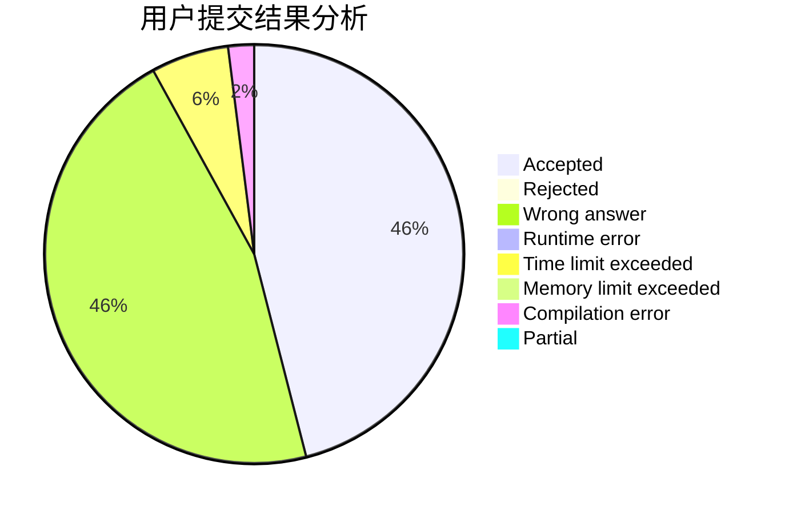
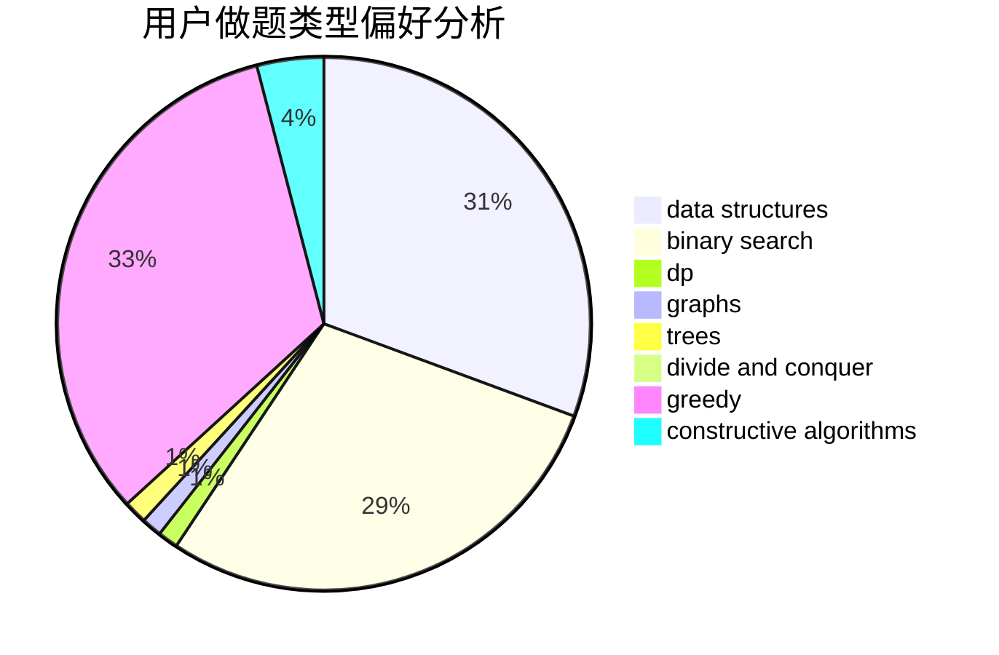
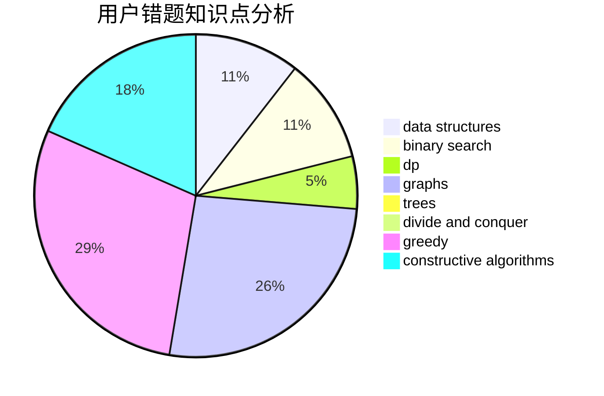

# Silicone

<!-- tabs:start -->

#### **用户提交结果分析**

#### **用户做题类型偏好分析**

#### **用户错题知识点分析**

<!-- tabs:end -->
# 推荐题目
[842C](https://codeforces.com/contest/842/problem/C)		dfs and similar,
                        graphs,
                        math,
                        number theory,
                        trees		  
[1228C](https://codeforces.com/contest/1228/problem/C)		math,
                        number theory		  
[14C](https://codeforces.com/contest/14/problem/C)		brute force,
                        constructive algorithms,
                        geometry,
                        implementation,
                        math		  
[1439D](https://codeforces.com/contest/1439/problem/D)		combinatorics,
                        dp,
                        fft		  
[834C](https://codeforces.com/contest/834/problem/C)		dsu,graphs,sortings,trees		  
[1488E](https://codeforces.com/contest/1488/problem/E)		*special problem,
                        data structures,
                        dp		  
[888C](https://codeforces.com/contest/888/problem/C)		binary search,
                        implementation,
                        two pointers		  
[678F](https://codeforces.com/contest/678/problem/F)		data structures,
                        divide and conquer,
                        geometry		  
[1314C](https://codeforces.com/contest/1314/problem/C)		dsu,graphs,sortings,trees		  
[612F](https://codeforces.com/contest/612/problem/F)		dp		  
