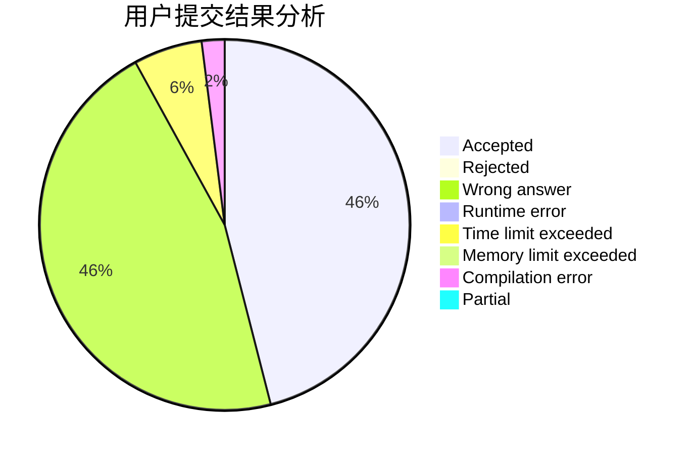
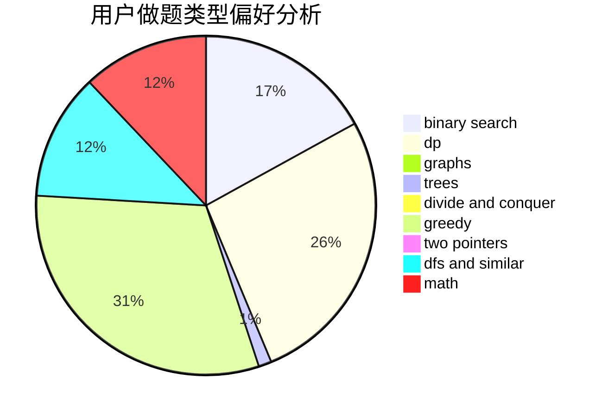

# Silicone

<!-- tabs:start -->

#### **用户提交结果分析**

#### **用户做题类型偏好分析**

<!-- tabs:end -->
# 推荐题目
[842C](https://codeforces.com/contest/842/problem/C)
[1228C](https://codeforces.com/contest/1228/problem/C)
[14C](https://codeforces.com/contest/14/problem/C)
[1439D](https://codeforces.com/contest/1439/problem/D)
[834C](https://codeforces.com/contest/834/problem/C)
[1488E](https://codeforces.com/contest/1488/problem/E)
[888C](https://codeforces.com/contest/888/problem/C)
[678F](https://codeforces.com/contest/678/problem/F)
[1314C](https://codeforces.com/contest/1314/problem/C)
[612F](https://codeforces.com/contest/612/problem/F)
