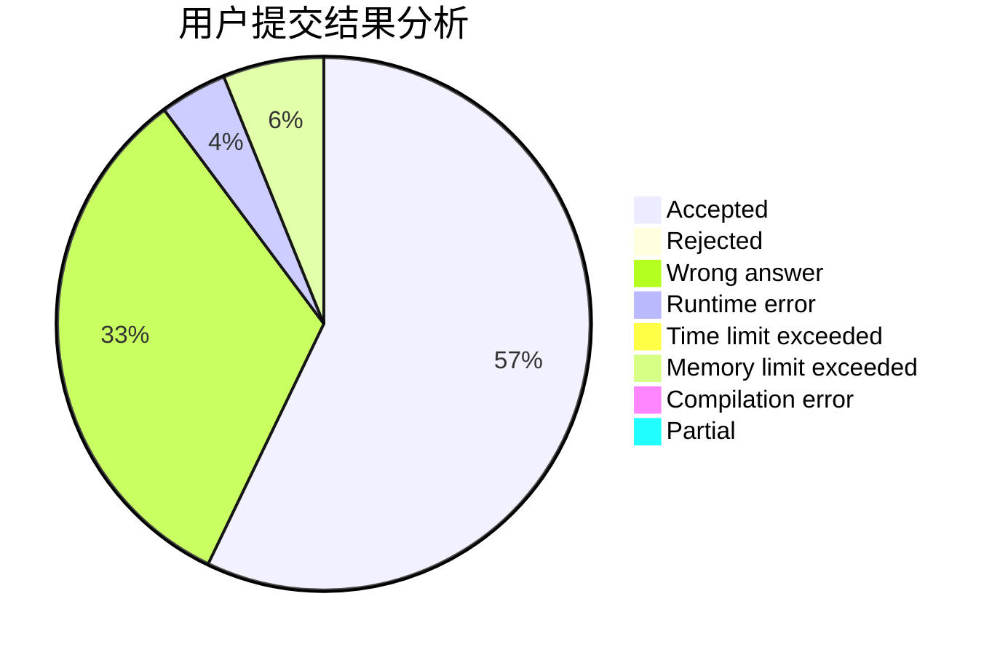
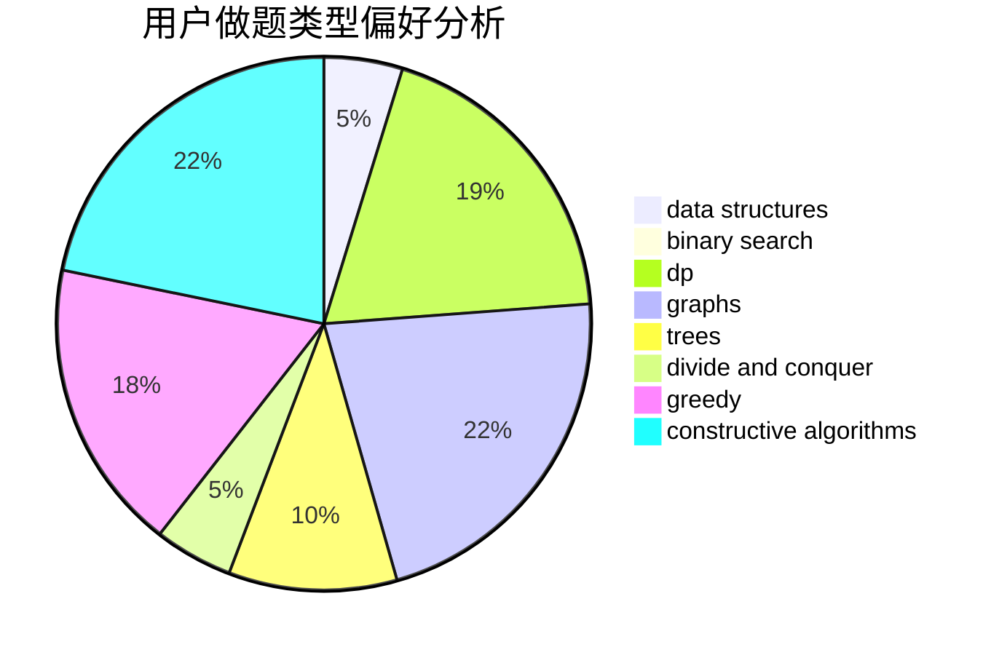

# Sillage

<!-- tabs:start -->

#### **用户提交结果分析**

#### **用户做题类型偏好分析**

#### **用户错题知识点分析**

<!-- tabs:end -->
# 推荐题目
[835E](https://codeforces.com/contest/835/problem/E)		binary search,
                        constructive algorithms,
                        interactive		  
[708D](https://codeforces.com/contest/708/problem/D)		flows		  
[938B](https://codeforces.com/contest/938/problem/B)		brute force,
                        greedy		  
[273E](https://codeforces.com/contest/273/problem/E)		dp,
                        games		  
[1120F](https://codeforces.com/contest/1120/problem/F)		data structures,
                        dp,
                        greedy		  
[1340D](https://codeforces.com/contest/1340/problem/D)		constructive algorithms,
                        dfs and similar,
                        graphs,
                        trees		  
[1041C](https://codeforces.com/contest/1041/problem/C)		binary search,
                        data structures,
                        greedy,
                        two pointers		  
[1248D2](https://codeforces.com/contest/1248D/problem/2)		dsu,graphs,sortings,trees		  
[961E](https://codeforces.com/contest/961/problem/E)		data structures		  
[682C](https://codeforces.com/contest/682/problem/C)		dfs and similar,
                        dp,
                        graphs,
                        trees		  
