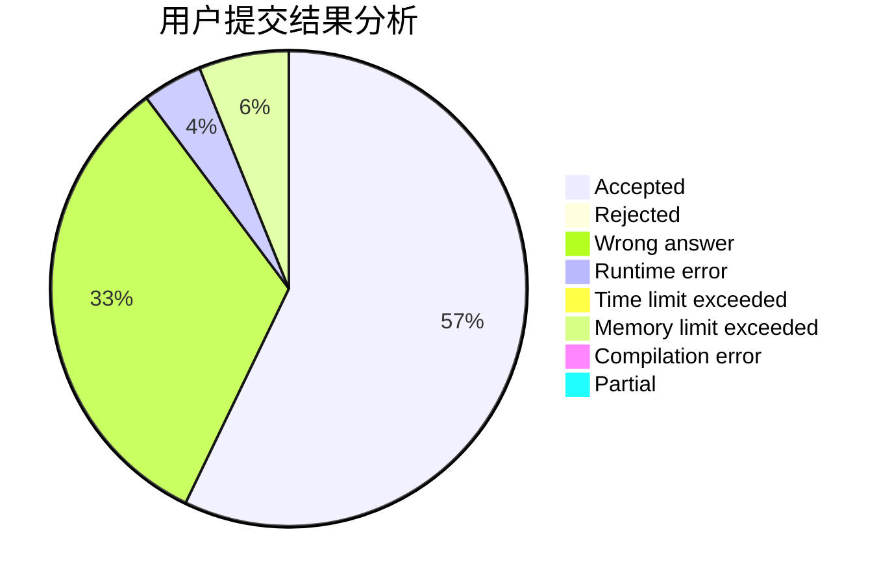
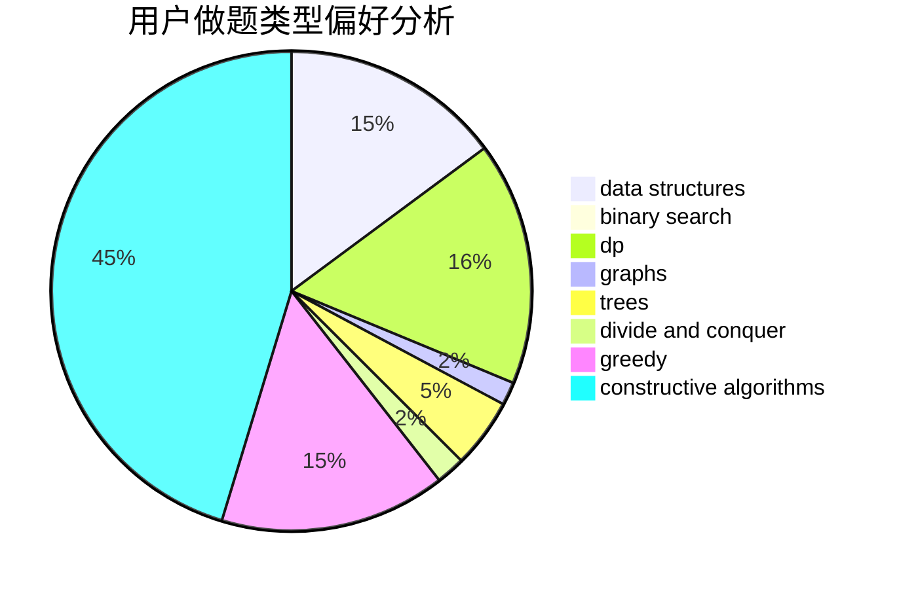

# Sillage

<!-- tabs:start -->

#### **用户提交结果分析**

#### **用户做题类型偏好分析**

#### **用户错题知识点分析**

<!-- tabs:end -->
# 推荐题目
[853C](https://codeforces.com/contest/853/problem/C)		data structures		  
[727F](https://codeforces.com/contest/727/problem/F)		binary search,
                        dp,
                        greedy		  
[95A](https://codeforces.com/contest/95/problem/A)		implementation,
                        strings		  
[289D](https://codeforces.com/contest/289/problem/D)		dsu,graphs,sortings,trees		  
[11302](https://codeforces.com/contest/1130/problem/2)		dsu,graphs,sortings,trees		  
[1347C](https://codeforces.com/contest/1347/problem/C)		dsu,graphs,sortings,trees		  
[1041F](https://codeforces.com/contest/1041/problem/F)		data structures,
                        divide and conquer,
                        dp,
                        math		  
[1252F](https://codeforces.com/contest/1252/problem/F)		hashing,
                        trees		  
[984A](https://codeforces.com/contest/984/problem/A)		sortings		  
[706D](https://codeforces.com/contest/706/problem/D)		binary search,
                        bitmasks,
                        data structures,
                        trees		  
