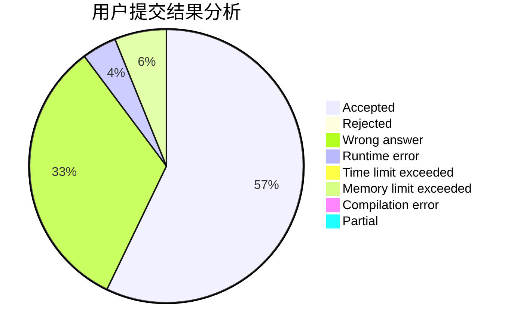
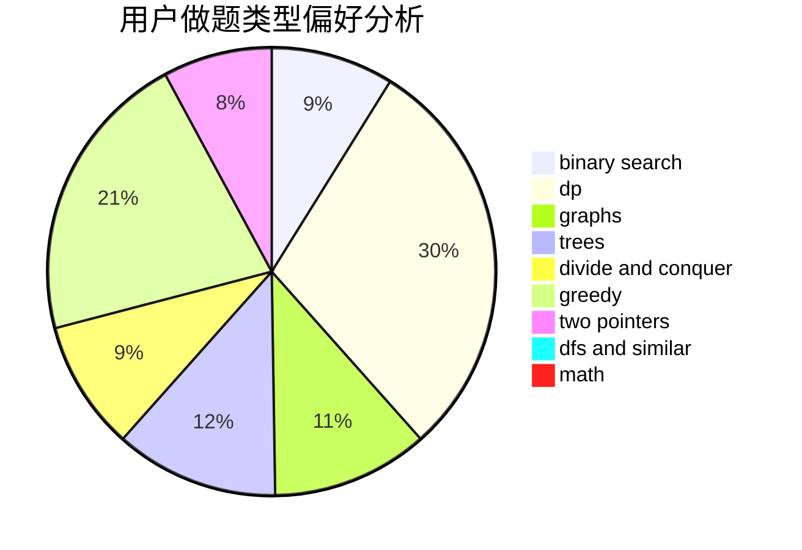

# Sillage

<!-- tabs:start -->

#### **用户提交结果分析**

#### **用户做题类型偏好分析**

<!-- tabs:end -->
# 推荐题目
[853C](https://codeforces.com/contest/853/problem/C)
[727F](https://codeforces.com/contest/727/problem/F)
[95A](https://codeforces.com/contest/95/problem/A)
[289D](https://codeforces.com/contest/289/problem/D)
[11302](https://codeforces.com/contest/1130/problem/2)
[1347C](https://codeforces.com/contest/1347/problem/C)
[1041F](https://codeforces.com/contest/1041/problem/F)
[1252F](https://codeforces.com/contest/1252/problem/F)
[984A](https://codeforces.com/contest/984/problem/A)
[706D](https://codeforces.com/contest/706/problem/D)
