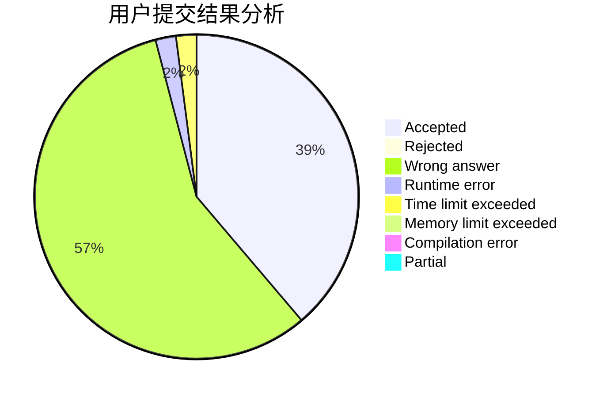
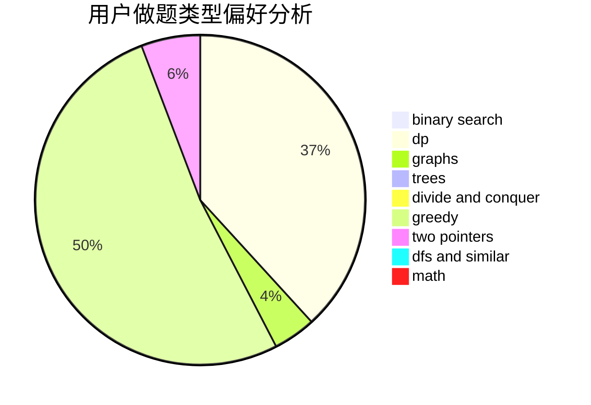

# Silliance

<!-- tabs:start -->

#### **用户提交结果分析**

#### **用户做题类型偏好分析**

<!-- tabs:end -->
# 推荐题目
[1029C](https://codeforces.com/contest/1029/problem/C)
[112B](https://codeforces.com/contest/112/problem/B)
[1092A](https://codeforces.com/contest/1092/problem/A)
[633C](https://codeforces.com/contest/633/problem/C)
[507E](https://codeforces.com/contest/507/problem/E)
[765D](https://codeforces.com/contest/765/problem/D)
[278B](https://codeforces.com/contest/278/problem/B)
[1425E](https://codeforces.com/contest/1425/problem/E)
[146C](https://codeforces.com/contest/146/problem/C)
[1148C](https://codeforces.com/contest/1148/problem/C)
