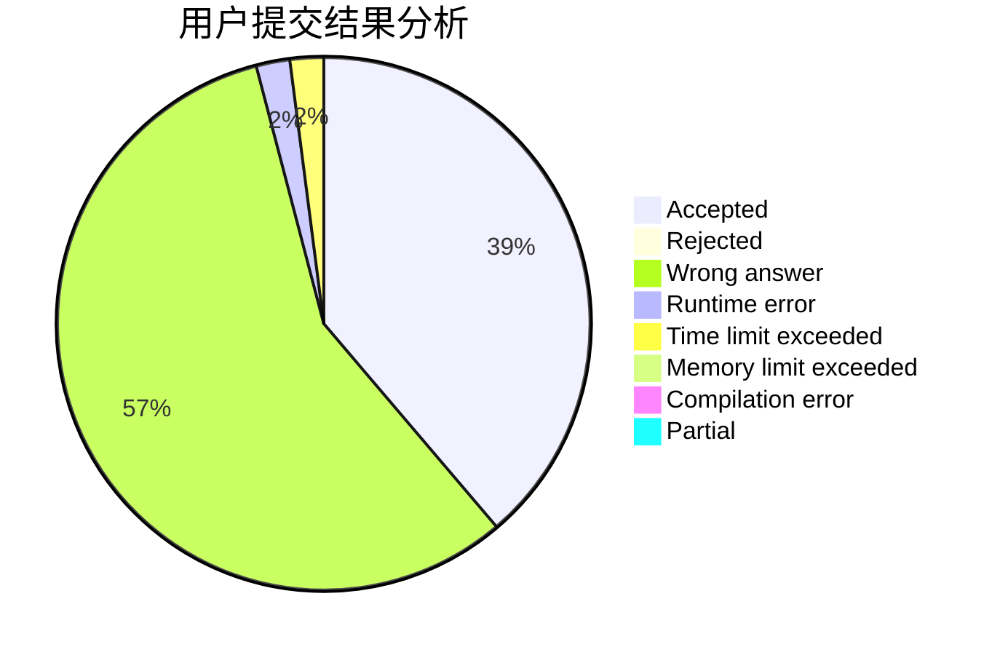
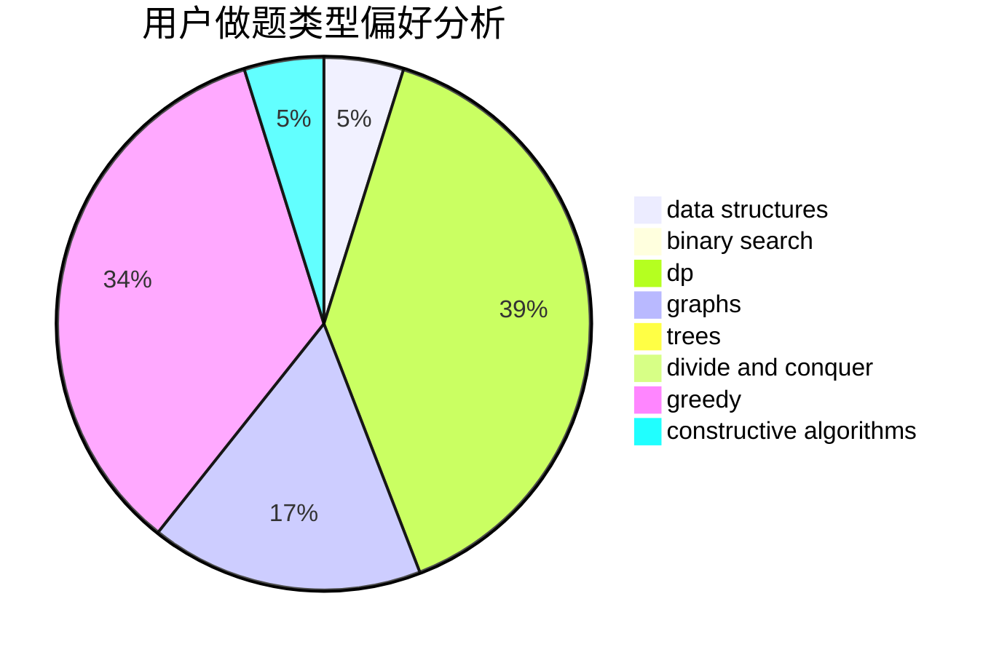
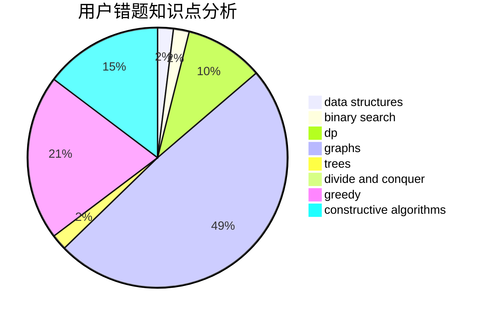

# Silliance

<!-- tabs:start -->

#### **用户提交结果分析**

#### **用户做题类型偏好分析**

#### **用户错题知识点分析**

<!-- tabs:end -->
# 推荐题目
[1029C](https://codeforces.com/contest/1029/problem/C)		greedy,
                        math,
                        sortings		  
[112B](https://codeforces.com/contest/112/problem/B)		implementation,
                        math		  
[1092A](https://codeforces.com/contest/1092/problem/A)		implementation		  
[633C](https://codeforces.com/contest/633/problem/C)		data structures,
                        dp,
                        hashing,
                        implementation,
                        sortings,
                        string suffix structures,
                        strings		  
[507E](https://codeforces.com/contest/507/problem/E)		dfs and similar,
                        dp,
                        graphs,
                        shortest paths		  
[765D](https://codeforces.com/contest/765/problem/D)		constructive algorithms,
                        dsu,
                        math		  
[278B](https://codeforces.com/contest/278/problem/B)		brute force,
                        strings		  
[1425E](https://codeforces.com/contest/1425/problem/E)		greedy,
                        implementation		  
[146C](https://codeforces.com/contest/146/problem/C)		dsu,graphs,sortings,trees		  
[1148C](https://codeforces.com/contest/1148/problem/C)		constructive algorithms,
                        sortings		  
