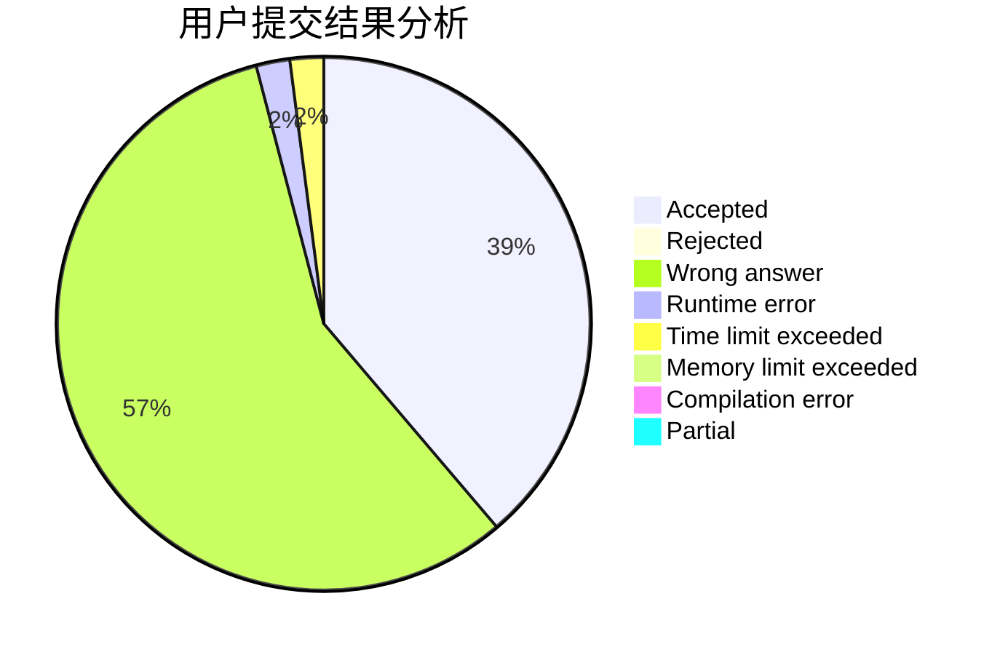
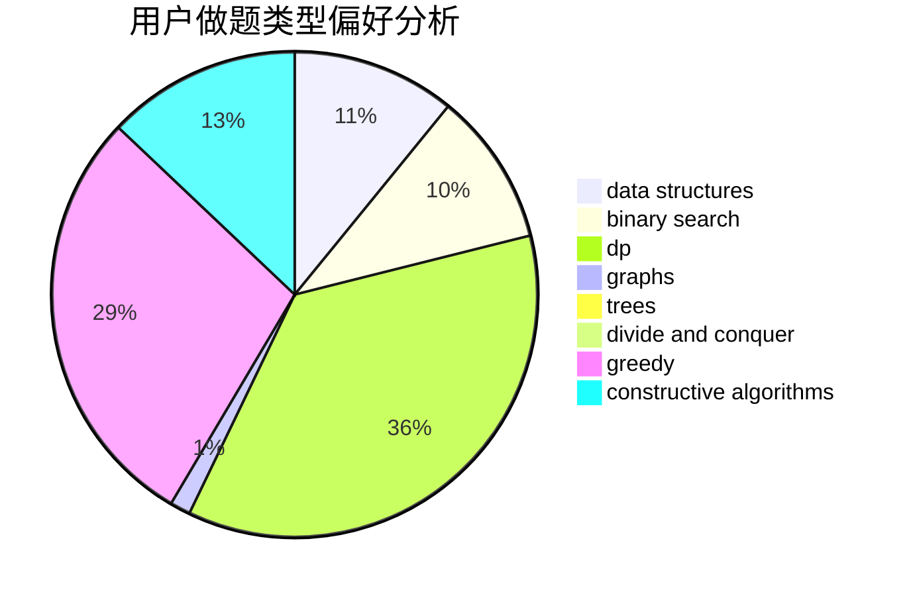
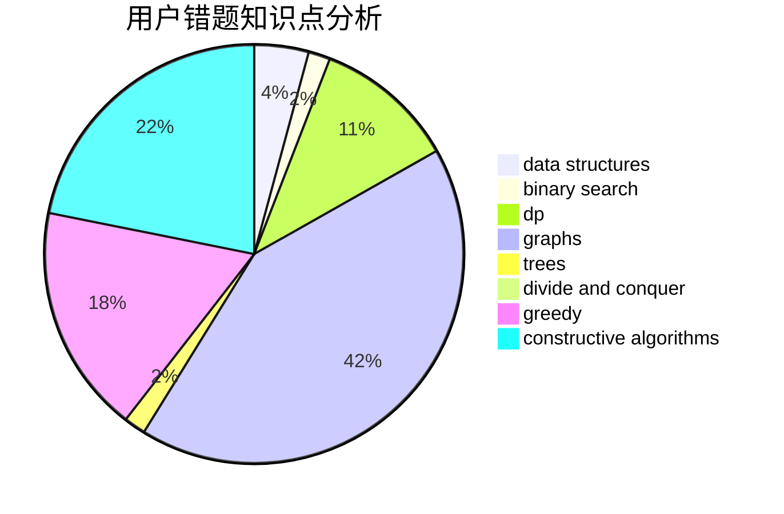

# Silliance

<!-- tabs:start -->

#### **用户提交结果分析**

#### **用户做题类型偏好分析**

#### **用户错题知识点分析**

<!-- tabs:end -->
# 推荐题目
[1028H](https://codeforces.com/contest/1028/problem/H)		math		  
[1120C](https://codeforces.com/contest/1120/problem/C)		dp,
                        strings		  
[1091H](https://codeforces.com/contest/1091/problem/H)		games		  
[614D](https://codeforces.com/contest/614/problem/D)		dsu,graphs,sortings,trees		  
[486E](https://codeforces.com/contest/486/problem/E)		data structures,
                        dp,
                        greedy,
                        hashing,
                        math		  
[746B](https://codeforces.com/contest/746/problem/B)		implementation,
                        strings		  
[260A](https://codeforces.com/contest/260/problem/A)		implementation,
                        math		  
[1418A](https://codeforces.com/contest/1418/problem/A)		math		  
[1462E2](https://codeforces.com/contest/1462E/problem/2)		binary search,
                        combinatorics,
                        implementation,
                        math,
                        sortings,
                        two pointers		  
[1146C](https://codeforces.com/contest/1146/problem/C)		bitmasks,
                        graphs,
                        interactive		  
