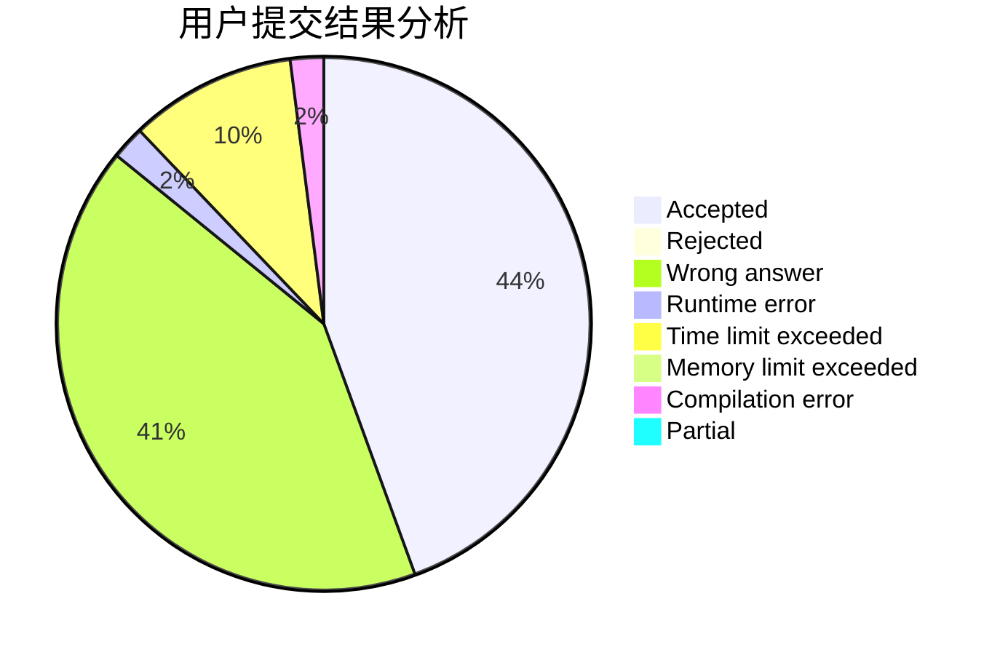
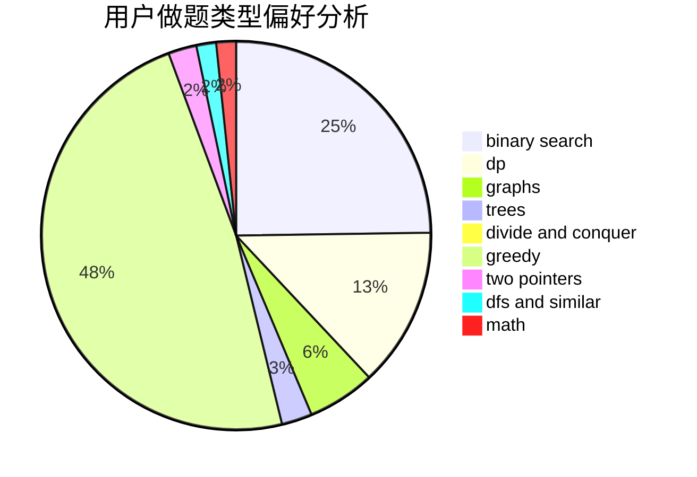

# SilverBulletALi

<!-- tabs:start -->

#### **用户提交结果分析**

#### **用户做题类型偏好分析**

<!-- tabs:end -->
# 推荐题目
[1468J](https://codeforces.com/contest/1468/problem/J)
[601C](https://codeforces.com/contest/601/problem/C)
[519E](https://codeforces.com/contest/519/problem/E)
[12621](https://codeforces.com/contest/1262/problem/1)
[883D](https://codeforces.com/contest/883/problem/D)
[17C](https://codeforces.com/contest/17/problem/C)
[23B](https://codeforces.com/contest/23/problem/B)
[877B](https://codeforces.com/contest/877/problem/B)
[1121B](https://codeforces.com/contest/1121/problem/B)
[536D](https://codeforces.com/contest/536/problem/D)
