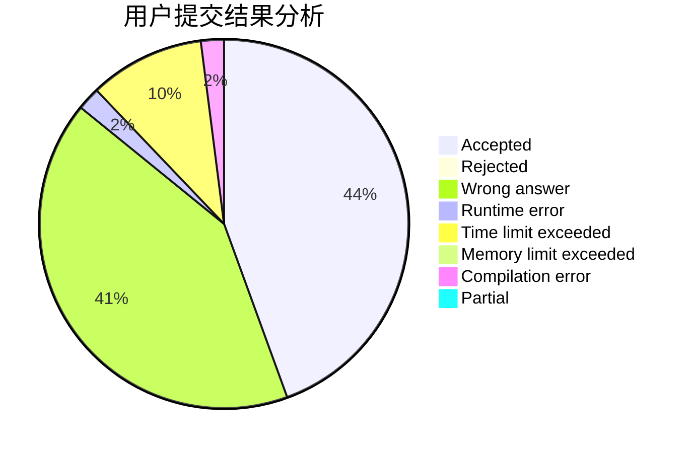
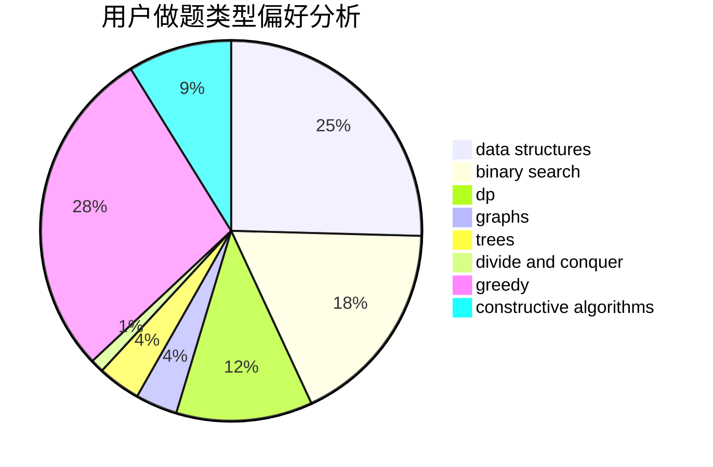
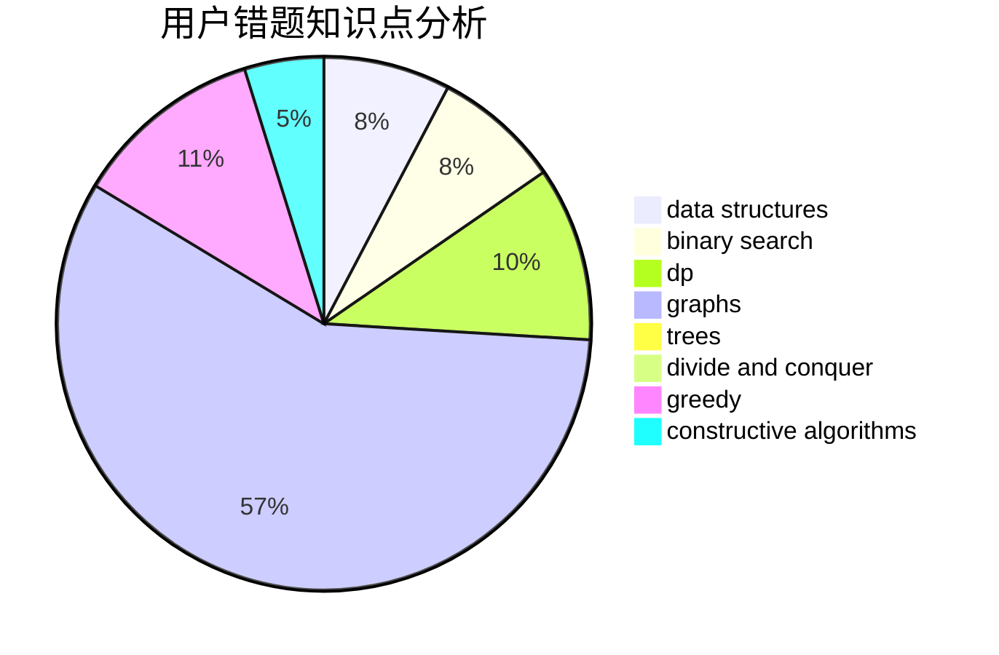

# SilverBulletALi

<!-- tabs:start -->

#### **用户提交结果分析**

#### **用户做题类型偏好分析**

#### **用户错题知识点分析**

<!-- tabs:end -->
# 推荐题目
[1468J](https://codeforces.com/contest/1468/problem/J)		dsu,
                        graphs,
                        greedy		  
[601C](https://codeforces.com/contest/601/problem/C)		dp,
                        math,
                        probabilities		  
[519E](https://codeforces.com/contest/519/problem/E)		binary search,
                        data structures,
                        dfs and similar,
                        dp,
                        trees		  
[12621](https://codeforces.com/contest/1262/problem/1)		dsu,graphs,sortings,trees		  
[883D](https://codeforces.com/contest/883/problem/D)		binary search,
                        dp,
                        math		  
[17C](https://codeforces.com/contest/17/problem/C)		dp		  
[23B](https://codeforces.com/contest/23/problem/B)		constructive algorithms,
                        graphs,
                        math		  
[877B](https://codeforces.com/contest/877/problem/B)		brute force,
                        dp		  
[1121B](https://codeforces.com/contest/1121/problem/B)		brute force,
                        implementation		  
[536D](https://codeforces.com/contest/536/problem/D)		dp,
                        games		  
