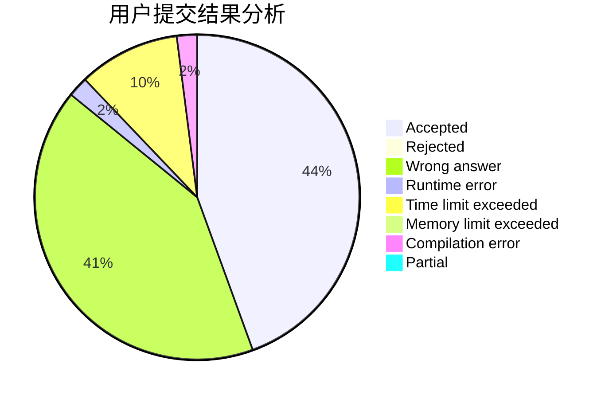
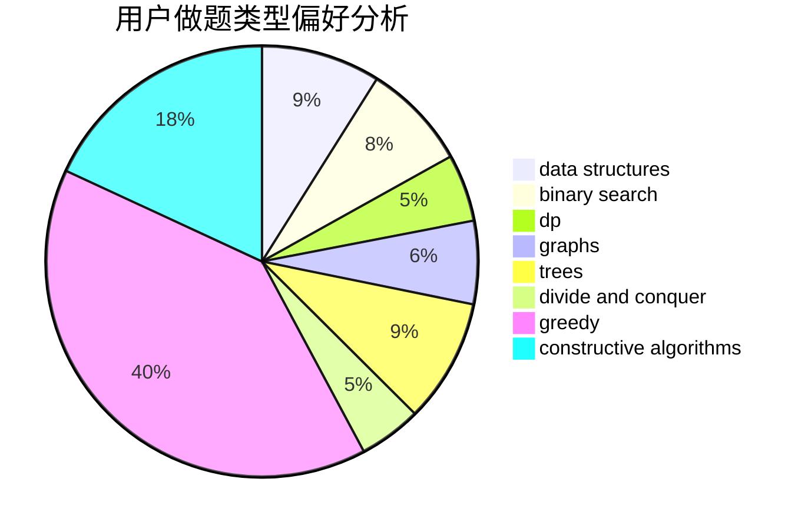
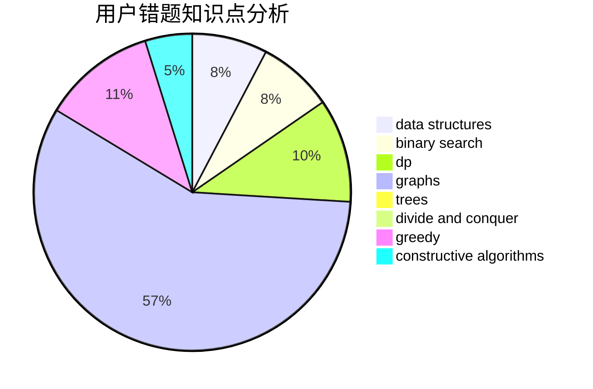

# SilverBulletALi
<!-- tabs:start -->
#### **用户提交结果分析**

#### **用户做题类型偏好分析**

#### **用户错题知识点分析**

<!-- tabs:end -->
# 推荐题目
[Different Divisors](http://codeforces.com/problemset/problem/1474/B)		binary search,
                        constructive algorithms,
                        greedy,
                        math,
                        number theory		  
[Boxes Packing](http://codeforces.com/problemset/problem/1066/D)		binary search,
                        implementation		  
[Kayaking](http://codeforces.com/problemset/problem/863/B)		brute force,
                        greedy,
                        sortings		  
[Stairs and Lines](http://codeforces.com/problemset/problem/498/E)		dp,
                        matrices		  
[Tree Queries](http://codeforces.com/problemset/problem/1254/D)		data structures,
                        probabilities,
                        trees		  
[Nanosoft](http://codeforces.com/problemset/problem/1301/E)		binary search,
                        data structures,
                        dp,
                        implementation		  
[Towers](http://codeforces.com/problemset/problem/37/A)		sortings		  
[Luxurious Houses](http://codeforces.com/problemset/problem/581/B)		implementation,
                        math		  
[Drazil and Tiles](https://codeforces.com/contest/516/problem/B)		constructive algorithms,
                        greedy		  
[Rin and The Unknown Flower](http://codeforces.com/problemset/problem/1292/E)		constructive algorithms,
                        greedy,
                        interactive,
                        math		  
<!-- tabs:start -->
#### **data structures**
[Different Divisors](http://codeforces.com/problemset/problem/1254/D)		data structures,
                        probabilities,
                        trees		  
[Boxes Packing](http://codeforces.com/problemset/problem/1301/E)		binary search,
                        data structures,
                        dp,
                        implementation		  
[Kayaking](http://codeforces.com/problemset/problem/1099/F)		binary search,
                        data structures,
                        dfs and similar,
                        dp,
                        games,
                        trees		  
[Stairs and Lines](http://codeforces.com/problemset/problem/915/E)		data structures,
                        implementation,
                        sortings		  
[Tree Queries](http://codeforces.com/problemset/problem/763/D)		data structures,
                        graphs,
                        hashing,
                        shortest paths,
                        trees		  
[Nanosoft](http://codeforces.com/problemset/problem/793/G)		data structures,
                        divide and conquer,
                        flows,
                        graph matchings		  
[Towers](http://codeforces.com/problemset/problem/558/E)		data structures,
                        sortings,
                        strings		  
[Luxurious Houses](http://codeforces.com/problemset/problem/1368/G)		data structures,
                        geometry,
                        graphs,
                        trees		  
[Drazil and Tiles](http://codeforces.com/problemset/problem/1466/D)		data structures,
                        greedy,
                        sortings,
                        trees		  
[Rin and The Unknown Flower](http://codeforces.com/problemset/problem/797/E)		brute force,
                        data structures,
                        dp		  
#### **binary search**
[Different Divisors](http://codeforces.com/problemset/problem/1474/B)		binary search,
                        constructive algorithms,
                        greedy,
                        math,
                        number theory		  
[Boxes Packing](http://codeforces.com/problemset/problem/1066/D)		binary search,
                        implementation		  
[Kayaking](http://codeforces.com/problemset/problem/1301/E)		binary search,
                        data structures,
                        dp,
                        implementation		  
[Stairs and Lines](http://codeforces.com/problemset/problem/1119/B)		binary search,
                        flows,
                        greedy,
                        sortings		  
[Tree Queries](http://codeforces.com/problemset/problem/1099/F)		binary search,
                        data structures,
                        dfs and similar,
                        dp,
                        games,
                        trees		  
[Nanosoft](https://codeforces.com/contest/1489/problem/F)		binary search,
                        implementation		  
[Towers](http://codeforces.com/problemset/problem/1201/D)		binary search,
                        dp,
                        greedy,
                        implementation		  
[Luxurious Houses](http://codeforces.com/problemset/problem/1354/C1)		binary search,
                        geometry,
                        math,
                        ternary search		  
[Drazil and Tiles](http://codeforces.com/problemset/problem/1354/B)		binary search,
                        dp,
                        implementation,
                        two pointers		  
[Rin and The Unknown Flower](http://codeforces.com/problemset/problem/1184/B1)		binary search,
                        sortings		  
#### **dp**
[Different Divisors](http://codeforces.com/problemset/problem/498/E)		dp,
                        matrices		  
[Boxes Packing](http://codeforces.com/problemset/problem/1301/E)		binary search,
                        data structures,
                        dp,
                        implementation		  
[Kayaking](http://codeforces.com/problemset/problem/785/D)		combinatorics,
                        dp,
                        math,
                        number theory		  
[Stairs and Lines](http://codeforces.com/problemset/problem/798/B)		brute force,
                        dp,
                        strings		  
[Tree Queries](http://codeforces.com/problemset/problem/1099/F)		binary search,
                        data structures,
                        dfs and similar,
                        dp,
                        games,
                        trees		  
[Nanosoft](http://codeforces.com/problemset/problem/1392/G)		bitmasks,
                        dfs and similar,
                        dp,
                        math,
                        shortest paths		  
[Towers](http://codeforces.com/problemset/problem/386/C)		dp,
                        strings,
                        two pointers		  
[Luxurious Houses](http://codeforces.com/problemset/problem/505/B)		dfs and similar,
                        dp,
                        dsu,
                        graphs		  
[Drazil and Tiles](http://codeforces.com/problemset/problem/1201/D)		binary search,
                        dp,
                        greedy,
                        implementation		  
[Rin and The Unknown Flower](http://codeforces.com/problemset/problem/977/F)		dp		  
#### **graph**
[Different Divisors](http://codeforces.com/problemset/problem/21/D)		bitmasks,
                        graph matchings,
                        graphs		  
[Boxes Packing](http://codeforces.com/problemset/problem/859/E)		combinatorics,
                        dfs and similar,
                        dsu,
                        graphs,
                        trees		  
[Kayaking](http://codeforces.com/problemset/problem/1291/F)		graphs,
                        interactive		  
[Stairs and Lines](http://codeforces.com/problemset/problem/505/B)		dfs and similar,
                        dp,
                        dsu,
                        graphs		  
[Tree Queries](http://codeforces.com/problemset/problem/1082/G)		flows,
                        graphs		  
[Nanosoft](https://codeforces.com/contest/782/problem/C)		dfs and similar,
                        graphs,
                        greedy,
                        trees		  
[Towers](http://codeforces.com/problemset/problem/763/D)		data structures,
                        graphs,
                        hashing,
                        shortest paths,
                        trees		  
[Luxurious Houses](https://codeforces.com/contest/1489/problem/G)		dsu,
                        graphs,
                        greedy		  
[Drazil and Tiles](http://codeforces.com/problemset/problem/793/G)		data structures,
                        divide and conquer,
                        flows,
                        graph matchings		  
[Rin and The Unknown Flower](http://codeforces.com/problemset/problem/1368/G)		data structures,
                        geometry,
                        graphs,
                        trees		  
#### **trees**
[Different Divisors](http://codeforces.com/problemset/problem/1254/D)		data structures,
                        probabilities,
                        trees		  
[Boxes Packing](http://codeforces.com/problemset/problem/859/E)		combinatorics,
                        dfs and similar,
                        dsu,
                        graphs,
                        trees		  
[Kayaking](http://codeforces.com/problemset/problem/1099/F)		binary search,
                        data structures,
                        dfs and similar,
                        dp,
                        games,
                        trees		  
[Stairs and Lines](https://codeforces.com/contest/782/problem/C)		dfs and similar,
                        graphs,
                        greedy,
                        trees		  
[Tree Queries](http://codeforces.com/problemset/problem/763/D)		data structures,
                        graphs,
                        hashing,
                        shortest paths,
                        trees		  
[Nanosoft](http://codeforces.com/problemset/problem/1485/E)		dfs and similar,
                        dp,
                        greedy,
                        trees		  
[Towers](http://codeforces.com/problemset/problem/1368/G)		data structures,
                        geometry,
                        graphs,
                        trees		  
[Luxurious Houses](http://codeforces.com/problemset/problem/1466/D)		data structures,
                        greedy,
                        sortings,
                        trees		  
[Drazil and Tiles](http://codeforces.com/problemset/problem/1479/D)		binary search,
                        bitmasks,
                        brute force,
                        data structures,
                        probabilities,
                        trees		  
[Rin and The Unknown Flower](http://codeforces.com/problemset/problem/1511/C)		brute force,
                        data structures,
                        implementation,
                        trees		  
#### **divide and conquer**
[Different Divisors](http://codeforces.com/problemset/problem/793/G)		data structures,
                        divide and conquer,
                        flows,
                        graph matchings		  
[Boxes Packing](http://codeforces.com/problemset/problem/1373/D)		divide and conquer,
                        dp,
                        greedy,
                        implementation		  
[Kayaking](http://codeforces.com/problemset/problem/1461/D)		binary search,
                        brute force,
                        data structures,
                        divide and conquer,
                        implementation,
                        sortings		  
[Stairs and Lines](http://codeforces.com/problemset/problem/1466/G)		combinatorics,
                        divide and conquer,
                        hashing,
                        math,
                        string suffix structures,
                        strings		  
[Tree Queries](http://codeforces.com/problemset/problem/1490/D)		dfs and similar,
                        divide and conquer,
                        implementation		  
[Nanosoft](https://codeforces.com/contest/1483/problem/C)		data structures,
                        divide and conquer,
                        dp		  
[Towers](http://codeforces.com/problemset/problem/1491/E)		brute force,
                        dfs and similar,
                        divide and conquer,
                        number theory,
                        trees		  
[Luxurious Houses](http://codeforces.com/problemset/problem/1303/G)		data structures,
                        divide and conquer,
                        geometry,
                        trees		  
[Drazil and Tiles](http://codeforces.com/problemset/problem/1494/D)		constructive algorithms,
                        data structures,
                        dfs and similar,
                        divide and conquer,
                        dsu,
                        greedy,
                        sortings,
                        trees		  
[Rin and The Unknown Flower](http://codeforces.com/problemset/problem/1482/E)		data structures,
                        divide and conquer,
                        dp		  
#### **greedy**
[Different Divisors](http://codeforces.com/problemset/problem/1474/B)		binary search,
                        constructive algorithms,
                        greedy,
                        math,
                        number theory		  
[Boxes Packing](http://codeforces.com/problemset/problem/863/B)		brute force,
                        greedy,
                        sortings		  
[Kayaking](https://codeforces.com/contest/516/problem/B)		constructive algorithms,
                        greedy		  
[Stairs and Lines](http://codeforces.com/problemset/problem/1292/E)		constructive algorithms,
                        greedy,
                        interactive,
                        math		  
[Tree Queries](http://codeforces.com/problemset/problem/297/B)		constructive algorithms,
                        greedy		  
[Nanosoft](http://codeforces.com/problemset/problem/1119/B)		binary search,
                        flows,
                        greedy,
                        sortings		  
[Towers](https://codeforces.com/contest/782/problem/C)		dfs and similar,
                        graphs,
                        greedy,
                        trees		  
[Luxurious Houses](http://codeforces.com/problemset/problem/1201/D)		binary search,
                        dp,
                        greedy,
                        implementation		  
[Drazil and Tiles](http://codeforces.com/problemset/problem/808/C)		constructive algorithms,
                        greedy,
                        sortings		  
[Rin and The Unknown Flower](https://codeforces.com/contest/1489/problem/G)		dsu,
                        graphs,
                        greedy		  
#### **constructive algorithms**
[Different Divisors](http://codeforces.com/problemset/problem/1474/B)		binary search,
                        constructive algorithms,
                        greedy,
                        math,
                        number theory		  
[Boxes Packing](https://codeforces.com/contest/516/problem/B)		constructive algorithms,
                        greedy		  
[Kayaking](http://codeforces.com/problemset/problem/1292/E)		constructive algorithms,
                        greedy,
                        interactive,
                        math		  
[Stairs and Lines](http://codeforces.com/problemset/problem/659/B)		constructive algorithms,
                        sortings		  
[Tree Queries](http://codeforces.com/problemset/problem/632/B)		brute force,
                        constructive algorithms		  
[Nanosoft](http://codeforces.com/problemset/problem/297/B)		constructive algorithms,
                        greedy		  
[Towers](http://codeforces.com/problemset/problem/513/A)		constructive algorithms,
                        math		  
[Luxurious Houses](http://codeforces.com/problemset/problem/1446/E)		constructive algorithms,
                        dfs and similar		  
[Drazil and Tiles](http://codeforces.com/problemset/problem/808/C)		constructive algorithms,
                        greedy,
                        sortings		  
[Rin and The Unknown Flower](http://codeforces.com/problemset/problem/1097/E)		constructive algorithms,
                        greedy		  
#### **sortings**
[Different Divisors](http://codeforces.com/problemset/problem/863/B)		brute force,
                        greedy,
                        sortings		  
[Boxes Packing](http://codeforces.com/problemset/problem/37/A)		sortings		  
[Kayaking](http://codeforces.com/problemset/problem/659/B)		constructive algorithms,
                        sortings		  
[Stairs and Lines](http://codeforces.com/problemset/problem/1119/B)		binary search,
                        flows,
                        greedy,
                        sortings		  
[Tree Queries](http://codeforces.com/problemset/problem/915/E)		data structures,
                        implementation,
                        sortings		  
[Nanosoft](http://codeforces.com/problemset/problem/808/C)		constructive algorithms,
                        greedy,
                        sortings		  
[Towers](http://codeforces.com/problemset/problem/1398/B)		games,
                        greedy,
                        sortings		  
[Luxurious Houses](http://codeforces.com/problemset/problem/558/E)		data structures,
                        sortings,
                        strings		  
[Drazil and Tiles](http://codeforces.com/problemset/problem/1184/B1)		binary search,
                        sortings		  
[Rin and The Unknown Flower](http://codeforces.com/problemset/problem/1466/D)		data structures,
                        greedy,
                        sortings,
                        trees		  
<!-- tabs:end -->
