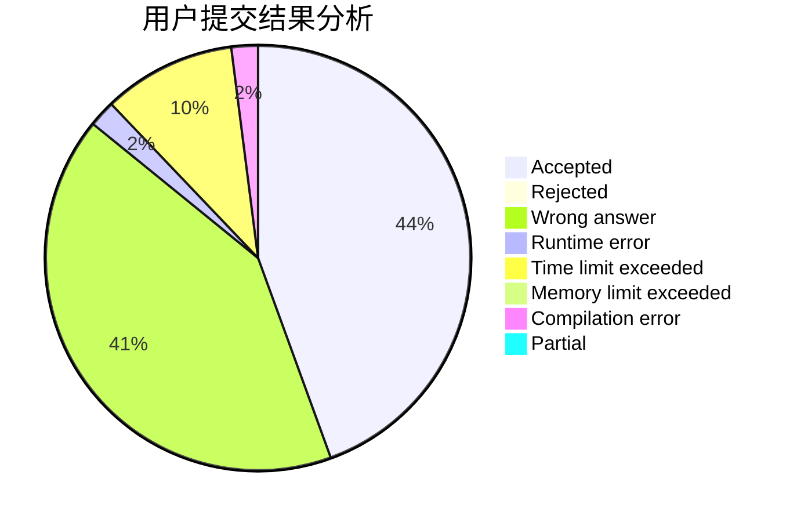
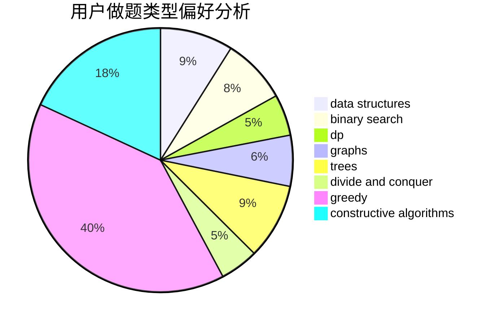
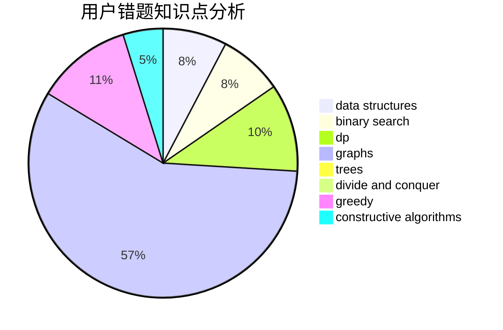

# SilverBulletALi

<!-- tabs:start -->

#### **用户提交结果分析**

#### **用户做题类型偏好分析**

#### **用户错题知识点分析**

<!-- tabs:end -->
# 推荐题目
[1460A](https://codeforces.com/contest/1460/problem/A)		dsu,graphs,sortings,trees		  
[581B](https://codeforces.com/contest/581/problem/B)		implementation,
                        math		  
[498E](https://codeforces.com/contest/498/problem/E)		dp,
                        matrices		  
[1254D](https://codeforces.com/contest/1254/problem/D)		data structures,
                        probabilities,
                        trees		  
[863B](https://codeforces.com/contest/863/problem/B)		brute force,
                        greedy,
                        sortings		  
[158A](https://codeforces.com/contest/158/problem/A)		*special problem,
                        implementation		  
[21D](https://codeforces.com/contest/21/problem/D)		bitmasks,
                        graph matchings,
                        graphs		  
[859E](https://codeforces.com/contest/859/problem/E)		combinatorics,
                        dfs and similar,
                        dsu,
                        graphs,
                        trees		  
[1119B](https://codeforces.com/contest/1119/problem/B)		binary search,
                        flows,
                        greedy,
                        sortings		  
[513A](https://codeforces.com/contest/513/problem/A)		constructive algorithms,
                        math		  
