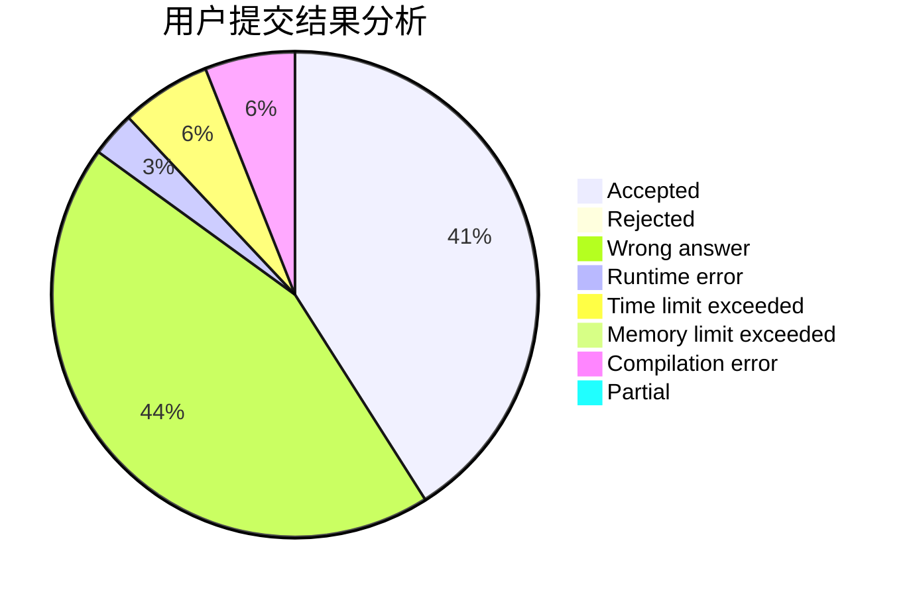
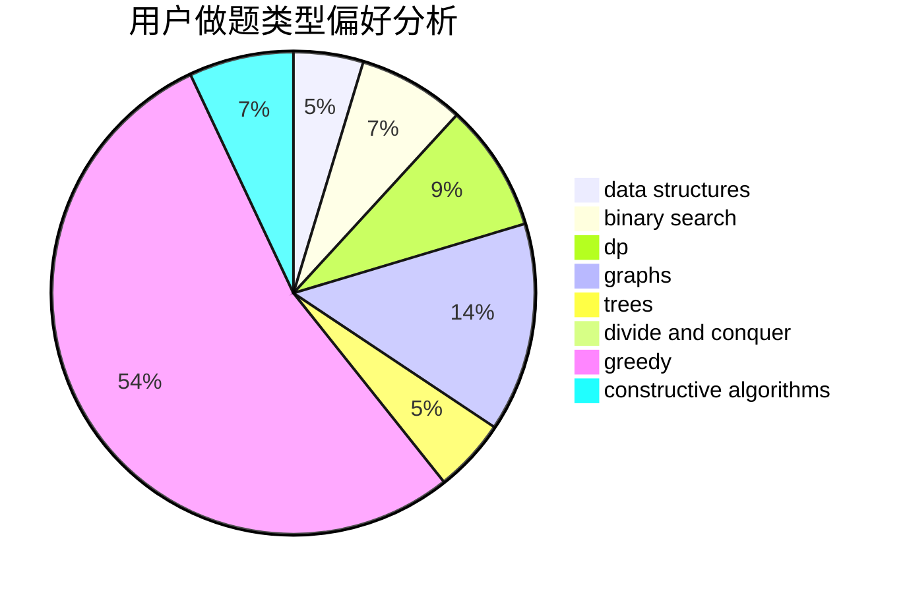
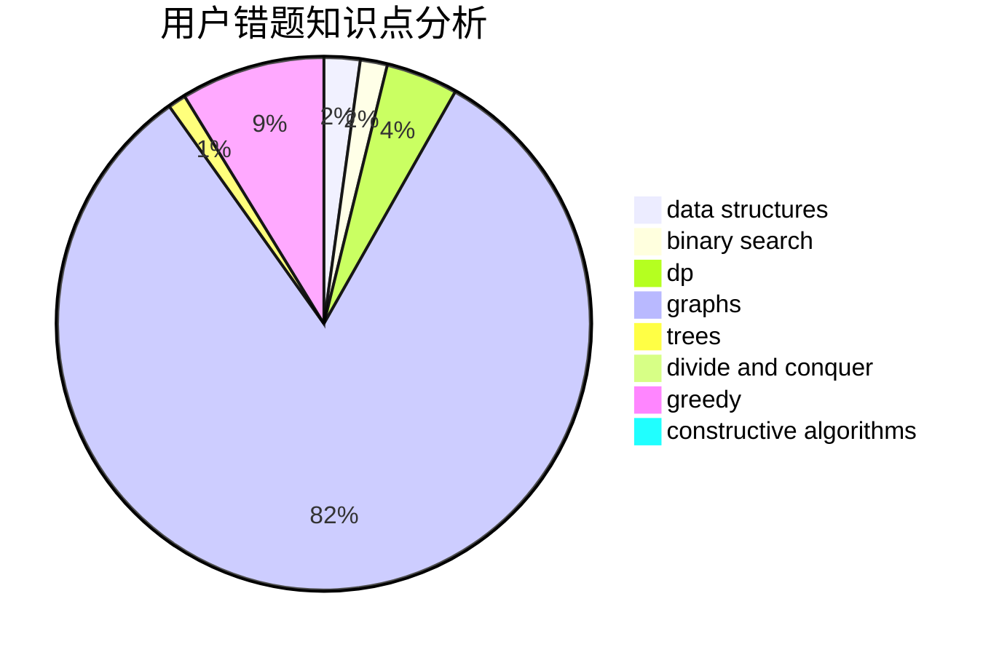

# Simon_Chen

<!-- tabs:start -->

#### **用户提交结果分析**

#### **用户做题类型偏好分析**

#### **用户错题知识点分析**

<!-- tabs:end -->
# 推荐题目
[946F](https://codeforces.com/contest/946/problem/F)		combinatorics,
                        dp,
                        matrices		  
[1040D](https://codeforces.com/contest/1040/problem/D)		dsu,graphs,sortings,trees		  
[792B](https://codeforces.com/contest/792/problem/B)		implementation		  
[789B](https://codeforces.com/contest/789/problem/B)		brute force,
                        implementation,
                        math		  
[1270H](https://codeforces.com/contest/1270/problem/H)		data structures		  
[1300A](https://codeforces.com/contest/1300/problem/A)		implementation,
                        math		  
[846B](https://codeforces.com/contest/846/problem/B)		brute force,
                        greedy		  
[171G](https://codeforces.com/contest/171/problem/G)		*special problem		  
[1243D](https://codeforces.com/contest/1243/problem/D)		dsu,graphs,sortings,trees		  
[845B](https://codeforces.com/contest/845/problem/B)		brute force,
                        greedy,
                        implementation		  
