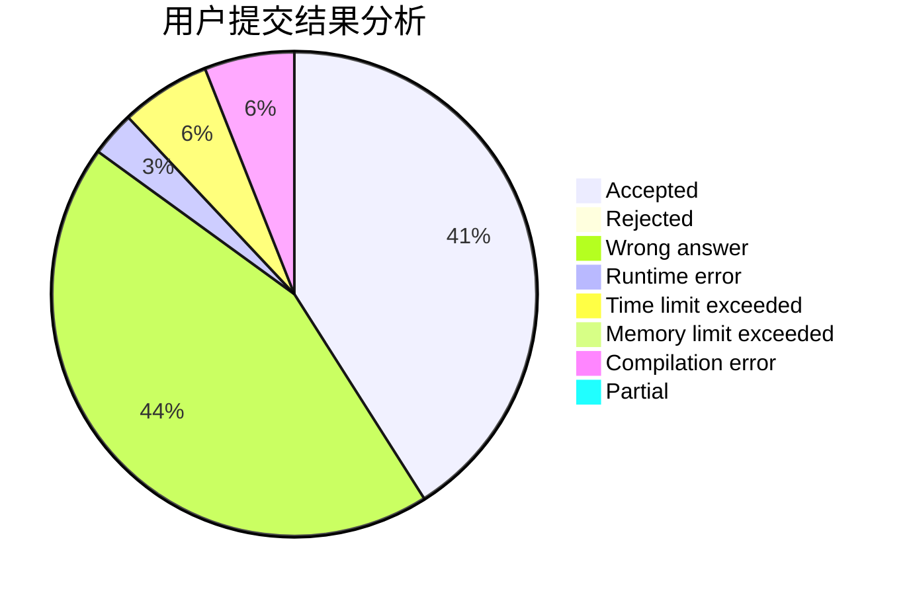
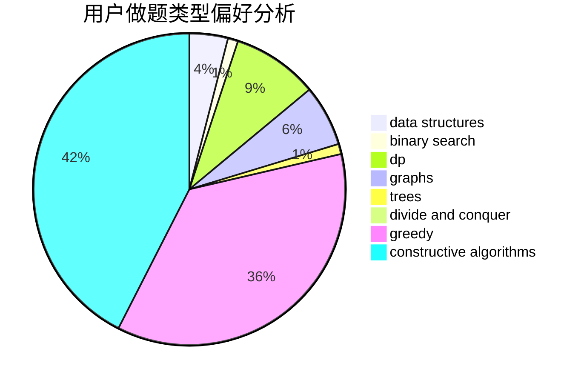
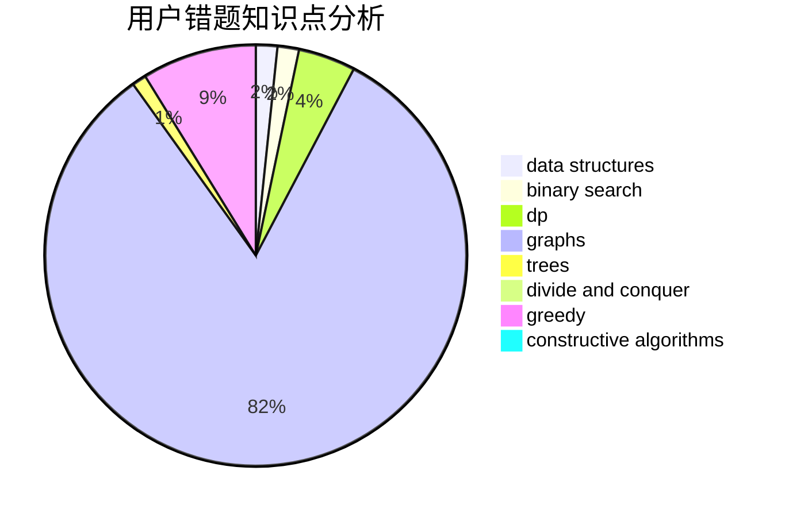

# Simon_Chen

<!-- tabs:start -->

#### **用户提交结果分析**

#### **用户做题类型偏好分析**

#### **用户错题知识点分析**

<!-- tabs:end -->
# 推荐题目
[963C](https://codeforces.com/contest/963/problem/C)		brute force,
                        math,
                        number theory		  
[1041C](https://codeforces.com/contest/1041/problem/C)		binary search,
                        data structures,
                        greedy,
                        two pointers		  
[808A](https://codeforces.com/contest/808/problem/A)		implementation		  
[804D](https://codeforces.com/contest/804/problem/D)		binary search,
                        brute force,
                        dfs and similar,
                        dp,
                        sortings,
                        trees		  
[1280A](https://codeforces.com/contest/1280/problem/A)		implementation,
                        math		  
[1307F](https://codeforces.com/contest/1307/problem/F)		dfs and similar,
                        dsu,
                        trees		  
[864D](https://codeforces.com/contest/864/problem/D)		greedy,
                        implementation,
                        math		  
[199E](https://codeforces.com/contest/199/problem/E)		dsu,graphs,sortings,trees		  
[1248E](https://codeforces.com/contest/1248/problem/E)		dsu,graphs,sortings,trees		  
[863C](https://codeforces.com/contest/863/problem/C)		graphs,
                        implementation		  
