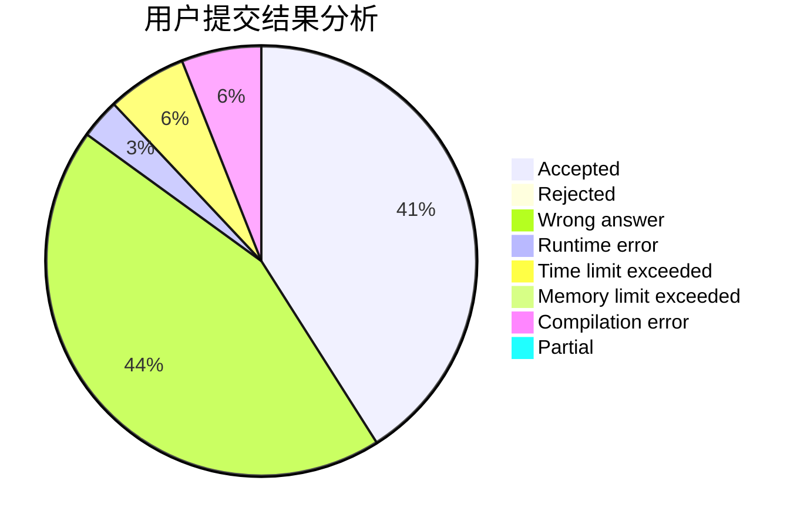
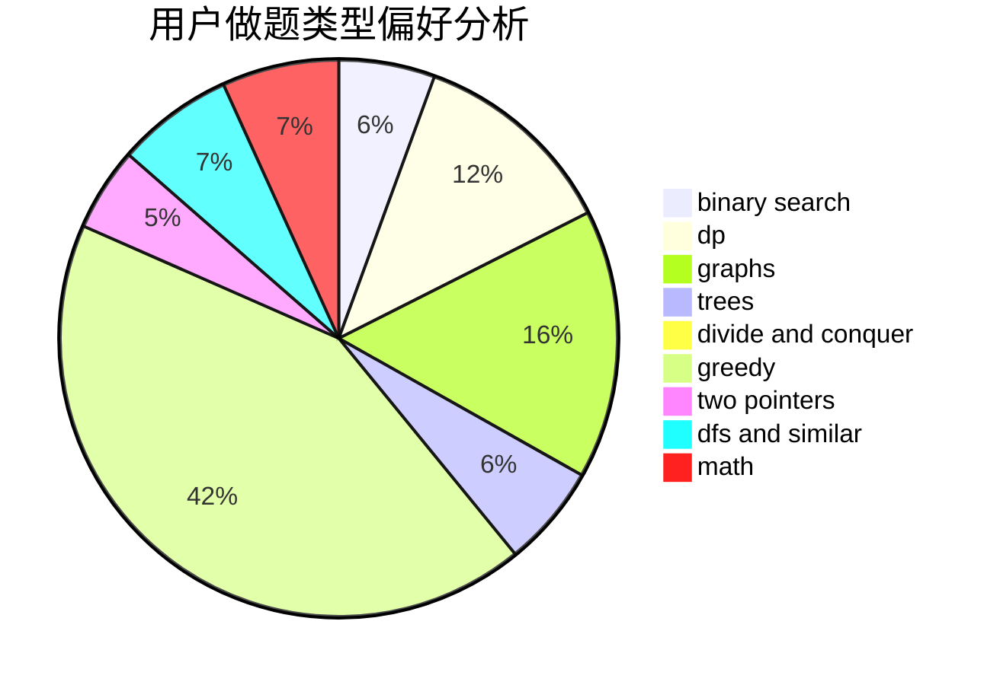

# Simon_Chen

<!-- tabs:start -->

#### **用户提交结果分析**

#### **用户做题类型偏好分析**

<!-- tabs:end -->
# 推荐题目
[963C](https://codeforces.com/contest/963/problem/C)
[1041C](https://codeforces.com/contest/1041/problem/C)
[808A](https://codeforces.com/contest/808/problem/A)
[804D](https://codeforces.com/contest/804/problem/D)
[1280A](https://codeforces.com/contest/1280/problem/A)
[1307F](https://codeforces.com/contest/1307/problem/F)
[864D](https://codeforces.com/contest/864/problem/D)
[199E](https://codeforces.com/contest/199/problem/E)
[1248E](https://codeforces.com/contest/1248/problem/E)
[863C](https://codeforces.com/contest/863/problem/C)
