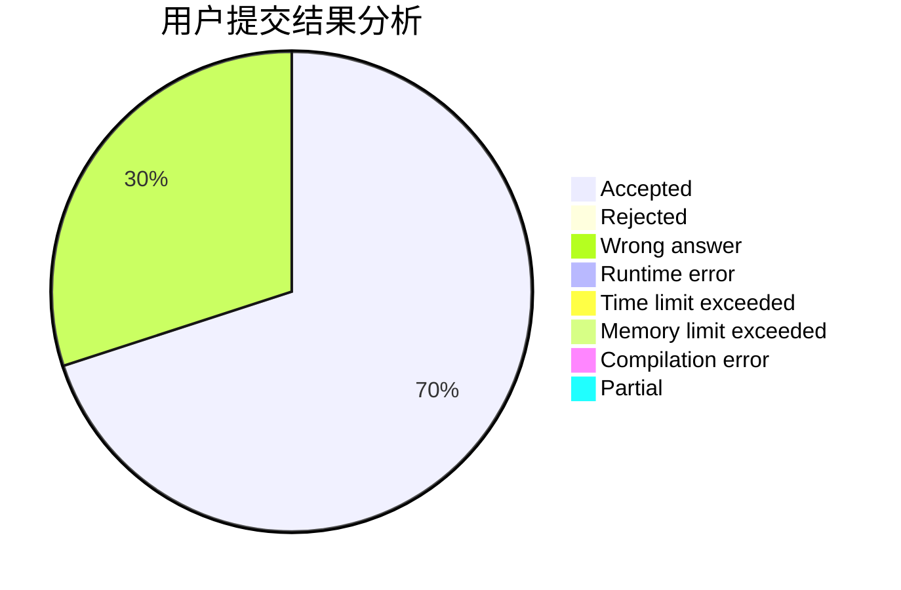
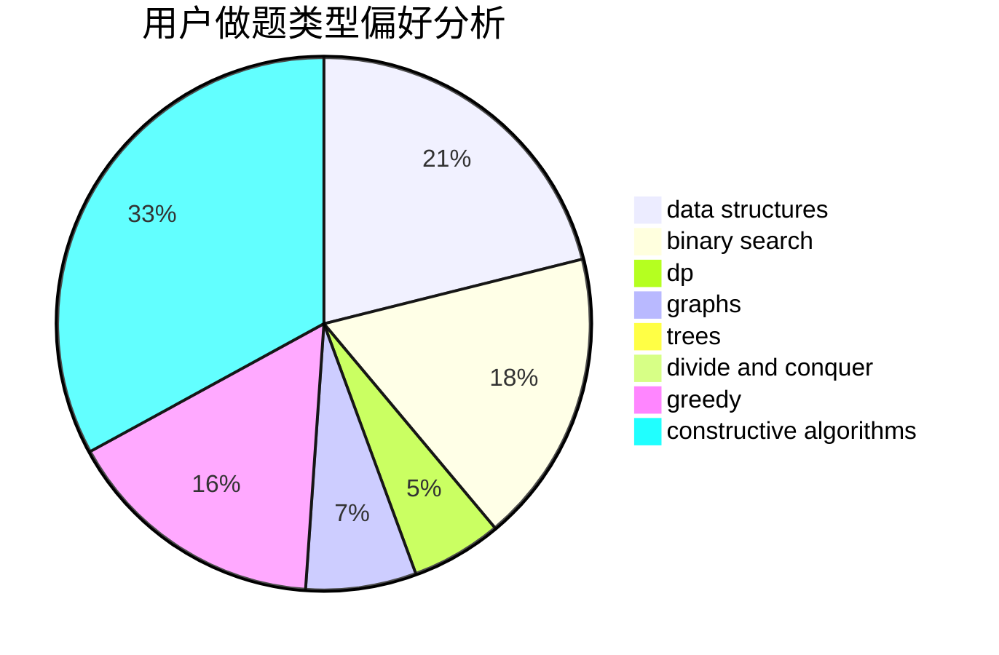

# A_Cool_Pig

<!-- tabs:start -->

#### **用户提交结果分析**

#### **用户做题类型偏好分析**

#### **用户错题知识点分析**

<!-- tabs:end -->
# 推荐题目
[1504D](https://codeforces.com/contest/1504/problem/D)		dsu,graphs,sortings,trees		  
[1374C](https://codeforces.com/contest/1374/problem/C)		greedy,
                        strings		  
[1505D](https://codeforces.com/contest/1505/problem/D)		number theory		  
[1417C](https://codeforces.com/contest/1417/problem/C)		dsu,graphs,sortings,trees		  
[1143F](https://codeforces.com/contest/1143/problem/F)		dsu,graphs,sortings,trees		  
[1505B](https://codeforces.com/contest/1505/problem/B)		implementation,
                        number theory		  
[1207E](https://codeforces.com/contest/1207/problem/E)		bitmasks,
                        interactive,
                        math		  
[1505C](https://codeforces.com/contest/1505/problem/C)		implementation		  
[1505F](https://codeforces.com/contest/1505/problem/F)		math		  
[1031A](https://codeforces.com/contest/1031/problem/A)		implementation,
                        math		  
