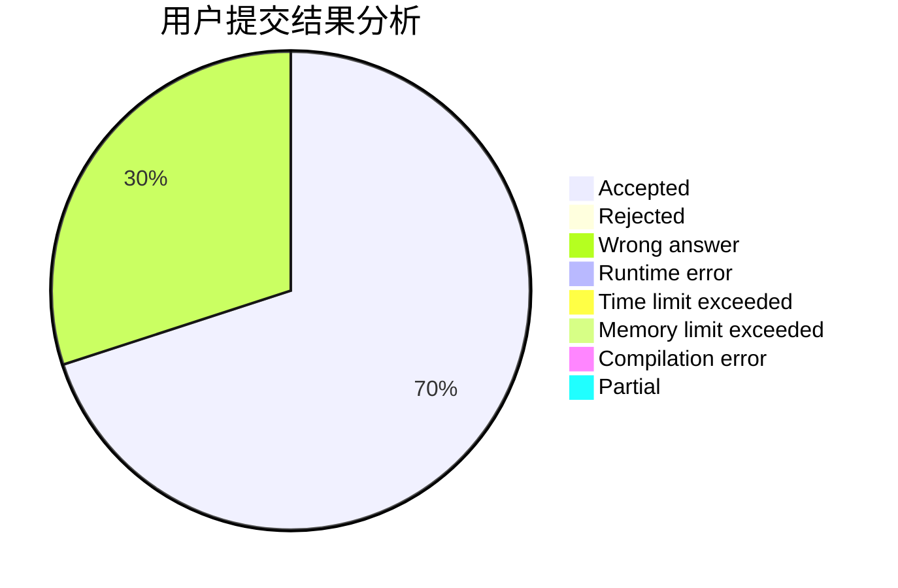
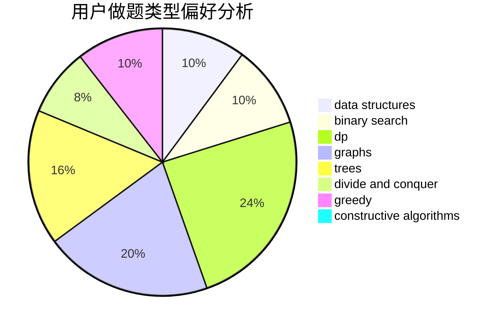

# A_Cool_Pig

<!-- tabs:start -->

#### **用户提交结果分析**

#### **用户做题类型偏好分析**

#### **用户错题知识点分析**

<!-- tabs:end -->
# 推荐题目
[1513C](https://codeforces.com/contest/1513/problem/C)		dp,
                        matrices		  
[1383B](https://codeforces.com/contest/1383/problem/B)		bitmasks,
                        constructive algorithms,
                        dp,
                        games,
                        greedy,
                        math		  
[152E](https://codeforces.com/contest/152/problem/E)		bitmasks,
                        dp,
                        graphs,
                        trees		  
[1424M](https://codeforces.com/contest/1424/problem/M)		graphs,
                        sortings		  
[1146A](https://codeforces.com/contest/1146/problem/A)		implementation,
                        strings		  
[152B](https://codeforces.com/contest/152/problem/B)		binary search,
                        implementation		  
[1213A](https://codeforces.com/contest/1213/problem/A)		math		  
[152D](https://codeforces.com/contest/152/problem/D)		brute force		  
[155A](https://codeforces.com/contest/155/problem/A)		brute force		  
[1031D](https://codeforces.com/contest/1031/problem/D)		greedy		  
