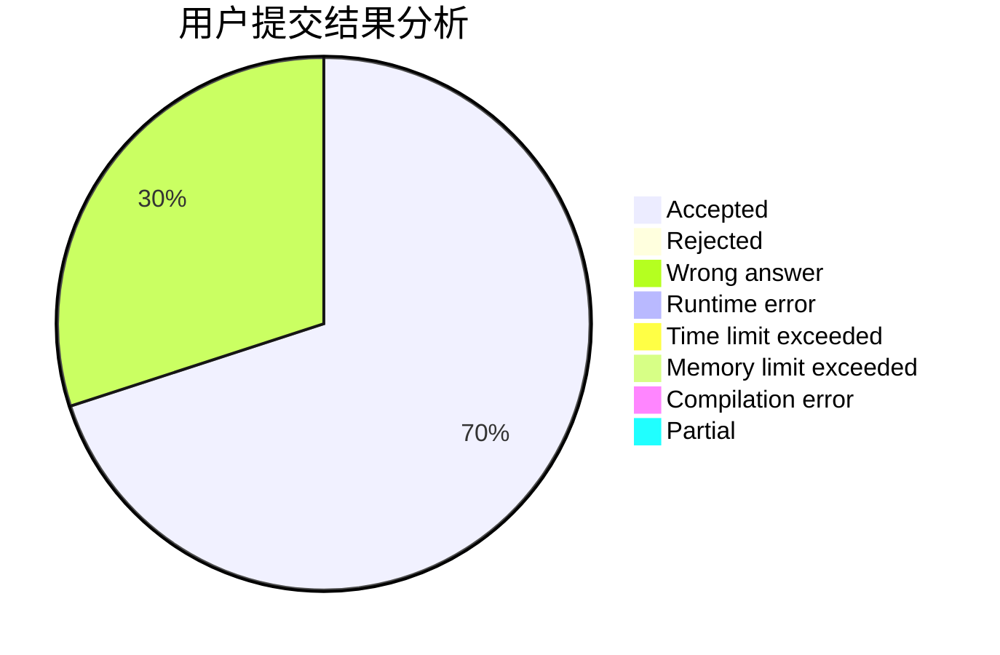
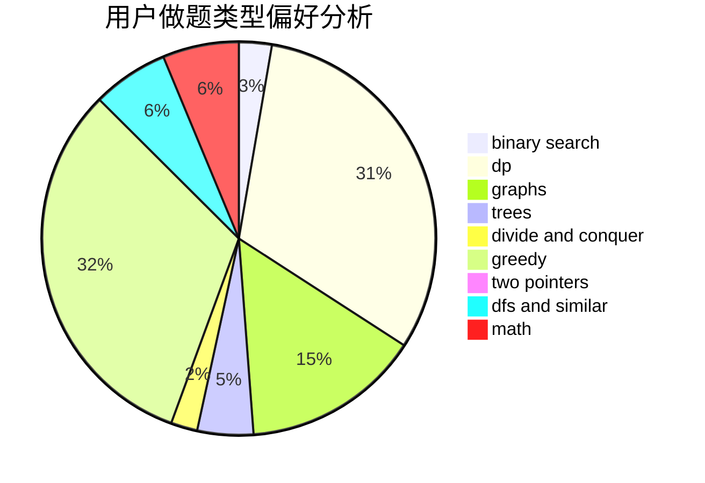

# A_Cool_Pig

<!-- tabs:start -->

#### **用户提交结果分析**

#### **用户做题类型偏好分析**

<!-- tabs:end -->
# 推荐题目
[1513C](https://codeforces.com/contest/1513/problem/C)
[1383B](https://codeforces.com/contest/1383/problem/B)
[152E](https://codeforces.com/contest/152/problem/E)
[1424M](https://codeforces.com/contest/1424/problem/M)
[1146A](https://codeforces.com/contest/1146/problem/A)
[152B](https://codeforces.com/contest/152/problem/B)
[1213A](https://codeforces.com/contest/1213/problem/A)
[152D](https://codeforces.com/contest/152/problem/D)
[155A](https://codeforces.com/contest/155/problem/A)
[1031D](https://codeforces.com/contest/1031/problem/D)
