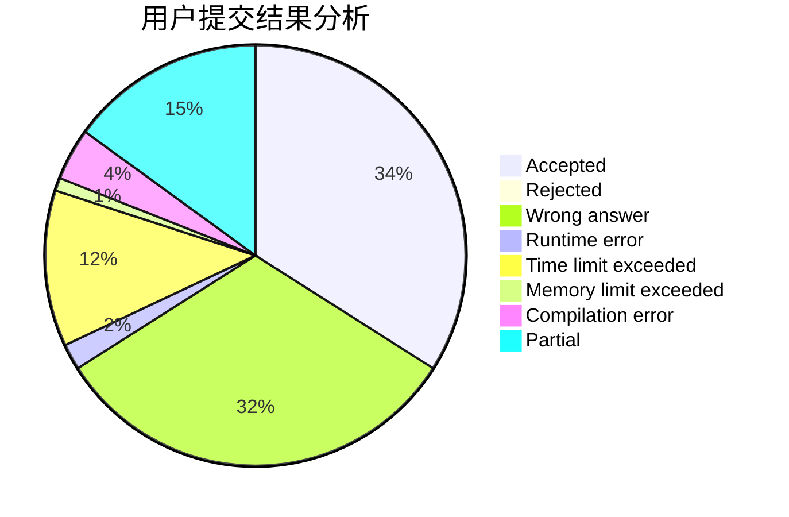
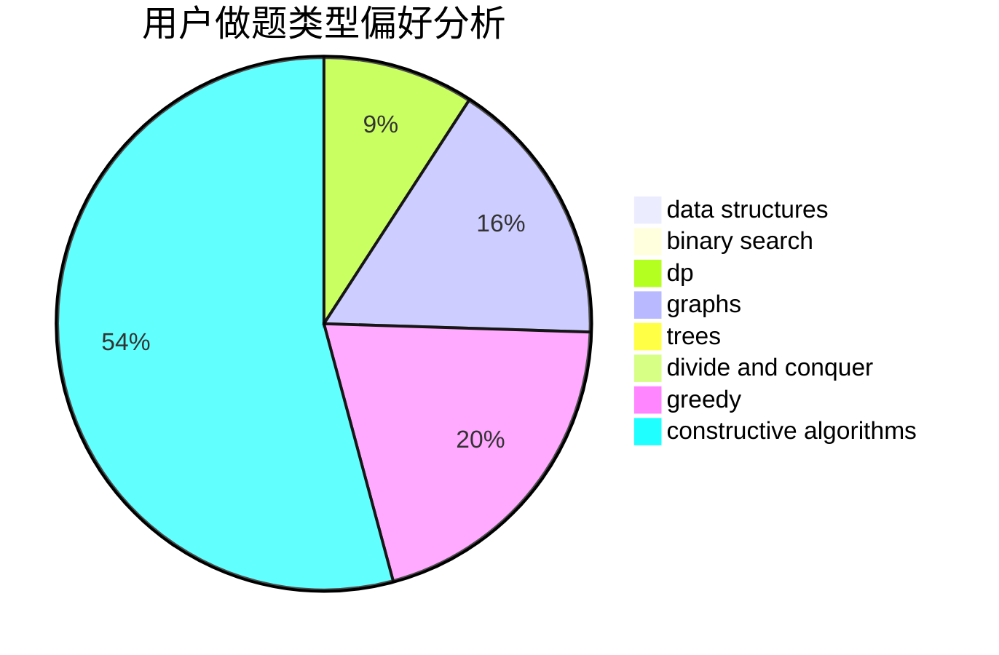

# SimulatedAnnealing

<!-- tabs:start -->

#### **用户提交结果分析**

#### **用户做题类型偏好分析**

#### **用户错题知识点分析**

<!-- tabs:end -->
# 推荐题目
[263A](https://codeforces.com/contest/263/problem/A)		implementation		  
[88A](https://codeforces.com/contest/88/problem/A)		brute force,
                        implementation		  
[460A](https://codeforces.com/contest/460/problem/A)		brute force,
                        implementation,
                        math		  
[21D](https://codeforces.com/contest/21/problem/D)		bitmasks,
                        graph matchings,
                        graphs		  
[403C](https://codeforces.com/contest/403/problem/C)		dsu,graphs,sortings,trees		  
[853B](https://codeforces.com/contest/853/problem/B)		greedy,
                        sortings,
                        two pointers		  
[1030A](https://codeforces.com/contest/1030/problem/A)		implementation		  
[1096G](https://codeforces.com/contest/1096/problem/G)		divide and conquer,
                        dp,
                        fft		  
[1118D2](https://codeforces.com/contest/1118D/problem/2)		binary search,
                        greedy		  
[1506E](https://codeforces.com/contest/1506/problem/E)		constructive algorithms,
                        implementation		  
