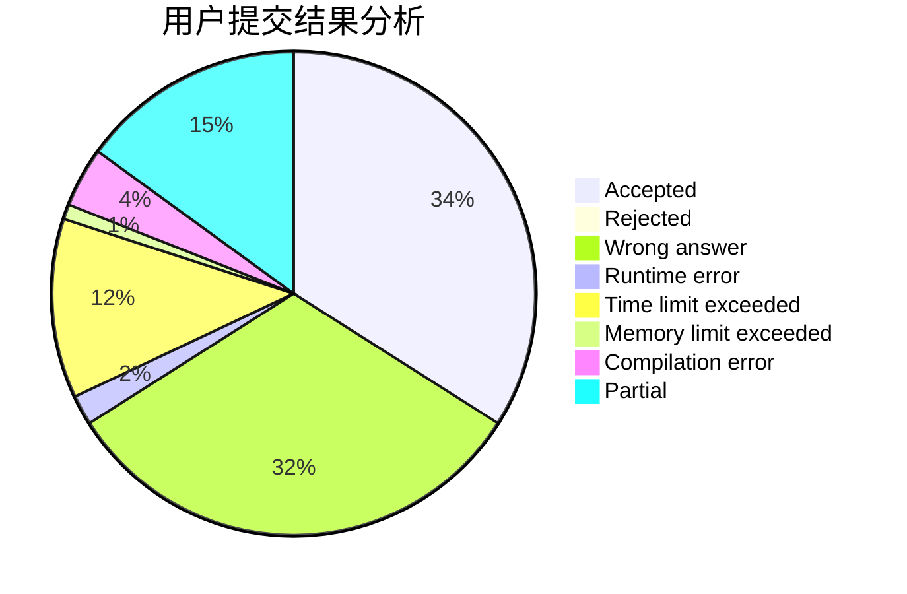
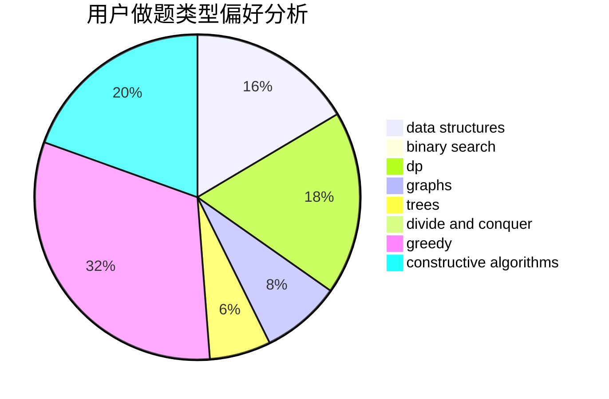

# SimulatedAnnealing

<!-- tabs:start -->

#### **用户提交结果分析**

#### **用户做题类型偏好分析**

#### **用户错题知识点分析**

<!-- tabs:end -->
# 推荐题目
[27D](https://codeforces.com/contest/27/problem/D)		2-sat,
                        dfs and similar,
                        dsu,
                        graphs		  
[909A](https://codeforces.com/contest/909/problem/A)		brute force,
                        greedy,
                        sortings		  
[479C](https://codeforces.com/contest/479/problem/C)		greedy,
                        sortings		  
[23B](https://codeforces.com/contest/23/problem/B)		constructive algorithms,
                        graphs,
                        math		  
[431D](https://codeforces.com/contest/431/problem/D)		binary search,
                        bitmasks,
                        combinatorics,
                        dp,
                        math		  
[871D](https://codeforces.com/contest/871/problem/D)		dsu,graphs,sortings,trees		  
[1030D](https://codeforces.com/contest/1030/problem/D)		geometry,
                        number theory		  
[1097C](https://codeforces.com/contest/1097/problem/C)		greedy,
                        implementation		  
[1120B](https://codeforces.com/contest/1120/problem/B)		constructive algorithms,
                        greedy,
                        implementation,
                        math		  
[158B](https://codeforces.com/contest/158/problem/B)		*special problem,
                        greedy,
                        implementation		  
