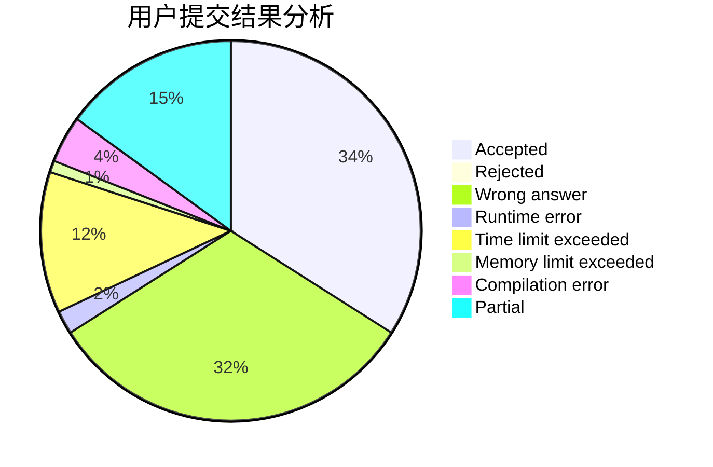
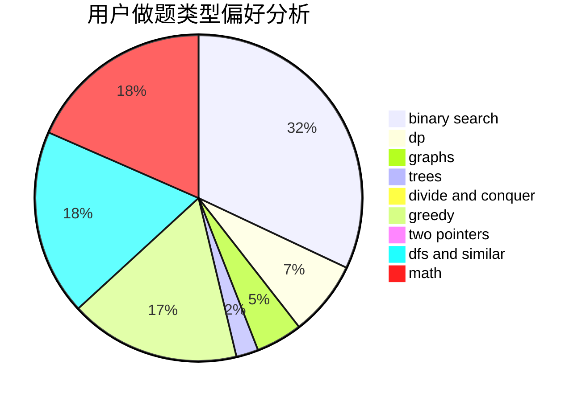

# SimulatedAnnealing

<!-- tabs:start -->

#### **用户提交结果分析**

#### **用户做题类型偏好分析**

<!-- tabs:end -->
# 推荐题目
[27D](https://codeforces.com/contest/27/problem/D)
[909A](https://codeforces.com/contest/909/problem/A)
[479C](https://codeforces.com/contest/479/problem/C)
[23B](https://codeforces.com/contest/23/problem/B)
[431D](https://codeforces.com/contest/431/problem/D)
[871D](https://codeforces.com/contest/871/problem/D)
[1030D](https://codeforces.com/contest/1030/problem/D)
[1097C](https://codeforces.com/contest/1097/problem/C)
[1120B](https://codeforces.com/contest/1120/problem/B)
[158B](https://codeforces.com/contest/158/problem/B)
