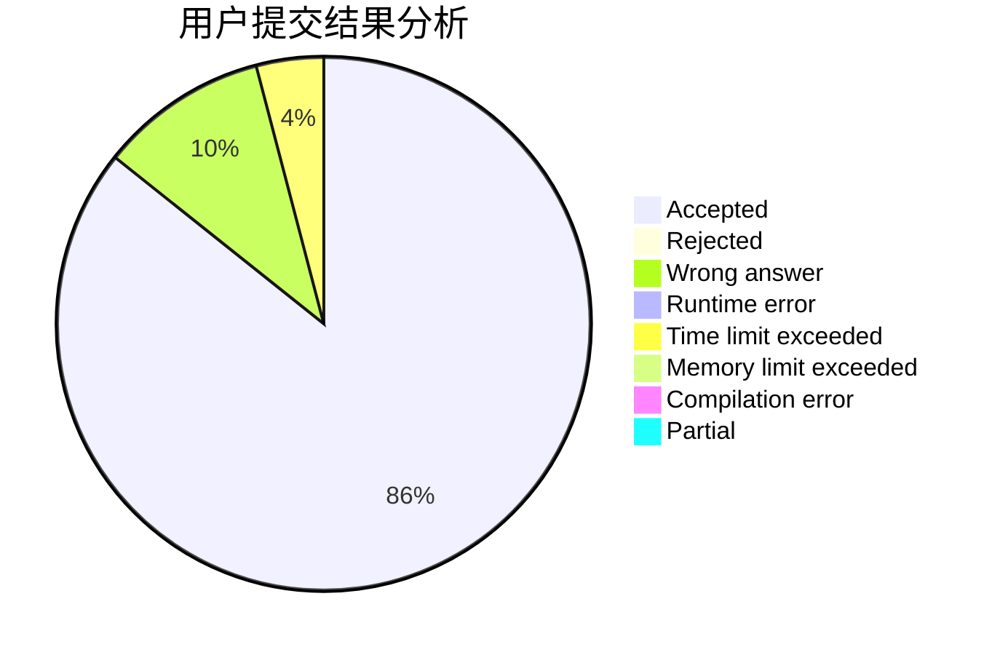
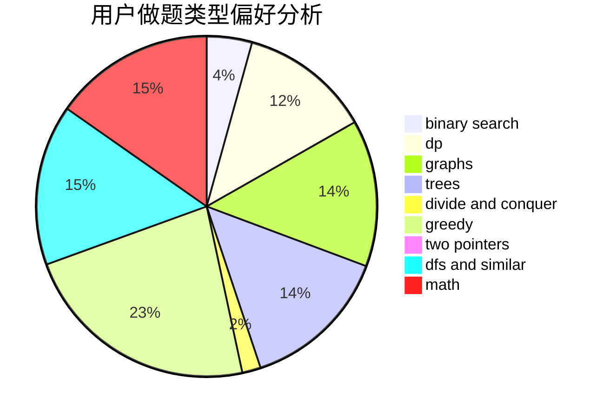

# Singularity0909

<!-- tabs:start -->

#### **用户提交结果分析**

#### **用户做题类型偏好分析**

<!-- tabs:end -->
# 推荐题目
[1100A](https://codeforces.com/contest/1100/problem/A)
[13771](https://codeforces.com/contest/1377/problem/1)
[1023A](https://codeforces.com/contest/1023/problem/A)
[16E](https://codeforces.com/contest/16/problem/E)
[755G](https://codeforces.com/contest/755/problem/G)
[136C](https://codeforces.com/contest/136/problem/C)
[884A](https://codeforces.com/contest/884/problem/A)
[1365G](https://codeforces.com/contest/1365/problem/G)
[653A](https://codeforces.com/contest/653/problem/A)
[902B](https://codeforces.com/contest/902/problem/B)
