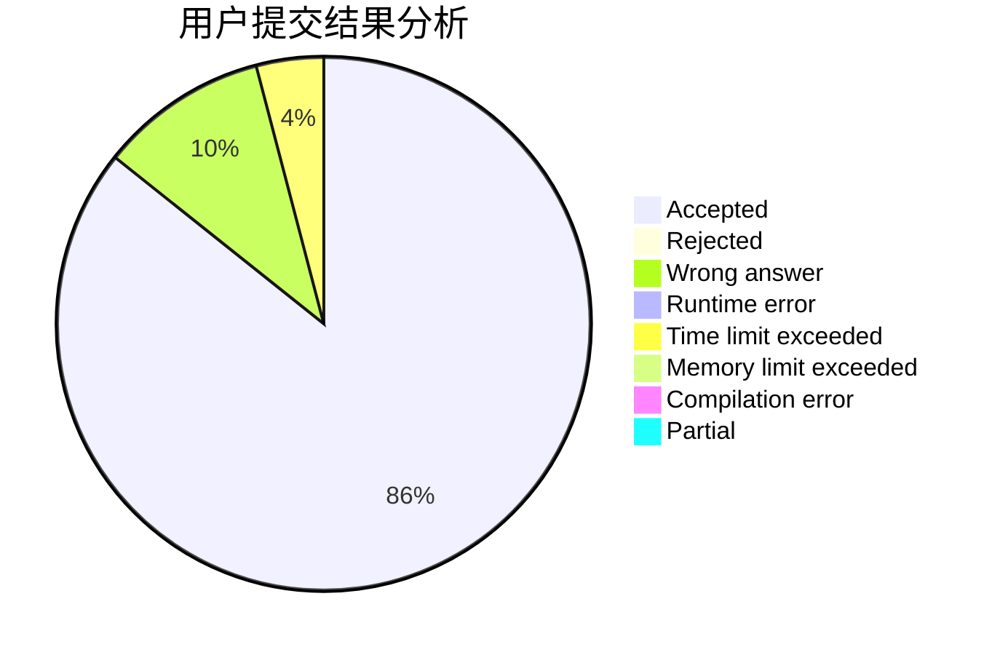
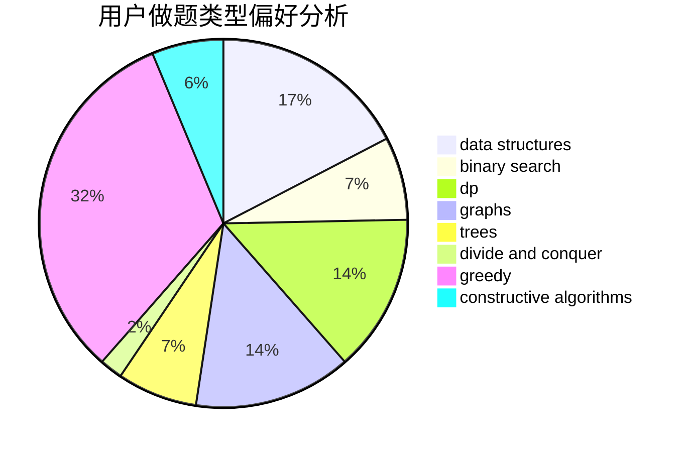

# Singularity0909

<!-- tabs:start -->

#### **用户提交结果分析**

#### **用户做题类型偏好分析**

#### **用户错题知识点分析**

<!-- tabs:end -->
# 推荐题目
[1100A](https://codeforces.com/contest/1100/problem/A)		implementation		  
[13771](https://codeforces.com/contest/1377/problem/1)		dsu,graphs,sortings,trees		  
[1023A](https://codeforces.com/contest/1023/problem/A)		brute force,
                        implementation,
                        strings		  
[16E](https://codeforces.com/contest/16/problem/E)		bitmasks,
                        dp,
                        probabilities		  
[755G](https://codeforces.com/contest/755/problem/G)		combinatorics,
                        divide and conquer,
                        dp,
                        fft,
                        math,
                        number theory		  
[136C](https://codeforces.com/contest/136/problem/C)		dsu,graphs,sortings,trees		  
[884A](https://codeforces.com/contest/884/problem/A)		implementation		  
[1365G](https://codeforces.com/contest/1365/problem/G)		bitmasks,
                        combinatorics,
                        constructive algorithms,
                        interactive,
                        math		  
[653A](https://codeforces.com/contest/653/problem/A)		brute force,
                        implementation,
                        sortings		  
[902B](https://codeforces.com/contest/902/problem/B)		dfs and similar,
                        dsu,
                        greedy		  
