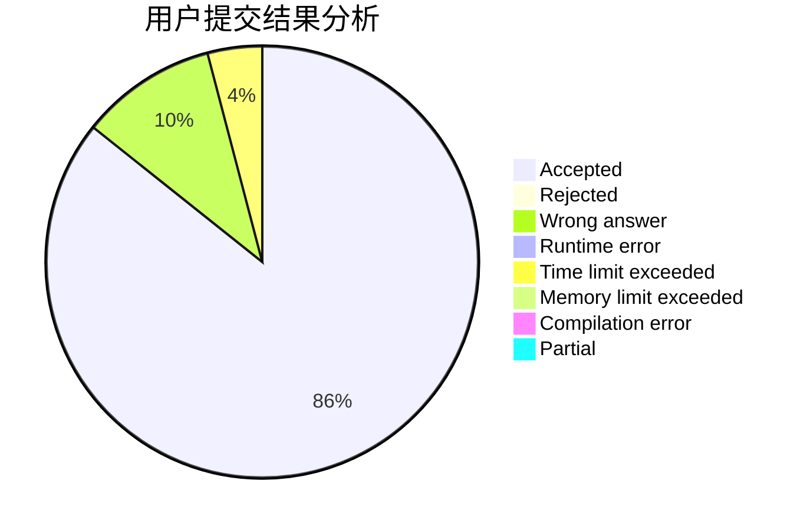
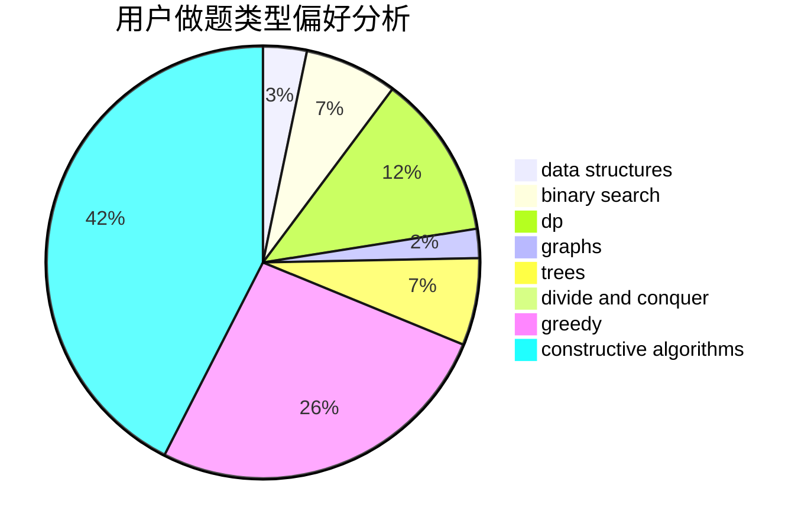

# Singularity0909

<!-- tabs:start -->

#### **用户提交结果分析**

#### **用户做题类型偏好分析**

#### **用户错题知识点分析**

<!-- tabs:end -->
# 推荐题目
[10C](https://codeforces.com/contest/10/problem/C)		number theory		  
[1369F](https://codeforces.com/contest/1369/problem/F)		dfs and similar,
                        dp,
                        games		  
[1020C](https://codeforces.com/contest/1020/problem/C)		dsu,graphs,sortings,trees		  
[1511G](https://codeforces.com/contest/1511/problem/G)		bitmasks,
                        brute force,
                        data structures,
                        games,
                        two pointers		  
[735A](https://codeforces.com/contest/735/problem/A)		implementation,
                        strings		  
[1362D](https://codeforces.com/contest/1362/problem/D)		dsu,graphs,sortings,trees		  
[864D](https://codeforces.com/contest/864/problem/D)		greedy,
                        implementation,
                        math		  
[1357D5](https://codeforces.com/contest/1357D/problem/5)		nan		  
[626F](https://codeforces.com/contest/626/problem/F)		dp		  
[884A](https://codeforces.com/contest/884/problem/A)		implementation		  
