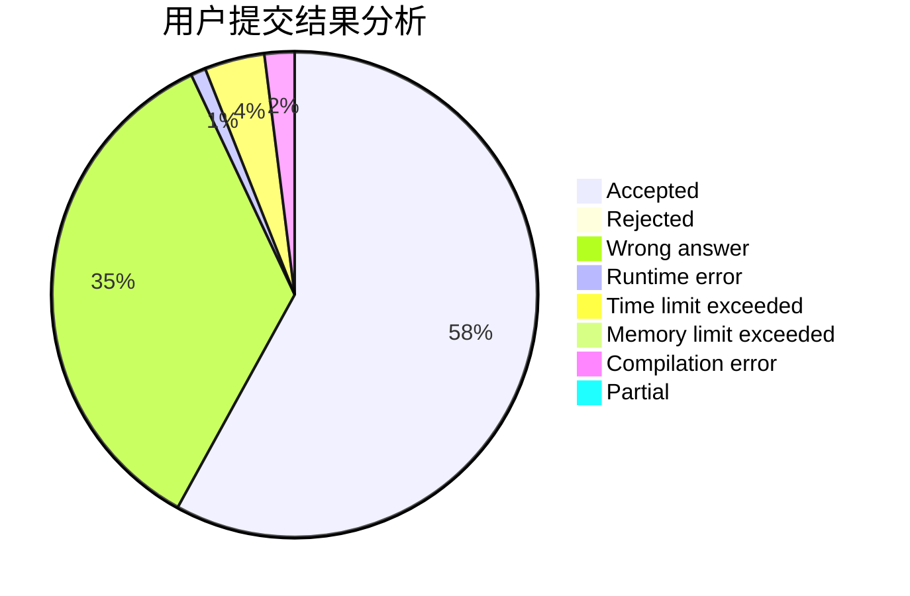
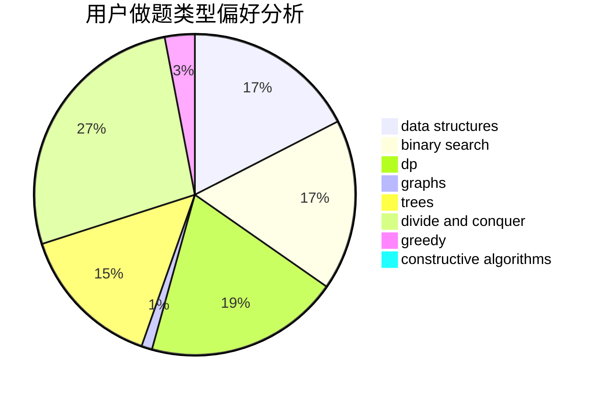

# Siyue

<!-- tabs:start -->

#### **用户提交结果分析**

#### **用户做题类型偏好分析**

#### **用户错题知识点分析**

<!-- tabs:end -->
# 推荐题目
[746G](https://codeforces.com/contest/746/problem/G)		constructive algorithms,
                        graphs,
                        trees		  
[367B](https://codeforces.com/contest/367/problem/B)		binary search,
                        data structures		  
[746B](https://codeforces.com/contest/746/problem/B)		implementation,
                        strings		  
[44G](https://codeforces.com/contest/44/problem/G)		data structures,
                        implementation		  
[199B](https://codeforces.com/contest/199/problem/B)		geometry		  
[620A](https://codeforces.com/contest/620/problem/A)		implementation,
                        math		  
[520A](https://codeforces.com/contest/520/problem/A)		implementation,
                        strings		  
[584C](https://codeforces.com/contest/584/problem/C)		constructive algorithms,
                        greedy,
                        strings		  
[704E](https://codeforces.com/contest/704/problem/E)		data structures,
                        geometry,
                        trees		  
[1107E](https://codeforces.com/contest/1107/problem/E)		dp		  
