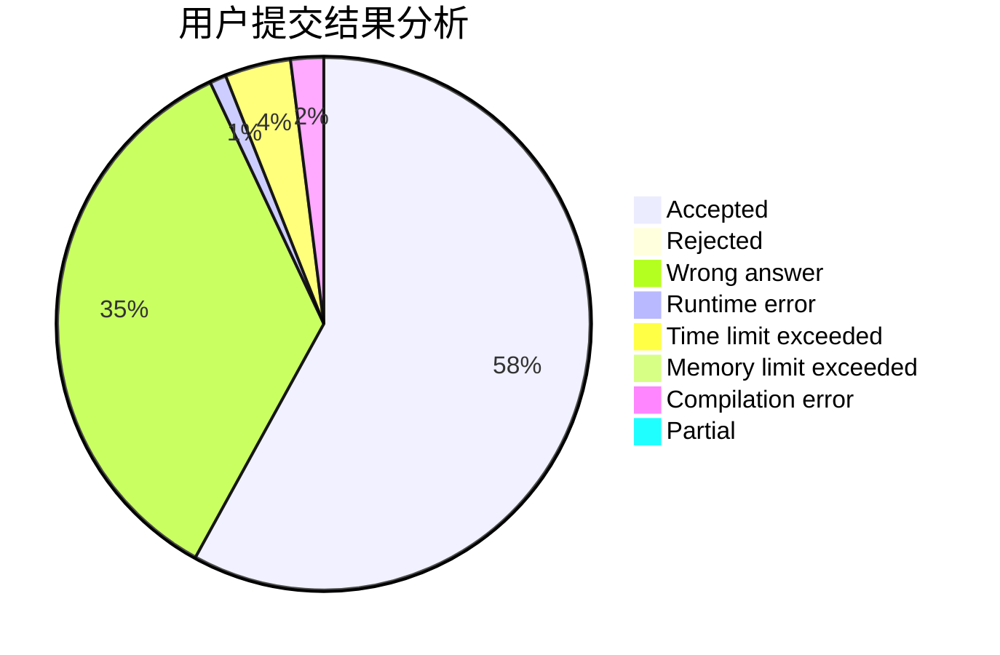
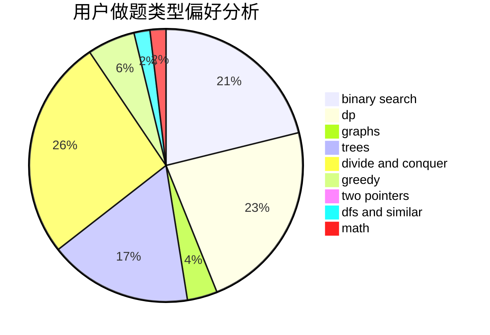

# Siyue

<!-- tabs:start -->

#### **用户提交结果分析**

#### **用户做题类型偏好分析**

<!-- tabs:end -->
# 推荐题目
[746G](https://codeforces.com/contest/746/problem/G)
[367B](https://codeforces.com/contest/367/problem/B)
[746B](https://codeforces.com/contest/746/problem/B)
[44G](https://codeforces.com/contest/44/problem/G)
[199B](https://codeforces.com/contest/199/problem/B)
[620A](https://codeforces.com/contest/620/problem/A)
[520A](https://codeforces.com/contest/520/problem/A)
[584C](https://codeforces.com/contest/584/problem/C)
[704E](https://codeforces.com/contest/704/problem/E)
[1107E](https://codeforces.com/contest/1107/problem/E)
