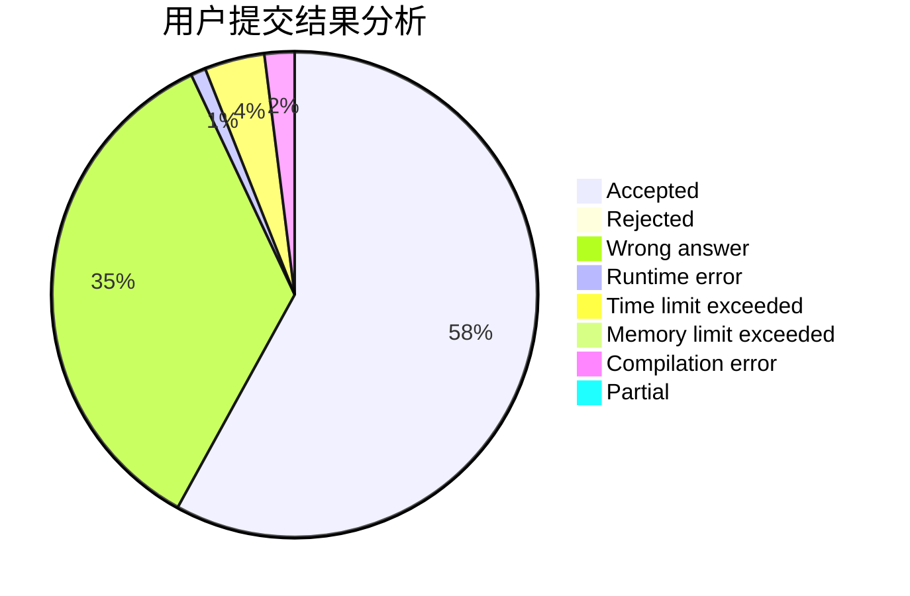
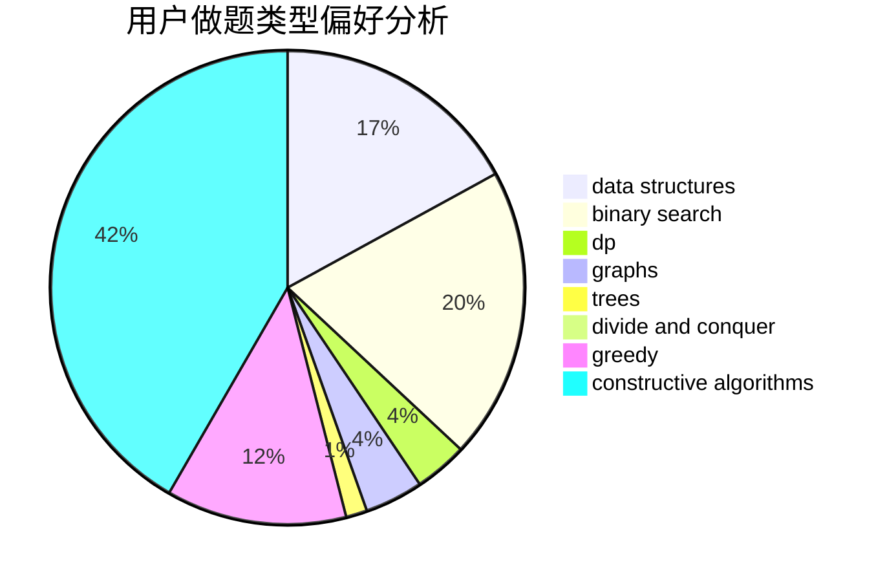

# Siyue

<!-- tabs:start -->

#### **用户提交结果分析**

#### **用户做题类型偏好分析**

#### **用户错题知识点分析**

<!-- tabs:end -->
# 推荐题目
[730A](https://codeforces.com/contest/730/problem/A)		greedy,
                        implementation		  
[33A](https://codeforces.com/contest/33/problem/A)		greedy,
                        implementation		  
[729B](https://codeforces.com/contest/729/problem/B)		dp,
                        implementation		  
[429B](https://codeforces.com/contest/429/problem/B)		dp		  
[171E](https://codeforces.com/contest/171/problem/E)		*special problem		  
[600E](https://codeforces.com/contest/600/problem/E)		data structures,
                        dfs and similar,
                        dsu,
                        trees		  
[4A](https://codeforces.com/contest/4/problem/A)		brute force,
                        math		  
[560A](https://codeforces.com/contest/560/problem/A)		implementation,
                        sortings		  
[681A](https://codeforces.com/contest/681/problem/A)		implementation		  
[1107B](https://codeforces.com/contest/1107/problem/B)		math,
                        number theory		  
