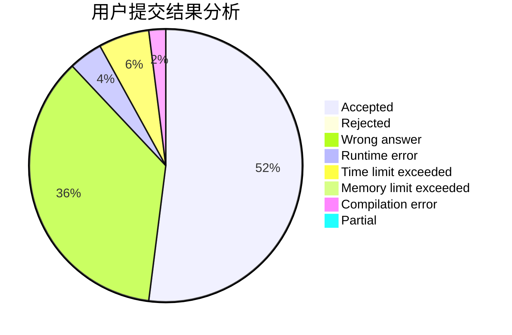
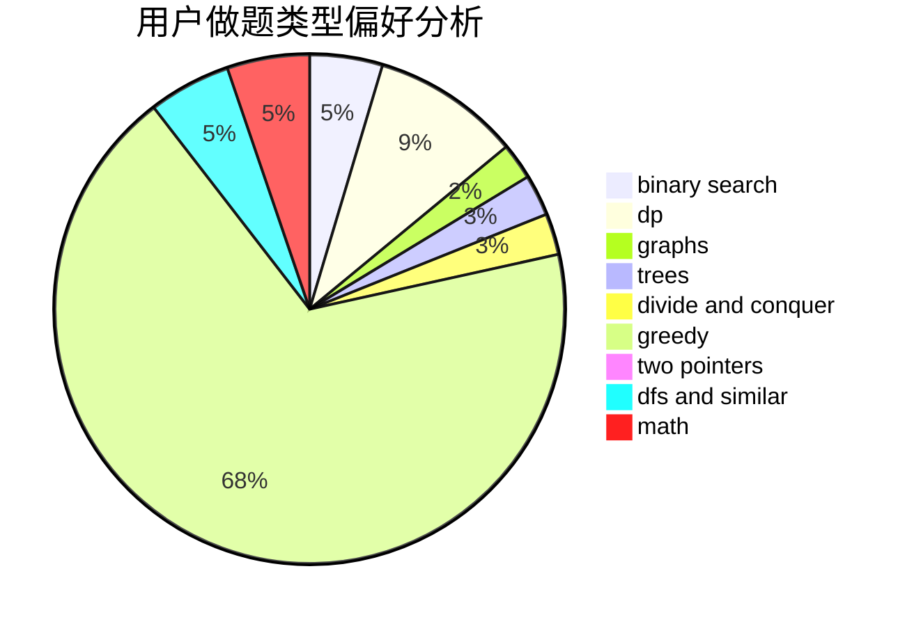

# Sky_Dreamer

<!-- tabs:start -->

#### **用户提交结果分析**

#### **用户做题类型偏好分析**

<!-- tabs:end -->
# 推荐题目
[677C](https://codeforces.com/contest/677/problem/C)
[1159F](https://codeforces.com/contest/1159/problem/F)
[591B](https://codeforces.com/contest/591/problem/B)
[1147C](https://codeforces.com/contest/1147/problem/C)
[521B](https://codeforces.com/contest/521/problem/B)
[553A](https://codeforces.com/contest/553/problem/A)
[429D](https://codeforces.com/contest/429/problem/D)
[411A](https://codeforces.com/contest/411/problem/A)
[158D](https://codeforces.com/contest/158/problem/D)
[167C](https://codeforces.com/contest/167/problem/C)
