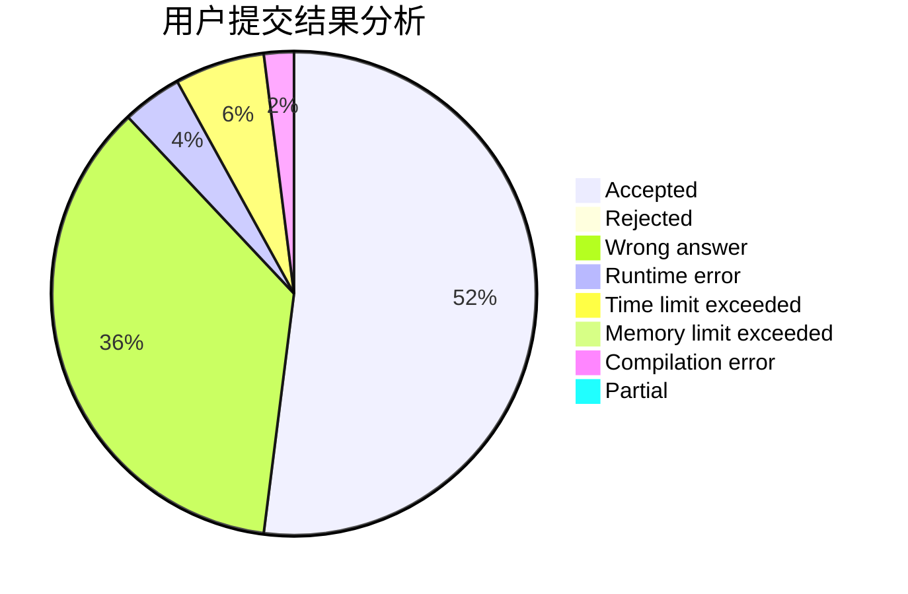
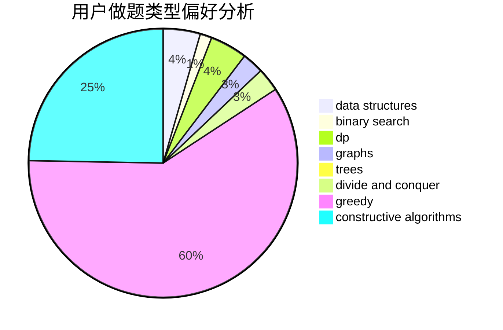

# Sky_Dreamer

<!-- tabs:start -->

#### **用户提交结果分析**

#### **用户做题类型偏好分析**

#### **用户错题知识点分析**

<!-- tabs:end -->
# 推荐题目
[677C](https://codeforces.com/contest/677/problem/C)		bitmasks,
                        combinatorics,
                        implementation,
                        strings		  
[1159F](https://codeforces.com/contest/1159/problem/F)		dsu,graphs,sortings,trees		  
[591B](https://codeforces.com/contest/591/problem/B)		implementation,
                        strings		  
[1147C](https://codeforces.com/contest/1147/problem/C)		games		  
[521B](https://codeforces.com/contest/521/problem/B)		dsu,graphs,sortings,trees		  
[553A](https://codeforces.com/contest/553/problem/A)		combinatorics,
                        dp,
                        math		  
[429D](https://codeforces.com/contest/429/problem/D)		data structures,
                        divide and conquer,
                        geometry		  
[411A](https://codeforces.com/contest/411/problem/A)		*special problem,
                        implementation		  
[158D](https://codeforces.com/contest/158/problem/D)		*special problem,
                        brute force,
                        number theory		  
[167C](https://codeforces.com/contest/167/problem/C)		games,
                        math		  
