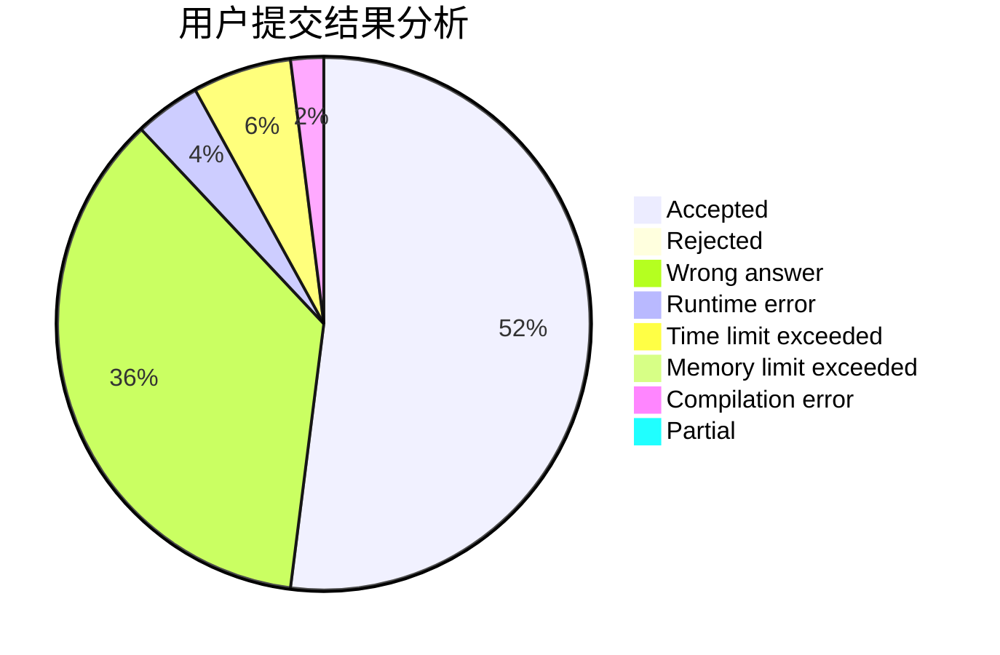
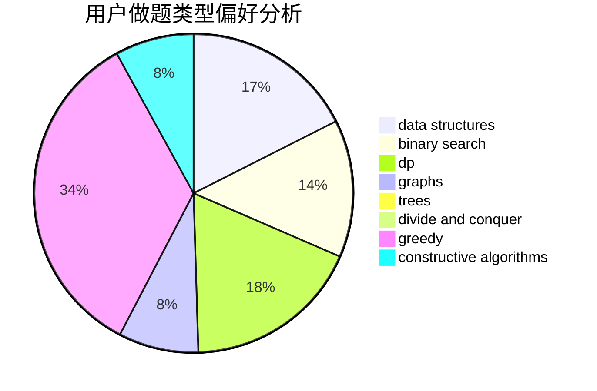

# Sky_Dreamer

<!-- tabs:start -->

#### **用户提交结果分析**

#### **用户做题类型偏好分析**

#### **用户错题知识点分析**

<!-- tabs:end -->
# 推荐题目
[653C](https://codeforces.com/contest/653/problem/C)		brute force,
                        implementation		  
[1157D](https://codeforces.com/contest/1157/problem/D)		constructive algorithms,
                        greedy,
                        math		  
[570E](https://codeforces.com/contest/570/problem/E)		combinatorics,
                        dp		  
[1145B](https://codeforces.com/contest/1145/problem/B)		brute force		  
[500B](https://codeforces.com/contest/500/problem/B)		dfs and similar,
                        dsu,
                        graphs,
                        greedy,
                        math,
                        sortings		  
[529B](https://codeforces.com/contest/529/problem/B)		brute force,
                        greedy,
                        sortings		  
[3C](https://codeforces.com/contest/3/problem/C)		brute force,
                        games,
                        implementation		  
[380C](https://codeforces.com/contest/380/problem/C)		data structures,
                        schedules		  
[1506G](https://codeforces.com/contest/1506/problem/G)		brute force,
                        data structures,
                        dp,
                        greedy,
                        strings		  
[1511B](https://codeforces.com/contest/1511/problem/B)		constructive algorithms,
                        math,
                        number theory		  
