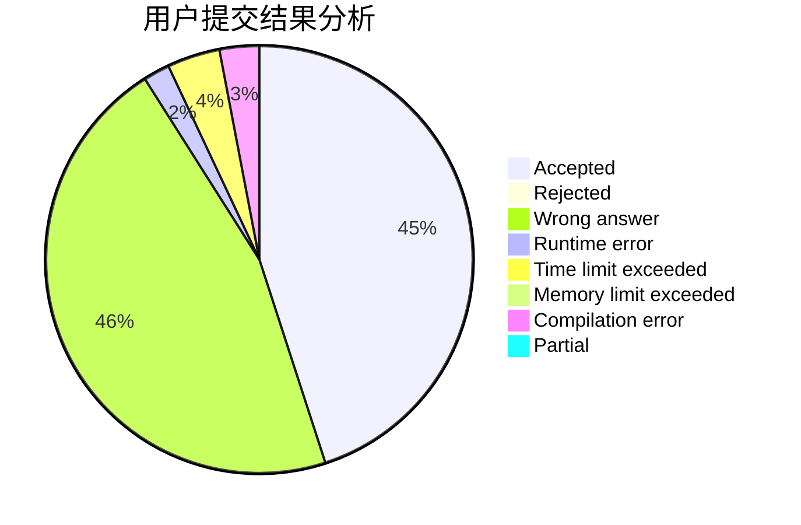
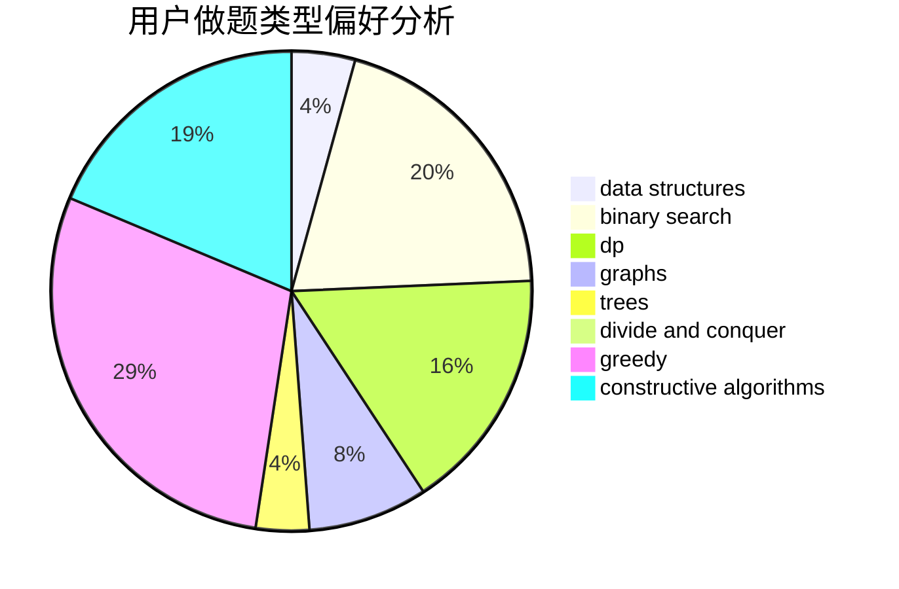
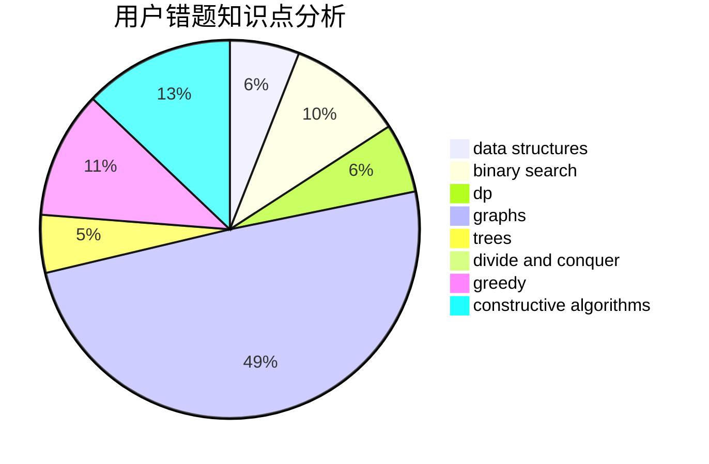

# SleepZzz
<!-- tabs:start -->
#### **用户提交结果分析**

#### **用户做题类型偏好分析**

#### **用户错题知识点分析**

<!-- tabs:end -->
# 推荐题目
[Two Friends](http://codeforces.com/problemset/problem/8/D)		binary search,
                        geometry		  
[Sum of Prefix Sums](http://codeforces.com/problemset/problem/1303/G)		data structures,
                        divide and conquer,
                        geometry,
                        trees		  
[Fence](http://codeforces.com/problemset/problem/363/B)		brute force,
                        dp		  
[Multi-Subject Competition](http://codeforces.com/problemset/problem/1082/C)		greedy,
                        sortings		  
[Xor-tree](http://codeforces.com/problemset/problem/429/A)		dfs and similar,
                        trees		  
[Byteland coins](https://codeforces.com/contest/759/problem/E)		combinatorics,
                        dp,
                        math		  
[Random Teams](http://codeforces.com/problemset/problem/478/B)		combinatorics,
                        constructive algorithms,
                        greedy,
                        math		  
[Special Olympics](http://codeforces.com/problemset/problem/199/B)		geometry		  
[Substring Removal Game](http://codeforces.com/problemset/problem/1398/B)		games,
                        greedy,
                        sortings		  
[Wizard's Tour](http://codeforces.com/problemset/problem/858/F)		constructive algorithms,
                        dfs and similar,
                        graphs		  
<!-- tabs:start -->
#### **data structures**
[Two Friends](http://codeforces.com/problemset/problem/1303/G)		data structures,
                        divide and conquer,
                        geometry,
                        trees		  
[Sum of Prefix Sums](http://codeforces.com/problemset/problem/527/C)		binary search,
                        data structures,
                        implementation		  
[Fence](http://codeforces.com/problemset/problem/1406/D)		constructive algorithms,
                        data structures,
                        greedy,
                        math		  
[Multi-Subject Competition](https://codeforces.com/contest/1287/problem/D)		constructive algorithms,
                        data structures,
                        dfs and similar,
                        graphs,
                        greedy,
                        trees		  
[Xor-tree](http://codeforces.com/problemset/problem/220/B)		constructive algorithms,
                        data structures		  
[Byteland coins](http://codeforces.com/problemset/problem/1492/C)		binary search,
                        data structures,
                        dp,
                        greedy,
                        two pointers		  
[Random Teams](http://codeforces.com/problemset/problem/1490/G)		binary search,
                        data structures,
                        math		  
[Special Olympics](http://codeforces.com/problemset/problem/1479/D)		binary search,
                        bitmasks,
                        brute force,
                        data structures,
                        probabilities,
                        trees		  
[Substring Removal Game](http://codeforces.com/problemset/problem/1497/A)		brute force,
                        data structures,
                        greedy,
                        sortings		  
[Wizard's Tour](http://codeforces.com/problemset/problem/1491/C)		brute force,
                        data structures,
                        dp,
                        greedy,
                        implementation		  
#### **binary search**
[Two Friends](http://codeforces.com/problemset/problem/8/D)		binary search,
                        geometry		  
[Sum of Prefix Sums](http://codeforces.com/problemset/problem/727/F)		binary search,
                        dp,
                        greedy		  
[Fence](http://codeforces.com/problemset/problem/938/C)		binary search,
                        brute force,
                        constructive algorithms		  
[Multi-Subject Competition](http://codeforces.com/problemset/problem/527/C)		binary search,
                        data structures,
                        implementation		  
[Xor-tree](http://codeforces.com/problemset/problem/1060/C)		binary search,
                        implementation,
                        two pointers		  
[Byteland coins](http://codeforces.com/problemset/problem/1492/C)		binary search,
                        data structures,
                        dp,
                        greedy,
                        two pointers		  
[Random Teams](http://codeforces.com/problemset/problem/1463/D)		binary search,
                        constructive algorithms,
                        greedy,
                        two pointers		  
[Special Olympics](http://codeforces.com/problemset/problem/1490/G)		binary search,
                        data structures,
                        math		  
[Substring Removal Game](http://codeforces.com/problemset/problem/1479/D)		binary search,
                        bitmasks,
                        brute force,
                        data structures,
                        probabilities,
                        trees		  
[Wizard's Tour](http://codeforces.com/problemset/problem/1436/E)		binary search,
                        data structures,
                        two pointers		  
#### **dp**
[Two Friends](http://codeforces.com/problemset/problem/363/B)		brute force,
                        dp		  
[Sum of Prefix Sums](https://codeforces.com/contest/759/problem/E)		combinatorics,
                        dp,
                        math		  
[Fence](http://codeforces.com/problemset/problem/433/B)		dp,
                        implementation,
                        sortings		  
[Multi-Subject Competition](http://codeforces.com/problemset/problem/727/F)		binary search,
                        dp,
                        greedy		  
[Xor-tree](http://codeforces.com/problemset/problem/721/C)		dp,
                        graphs		  
[Byteland coins](http://codeforces.com/problemset/problem/1272/D)		brute force,
                        dp		  
[Random Teams](http://codeforces.com/problemset/problem/1385/D)		bitmasks,
                        brute force,
                        divide and conquer,
                        dp,
                        implementation		  
[Special Olympics](http://codeforces.com/problemset/problem/1461/F)		constructive algorithms,
                        dp,
                        greedy		  
[Substring Removal Game](https://codeforces.com/contest/1240/problem/B)		dp,
                        greedy,
                        two pointers		  
[Wizard's Tour](http://codeforces.com/problemset/problem/1492/C)		binary search,
                        data structures,
                        dp,
                        greedy,
                        two pointers		  
#### **graph**
[Two Friends](http://codeforces.com/problemset/problem/858/F)		constructive algorithms,
                        dfs and similar,
                        graphs		  
[Sum of Prefix Sums](http://codeforces.com/problemset/problem/721/C)		dp,
                        graphs		  
[Fence](http://codeforces.com/problemset/problem/388/B)		bitmasks,
                        constructive algorithms,
                        graphs,
                        implementation,
                        math		  
[Multi-Subject Competition](https://codeforces.com/contest/1287/problem/D)		constructive algorithms,
                        data structures,
                        dfs and similar,
                        graphs,
                        greedy,
                        trees		  
[Xor-tree](http://codeforces.com/problemset/problem/1487/C)		brute force,
                        constructive algorithms,
                        dfs and similar,
                        graphs,
                        greedy,
                        implementation,
                        math		  
[Byteland coins](http://codeforces.com/problemset/problem/1437/C)		dp,
                        flows,
                        graph matchings,
                        greedy,
                        math,
                        sortings		  
[Random Teams](http://codeforces.com/problemset/problem/1470/D)		constructive algorithms,
                        dfs and similar,
                        graph matchings,
                        graphs,
                        greedy		  
[Special Olympics](http://codeforces.com/problemset/problem/1476/C)		dp,
                        graphs,
                        greedy		  
[Substring Removal Game](http://codeforces.com/problemset/problem/1304/D)		constructive algorithms,
                        graphs,
                        greedy,
                        two pointers		  
[Wizard's Tour](http://codeforces.com/problemset/problem/1475/C)		combinatorics,
                        graphs,
                        math		  
#### **trees**
[Two Friends](http://codeforces.com/problemset/problem/1303/G)		data structures,
                        divide and conquer,
                        geometry,
                        trees		  
[Sum of Prefix Sums](http://codeforces.com/problemset/problem/429/A)		dfs and similar,
                        trees		  
[Fence](http://codeforces.com/problemset/problem/1361/D)		greedy,
                        implementation,
                        math,
                        trees		  
[Multi-Subject Competition](https://codeforces.com/contest/1287/problem/D)		constructive algorithms,
                        data structures,
                        dfs and similar,
                        graphs,
                        greedy,
                        trees		  
[Xor-tree](http://codeforces.com/problemset/problem/1479/D)		binary search,
                        bitmasks,
                        brute force,
                        data structures,
                        probabilities,
                        trees		  
[Byteland coins](http://codeforces.com/problemset/problem/1511/C)		brute force,
                        data structures,
                        implementation,
                        trees		  
[Random Teams](http://codeforces.com/problemset/problem/1499/F)		combinatorics,
                        dfs and similar,
                        dp,
                        trees		  
[Special Olympics](http://codeforces.com/problemset/problem/1491/E)		brute force,
                        dfs and similar,
                        divide and conquer,
                        number theory,
                        trees		  
[Substring Removal Game](http://codeforces.com/problemset/problem/1466/D)		data structures,
                        greedy,
                        sortings,
                        trees		  
[Wizard's Tour](http://codeforces.com/problemset/problem/1495/D)		combinatorics,
                        dfs and similar,
                        graphs,
                        math,
                        shortest paths,
                        trees		  
#### **divide and conquer**
[Two Friends](http://codeforces.com/problemset/problem/1303/G)		data structures,
                        divide and conquer,
                        geometry,
                        trees		  
[Sum of Prefix Sums](http://codeforces.com/problemset/problem/873/D)		constructive algorithms,
                        divide and conquer		  
[Fence](http://codeforces.com/problemset/problem/1385/D)		bitmasks,
                        brute force,
                        divide and conquer,
                        dp,
                        implementation		  
[Multi-Subject Competition](http://codeforces.com/problemset/problem/1461/D)		binary search,
                        brute force,
                        data structures,
                        divide and conquer,
                        implementation,
                        sortings		  
[Xor-tree](http://codeforces.com/problemset/problem/1466/G)		combinatorics,
                        divide and conquer,
                        hashing,
                        math,
                        string suffix structures,
                        strings		  
[Byteland coins](http://codeforces.com/problemset/problem/1490/D)		dfs and similar,
                        divide and conquer,
                        implementation		  
[Random Teams](https://codeforces.com/contest/1483/problem/C)		data structures,
                        divide and conquer,
                        dp		  
[Special Olympics](http://codeforces.com/problemset/problem/1491/E)		brute force,
                        dfs and similar,
                        divide and conquer,
                        number theory,
                        trees		  
[Substring Removal Game](http://codeforces.com/problemset/problem/1303/G)		data structures,
                        divide and conquer,
                        geometry,
                        trees		  
[Wizard's Tour](http://codeforces.com/problemset/problem/1494/D)		constructive algorithms,
                        data structures,
                        dfs and similar,
                        divide and conquer,
                        dsu,
                        greedy,
                        sortings,
                        trees		  
#### **greedy**
[Two Friends](http://codeforces.com/problemset/problem/1082/C)		greedy,
                        sortings		  
[Sum of Prefix Sums](http://codeforces.com/problemset/problem/478/B)		combinatorics,
                        constructive algorithms,
                        greedy,
                        math		  
[Fence](http://codeforces.com/problemset/problem/1398/B)		games,
                        greedy,
                        sortings		  
[Multi-Subject Competition](http://codeforces.com/problemset/problem/1054/G)		constructive algorithms,
                        greedy,
                        math		  
[Xor-tree](http://codeforces.com/problemset/problem/727/F)		binary search,
                        dp,
                        greedy		  
[Byteland coins](http://codeforces.com/problemset/problem/1361/D)		greedy,
                        implementation,
                        math,
                        trees		  
[Random Teams](http://codeforces.com/problemset/problem/1406/D)		constructive algorithms,
                        data structures,
                        greedy,
                        math		  
[Special Olympics](http://codeforces.com/problemset/problem/1236/A)		brute force,
                        greedy,
                        math		  
[Substring Removal Game](http://codeforces.com/problemset/problem/1461/F)		constructive algorithms,
                        dp,
                        greedy		  
[Wizard's Tour](https://codeforces.com/contest/1287/problem/D)		constructive algorithms,
                        data structures,
                        dfs and similar,
                        graphs,
                        greedy,
                        trees		  
#### **constructive algorithms**
[Two Friends](http://codeforces.com/problemset/problem/478/B)		combinatorics,
                        constructive algorithms,
                        greedy,
                        math		  
[Sum of Prefix Sums](http://codeforces.com/problemset/problem/858/F)		constructive algorithms,
                        dfs and similar,
                        graphs		  
[Fence](http://codeforces.com/problemset/problem/1054/G)		constructive algorithms,
                        greedy,
                        math		  
[Multi-Subject Competition](http://codeforces.com/problemset/problem/873/D)		constructive algorithms,
                        divide and conquer		  
[Xor-tree](http://codeforces.com/problemset/problem/938/C)		binary search,
                        brute force,
                        constructive algorithms		  
[Byteland coins](http://codeforces.com/problemset/problem/388/B)		bitmasks,
                        constructive algorithms,
                        graphs,
                        implementation,
                        math		  
[Random Teams](http://codeforces.com/problemset/problem/1406/D)		constructive algorithms,
                        data structures,
                        greedy,
                        math		  
[Special Olympics](http://codeforces.com/problemset/problem/1461/F)		constructive algorithms,
                        dp,
                        greedy		  
[Substring Removal Game](https://codeforces.com/contest/1287/problem/D)		constructive algorithms,
                        data structures,
                        dfs and similar,
                        graphs,
                        greedy,
                        trees		  
[Wizard's Tour](http://codeforces.com/problemset/problem/220/B)		constructive algorithms,
                        data structures		  
#### **sortings**
[Two Friends](http://codeforces.com/problemset/problem/1082/C)		greedy,
                        sortings		  
[Sum of Prefix Sums](http://codeforces.com/problemset/problem/1398/B)		games,
                        greedy,
                        sortings		  
[Fence](http://codeforces.com/problemset/problem/807/A)		implementation,
                        sortings		  
[Multi-Subject Competition](http://codeforces.com/problemset/problem/433/B)		dp,
                        implementation,
                        sortings		  
[Xor-tree](http://codeforces.com/problemset/problem/1121/A)		implementation,
                        sortings		  
[Byteland coins](https://codeforces.com/contest/1496/problem/C)		geometry,
                        greedy,
                        math,
                        sortings		  
[Random Teams](http://codeforces.com/problemset/problem/1495/A)		geometry,
                        greedy,
                        math,
                        sortings		  
[Special Olympics](http://codeforces.com/problemset/problem/1497/A)		brute force,
                        data structures,
                        greedy,
                        sortings		  
[Substring Removal Game](http://codeforces.com/problemset/problem/1427/A)		math,
                        sortings		  
[Wizard's Tour](http://codeforces.com/problemset/problem/1461/D)		binary search,
                        brute force,
                        data structures,
                        divide and conquer,
                        implementation,
                        sortings		  
<!-- tabs:end -->
