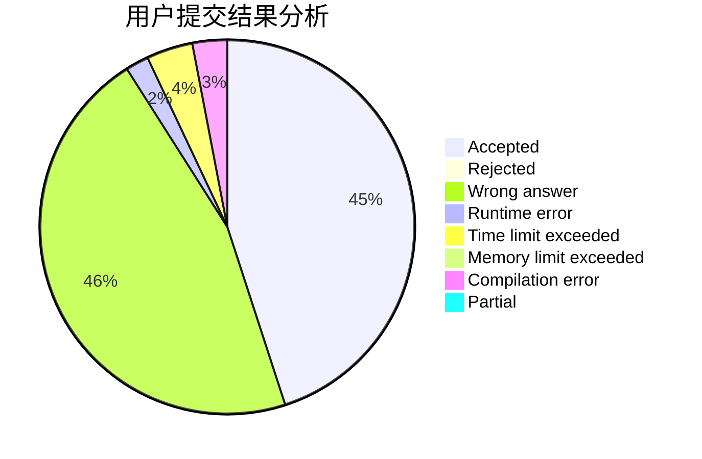
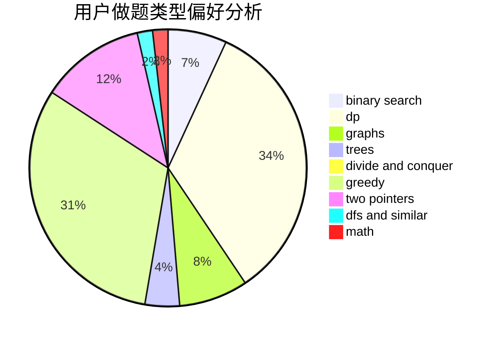

# SleepZzz

<!-- tabs:start -->

#### **用户提交结果分析**

#### **用户做题类型偏好分析**

<!-- tabs:end -->
# 推荐题目
[916B](https://codeforces.com/contest/916/problem/B)
[44E](https://codeforces.com/contest/44/problem/E)
[1312E](https://codeforces.com/contest/1312/problem/E)
[551C](https://codeforces.com/contest/551/problem/C)
[1082F](https://codeforces.com/contest/1082/problem/F)
[1055B](https://codeforces.com/contest/1055/problem/B)
[745C](https://codeforces.com/contest/745/problem/C)
[876C](https://codeforces.com/contest/876/problem/C)
[1281F](https://codeforces.com/contest/1281/problem/F)
[205A](https://codeforces.com/contest/205/problem/A)
