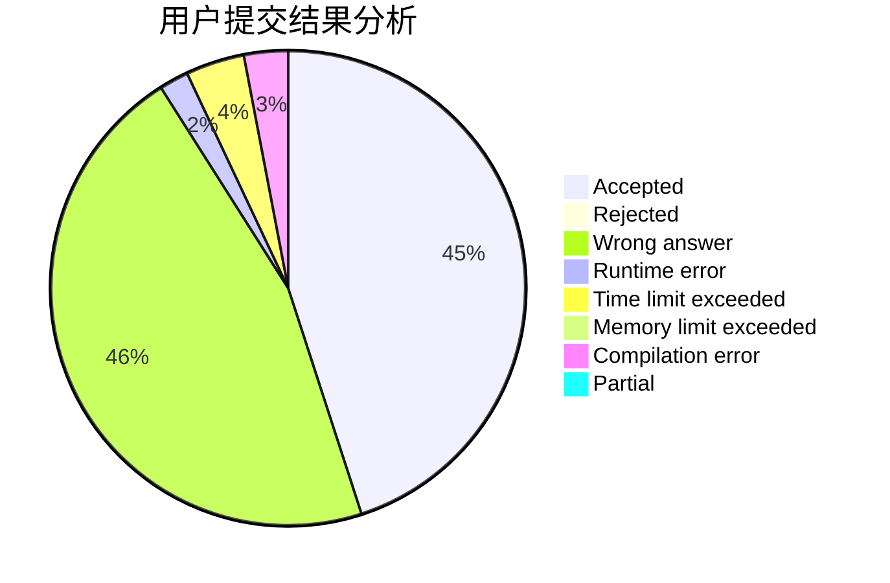
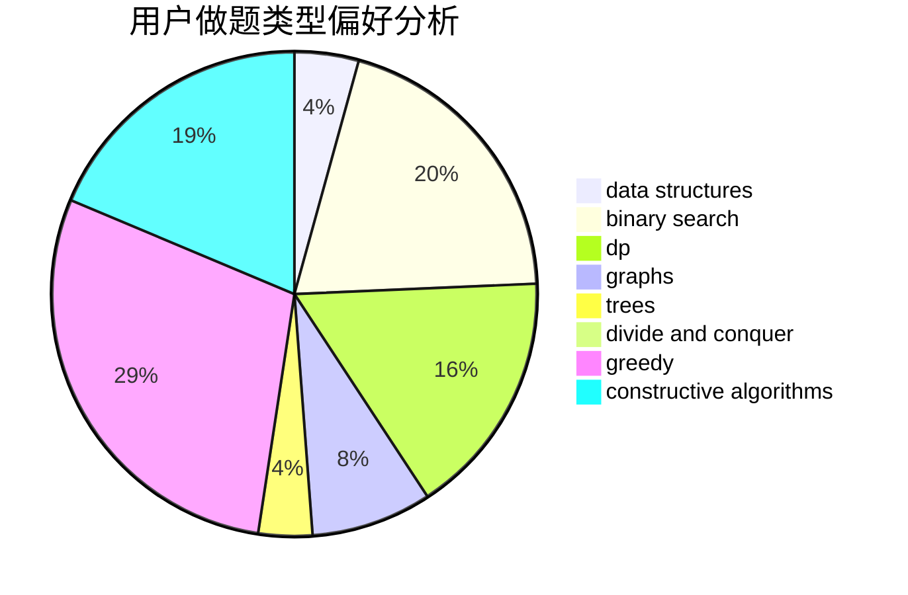
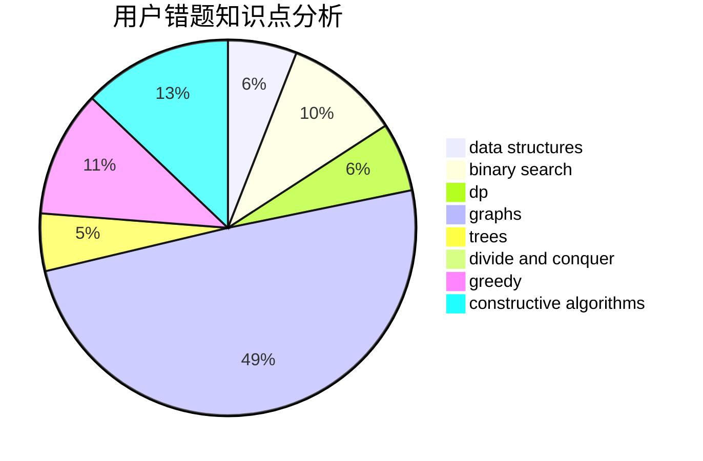

# SleepZzz

<!-- tabs:start -->

#### **用户提交结果分析**

#### **用户做题类型偏好分析**

#### **用户错题知识点分析**

<!-- tabs:end -->
# 推荐题目
[8D](https://codeforces.com/contest/8/problem/D)		binary search,
                        geometry		  
[429A](https://codeforces.com/contest/429/problem/A)		dfs and similar,
                        trees		  
[1303G](https://codeforces.com/contest/1303/problem/G)		data structures,
                        divide and conquer,
                        geometry,
                        trees		  
[527C](https://codeforces.com/contest/527/problem/C)		binary search,
                        data structures,
                        implementation		  
[1082C](https://codeforces.com/contest/1082/problem/C)		greedy,
                        sortings		  
[1054G](https://codeforces.com/contest/1054/problem/G)		constructive algorithms,
                        greedy,
                        math		  
[727F](https://codeforces.com/contest/727/problem/F)		binary search,
                        dp,
                        greedy		  
[858F](https://codeforces.com/contest/858/problem/F)		constructive algorithms,
                        dfs and similar,
                        graphs		  
[1272D](https://codeforces.com/contest/1272/problem/D)		brute force,
                        dp		  
[178F3](https://codeforces.com/contest/178F/problem/3)		nan		  
