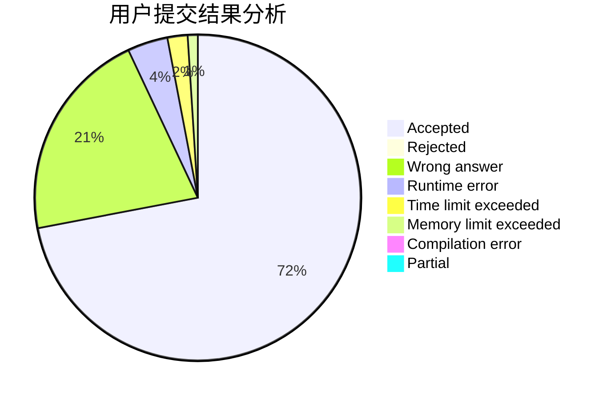
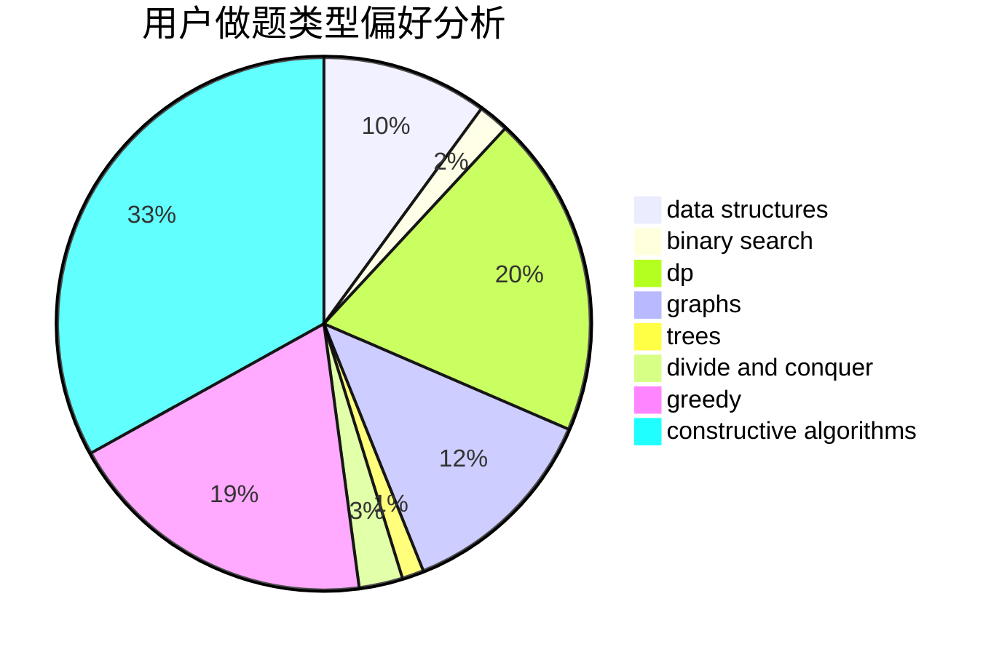

# Sloan_oneyy

<!-- tabs:start -->

#### **用户提交结果分析**

#### **用户做题类型偏好分析**

#### **用户错题知识点分析**

<!-- tabs:end -->
# 推荐题目
[1404A](https://codeforces.com/contest/1404/problem/A)		implementation,
                        strings		  
[1179D](https://codeforces.com/contest/1179/problem/D)		data structures,
                        dp,
                        trees		  
[934E](https://codeforces.com/contest/934/problem/E)		dsu,graphs,sortings,trees		  
[506C](https://codeforces.com/contest/506/problem/C)		dsu,graphs,sortings,trees		  
[1004F](https://codeforces.com/contest/1004/problem/F)		bitmasks,
                        data structures,
                        divide and conquer		  
[604A](https://codeforces.com/contest/604/problem/A)		implementation		  
[825D](https://codeforces.com/contest/825/problem/D)		binary search,
                        greedy,
                        implementation		  
[611H](https://codeforces.com/contest/611/problem/H)		constructive algorithms,
                        flows,
                        graphs		  
[471A](https://codeforces.com/contest/471/problem/A)		implementation		  
[1288D](https://codeforces.com/contest/1288/problem/D)		binary search,
                        bitmasks,
                        dp		  
