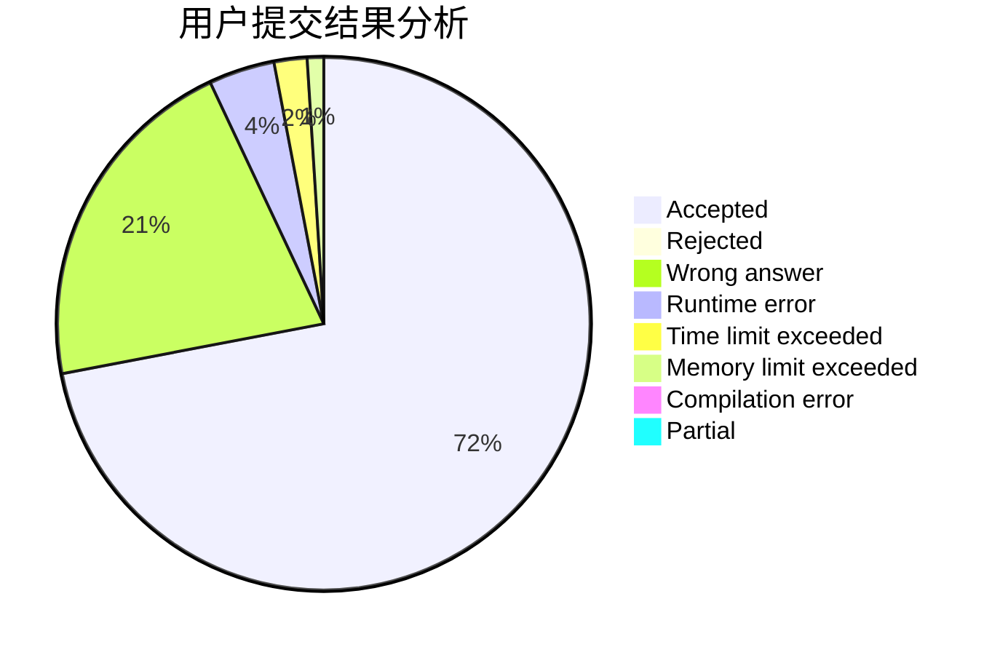
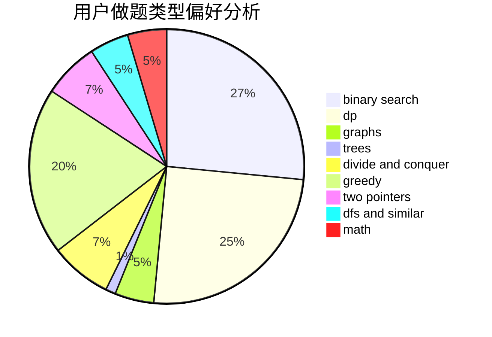

# Sloan_oneyy

<!-- tabs:start -->

#### **用户提交结果分析**

#### **用户做题类型偏好分析**

<!-- tabs:end -->
# 推荐题目
[1415C](https://codeforces.com/contest/1415/problem/C)
[1182C](https://codeforces.com/contest/1182/problem/C)
[956D](https://codeforces.com/contest/956/problem/D)
[526F](https://codeforces.com/contest/526/problem/F)
[1005A](https://codeforces.com/contest/1005/problem/A)
[622C](https://codeforces.com/contest/622/problem/C)
[844A](https://codeforces.com/contest/844/problem/A)
[631A](https://codeforces.com/contest/631/problem/A)
[489F](https://codeforces.com/contest/489/problem/F)
[1295F](https://codeforces.com/contest/1295/problem/F)
