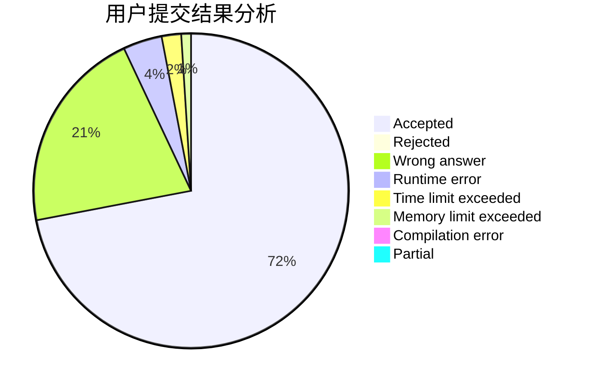
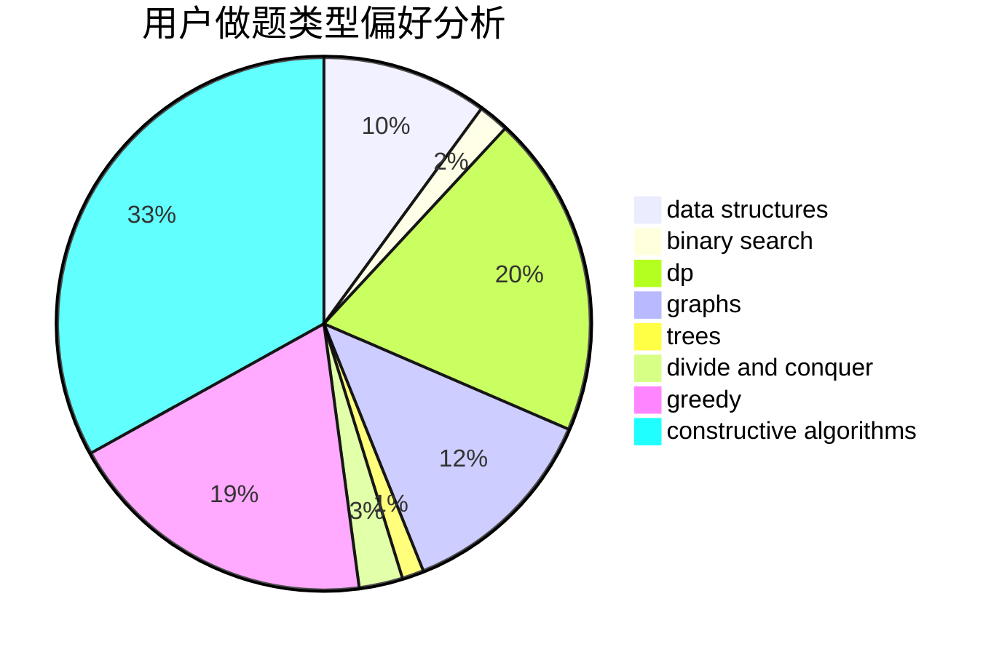

# Sloan_oneyy
<!-- tabs:start -->
#### **用户提交结果分析**

#### **用户做题类型偏好分析**

#### **用户错题知识点分析**

<!-- tabs:end -->
# 推荐题目
[Perfect Pair](http://codeforces.com/problemset/problem/317/A)		brute force		  
[AccurateLee](http://codeforces.com/problemset/problem/1369/B)		greedy,
                        implementation,
                        strings		  
[A Colourful Prospect](https://codeforces.com/contest/934/problem/E)		geometry,
                        graphs		  
[Fedor Runs for President](http://codeforces.com/problemset/problem/1179/D)		data structures,
                        dp,
                        trees		  
[Minimax Problem](http://codeforces.com/problemset/problem/1288/D)		binary search,
                        bitmasks,
                        dp		  
[MUH and Sticks](http://codeforces.com/problemset/problem/471/A)		implementation		  
[Minimum path](https://codeforces.com/contest/1072/problem/D)		greedy		  
[Uncowed Forces](http://codeforces.com/problemset/problem/604/A)		implementation		  
[Sereja and Stairs](http://codeforces.com/problemset/problem/381/B)		greedy,
                        implementation,
                        sortings		  
[Road Repairs](http://codeforces.com/problemset/problem/240/E)		dfs and similar,
                        graphs,
                        greedy		  
<!-- tabs:start -->
#### **data structures**
[Perfect Pair](http://codeforces.com/problemset/problem/1179/D)		data structures,
                        dp,
                        trees		  
[AccurateLee](http://codeforces.com/problemset/problem/475/D)		brute force,
                        data structures,
                        math		  
[A Colourful Prospect](http://codeforces.com/problemset/problem/1004/F)		bitmasks,
                        data structures,
                        divide and conquer		  
[Fedor Runs for President](http://codeforces.com/problemset/problem/1037/F)		combinatorics,
                        data structures,
                        math		  
[Minimax Problem](http://codeforces.com/problemset/problem/1209/F)		data structures,
                        dfs and similar,
                        graphs,
                        shortest paths,
                        strings,
                        trees		  
[MUH and Sticks](http://codeforces.com/problemset/problem/1051/G)		data structures,
                        dsu,
                        greedy		  
[Minimum path](http://codeforces.com/problemset/problem/526/F)		data structures,
                        divide and conquer		  
[Uncowed Forces](http://codeforces.com/problemset/problem/1492/C)		binary search,
                        data structures,
                        dp,
                        greedy,
                        two pointers		  
[Sereja and Stairs](http://codeforces.com/problemset/problem/1490/G)		binary search,
                        data structures,
                        math		  
[Road Repairs](http://codeforces.com/problemset/problem/1479/D)		binary search,
                        bitmasks,
                        brute force,
                        data structures,
                        probabilities,
                        trees		  
#### **binary search**
[Perfect Pair](http://codeforces.com/problemset/problem/1288/D)		binary search,
                        bitmasks,
                        dp		  
[AccurateLee](https://codeforces.com/contest/506/problem/C)		binary search,
                        greedy		  
[A Colourful Prospect](http://codeforces.com/problemset/problem/825/D)		binary search,
                        greedy,
                        implementation		  
[Fedor Runs for President](http://codeforces.com/problemset/problem/1492/C)		binary search,
                        data structures,
                        dp,
                        greedy,
                        two pointers		  
[Minimax Problem](http://codeforces.com/problemset/problem/1463/D)		binary search,
                        constructive algorithms,
                        greedy,
                        two pointers		  
[MUH and Sticks](http://codeforces.com/problemset/problem/1490/G)		binary search,
                        data structures,
                        math		  
[Minimum path](http://codeforces.com/problemset/problem/1479/D)		binary search,
                        bitmasks,
                        brute force,
                        data structures,
                        probabilities,
                        trees		  
[Uncowed Forces](http://codeforces.com/problemset/problem/1436/E)		binary search,
                        data structures,
                        two pointers		  
[Sereja and Stairs](http://codeforces.com/problemset/problem/1461/D)		binary search,
                        brute force,
                        data structures,
                        divide and conquer,
                        implementation,
                        sortings		  
[Road Repairs](http://codeforces.com/problemset/problem/1493/C)		binary search,
                        brute force,
                        constructive algorithms,
                        greedy,
                        strings		  
#### **dp**
[Perfect Pair](http://codeforces.com/problemset/problem/1179/D)		data structures,
                        dp,
                        trees		  
[AccurateLee](http://codeforces.com/problemset/problem/1288/D)		binary search,
                        bitmasks,
                        dp		  
[A Colourful Prospect](http://codeforces.com/problemset/problem/1156/D)		dfs and similar,
                        divide and conquer,
                        dp,
                        dsu,
                        trees		  
[Fedor Runs for President](http://codeforces.com/problemset/problem/1492/C)		binary search,
                        data structures,
                        dp,
                        greedy,
                        two pointers		  
[Minimax Problem](https://codeforces.com/contest/1457/problem/C)		brute force,
                        dp,
                        implementation		  
[MUH and Sticks](http://codeforces.com/problemset/problem/1491/C)		brute force,
                        data structures,
                        dp,
                        greedy,
                        implementation		  
[Minimum path](http://codeforces.com/problemset/problem/1437/C)		dp,
                        flows,
                        graph matchings,
                        greedy,
                        math,
                        sortings		  
[Uncowed Forces](http://codeforces.com/problemset/problem/1499/B)		brute force,
                        dp,
                        greedy,
                        implementation		  
[Sereja and Stairs](http://codeforces.com/problemset/problem/1491/D)		bitmasks,
                        constructive algorithms,
                        dp,
                        greedy,
                        math		  
[Road Repairs](http://codeforces.com/problemset/problem/1497/E1)		data structures,
                        dp,
                        greedy,
                        math,
                        number theory,
                        two pointers		  
#### **graph**
[Perfect Pair](https://codeforces.com/contest/934/problem/E)		geometry,
                        graphs		  
[AccurateLee](http://codeforces.com/problemset/problem/240/E)		dfs and similar,
                        graphs,
                        greedy		  
[A Colourful Prospect](http://codeforces.com/problemset/problem/1209/F)		data structures,
                        dfs and similar,
                        graphs,
                        shortest paths,
                        strings,
                        trees		  
[Fedor Runs for President](https://codeforces.com/contest/1104/problem/E)		constructive algorithms,
                        dfs and similar,
                        graphs,
                        math		  
[Minimax Problem](http://codeforces.com/problemset/problem/611/H)		constructive algorithms,
                        flows,
                        graphs		  
[MUH and Sticks](http://codeforces.com/problemset/problem/1010/F)		fft,
                        graphs,
                        trees		  
[Minimum path](http://codeforces.com/problemset/problem/1487/C)		brute force,
                        constructive algorithms,
                        dfs and similar,
                        graphs,
                        greedy,
                        implementation,
                        math		  
[Uncowed Forces](http://codeforces.com/problemset/problem/1437/C)		dp,
                        flows,
                        graph matchings,
                        greedy,
                        math,
                        sortings		  
[Sereja and Stairs](http://codeforces.com/problemset/problem/1470/D)		constructive algorithms,
                        dfs and similar,
                        graph matchings,
                        graphs,
                        greedy		  
[Road Repairs](http://codeforces.com/problemset/problem/1476/C)		dp,
                        graphs,
                        greedy		  
#### **trees**
[Perfect Pair](http://codeforces.com/problemset/problem/1179/D)		data structures,
                        dp,
                        trees		  
[AccurateLee](http://codeforces.com/problemset/problem/1209/F)		data structures,
                        dfs and similar,
                        graphs,
                        shortest paths,
                        strings,
                        trees		  
[A Colourful Prospect](http://codeforces.com/problemset/problem/1156/D)		dfs and similar,
                        divide and conquer,
                        dp,
                        dsu,
                        trees		  
[Fedor Runs for President](http://codeforces.com/problemset/problem/1010/F)		fft,
                        graphs,
                        trees		  
[Minimax Problem](http://codeforces.com/problemset/problem/1479/D)		binary search,
                        bitmasks,
                        brute force,
                        data structures,
                        probabilities,
                        trees		  
[MUH and Sticks](http://codeforces.com/problemset/problem/1511/C)		brute force,
                        data structures,
                        implementation,
                        trees		  
[Minimum path](http://codeforces.com/problemset/problem/1499/F)		combinatorics,
                        dfs and similar,
                        dp,
                        trees		  
[Uncowed Forces](http://codeforces.com/problemset/problem/1491/E)		brute force,
                        dfs and similar,
                        divide and conquer,
                        number theory,
                        trees		  
[Sereja and Stairs](http://codeforces.com/problemset/problem/1466/D)		data structures,
                        greedy,
                        sortings,
                        trees		  
[Road Repairs](http://codeforces.com/problemset/problem/1495/D)		combinatorics,
                        dfs and similar,
                        graphs,
                        math,
                        shortest paths,
                        trees		  
#### **divide and conquer**
[Perfect Pair](http://codeforces.com/problemset/problem/1004/F)		bitmasks,
                        data structures,
                        divide and conquer		  
[AccurateLee](http://codeforces.com/problemset/problem/1156/D)		dfs and similar,
                        divide and conquer,
                        dp,
                        dsu,
                        trees		  
[A Colourful Prospect](http://codeforces.com/problemset/problem/526/F)		data structures,
                        divide and conquer		  
[Fedor Runs for President](http://codeforces.com/problemset/problem/1461/D)		binary search,
                        brute force,
                        data structures,
                        divide and conquer,
                        implementation,
                        sortings		  
[Minimax Problem](http://codeforces.com/problemset/problem/1466/G)		combinatorics,
                        divide and conquer,
                        hashing,
                        math,
                        string suffix structures,
                        strings		  
[MUH and Sticks](http://codeforces.com/problemset/problem/1490/D)		dfs and similar,
                        divide and conquer,
                        implementation		  
[Minimum path](https://codeforces.com/contest/1483/problem/C)		data structures,
                        divide and conquer,
                        dp		  
[Uncowed Forces](http://codeforces.com/problemset/problem/1491/E)		brute force,
                        dfs and similar,
                        divide and conquer,
                        number theory,
                        trees		  
[Sereja and Stairs](http://codeforces.com/problemset/problem/1303/G)		data structures,
                        divide and conquer,
                        geometry,
                        trees		  
[Road Repairs](http://codeforces.com/problemset/problem/1494/D)		constructive algorithms,
                        data structures,
                        dfs and similar,
                        divide and conquer,
                        dsu,
                        greedy,
                        sortings,
                        trees		  
#### **greedy**
[Perfect Pair](http://codeforces.com/problemset/problem/1369/B)		greedy,
                        implementation,
                        strings		  
[AccurateLee](https://codeforces.com/contest/1072/problem/D)		greedy		  
[A Colourful Prospect](http://codeforces.com/problemset/problem/381/B)		greedy,
                        implementation,
                        sortings		  
[Fedor Runs for President](http://codeforces.com/problemset/problem/240/E)		dfs and similar,
                        graphs,
                        greedy		  
[Minimax Problem](http://codeforces.com/problemset/problem/1108/E1)		brute force,
                        greedy,
                        implementation		  
[MUH and Sticks](http://codeforces.com/problemset/problem/496/E)		greedy,
                        sortings		  
[Minimum path](https://codeforces.com/contest/506/problem/C)		binary search,
                        greedy		  
[Uncowed Forces](http://codeforces.com/problemset/problem/489/A)		greedy,
                        implementation,
                        sortings		  
[Sereja and Stairs](http://codeforces.com/problemset/problem/825/D)		binary search,
                        greedy,
                        implementation		  
[Road Repairs](http://codeforces.com/problemset/problem/1051/G)		data structures,
                        dsu,
                        greedy		  
#### **constructive algorithms**
[Perfect Pair](https://codeforces.com/contest/1104/problem/E)		constructive algorithms,
                        dfs and similar,
                        graphs,
                        math		  
[AccurateLee](http://codeforces.com/problemset/problem/611/H)		constructive algorithms,
                        flows,
                        graphs		  
[A Colourful Prospect](https://codeforces.com/contest/1261/problem/A)		constructive algorithms		  
[Fedor Runs for President](http://codeforces.com/problemset/problem/1493/A)		constructive algorithms,
                        greedy		  
[Minimax Problem](http://codeforces.com/problemset/problem/1463/D)		binary search,
                        constructive algorithms,
                        greedy,
                        two pointers		  
[MUH and Sticks](https://codeforces.com/contest/1456/problem/B)		bitmasks,
                        brute force,
                        constructive algorithms		  
[Minimum path](http://codeforces.com/problemset/problem/1492/D)		bitmasks,
                        constructive algorithms,
                        greedy,
                        math		  
[Uncowed Forces](https://codeforces.com/contest/1504/problem/D)		constructive algorithms,
                        games,
                        interactive		  
[Sereja and Stairs](https://codeforces.com/contest/1483/problem/A)		brute force,
                        constructive algorithms,
                        greedy,
                        implementation		  
[Road Repairs](https://codeforces.com/contest/1457/problem/D)		bitmasks,
                        brute force,
                        constructive algorithms		  
#### **sortings**
[Perfect Pair](http://codeforces.com/problemset/problem/381/B)		greedy,
                        implementation,
                        sortings		  
[AccurateLee](http://codeforces.com/problemset/problem/496/E)		greedy,
                        sortings		  
[A Colourful Prospect](http://codeforces.com/problemset/problem/489/A)		greedy,
                        implementation,
                        sortings		  
[Fedor Runs for President](http://codeforces.com/problemset/problem/1185/C1)		greedy,
                        sortings		  
[Minimax Problem](http://codeforces.com/problemset/problem/478/E)		brute force,
                        dfs and similar,
                        meet-in-the-middle,
                        sortings		  
[MUH and Sticks](http://codeforces.com/problemset/problem/1056/C)		greedy,
                        implementation,
                        interactive,
                        sortings		  
[Minimum path](https://codeforces.com/contest/1496/problem/C)		geometry,
                        greedy,
                        math,
                        sortings		  
[Uncowed Forces](http://codeforces.com/problemset/problem/1495/A)		geometry,
                        greedy,
                        math,
                        sortings		  
[Sereja and Stairs](http://codeforces.com/problemset/problem/1497/A)		brute force,
                        data structures,
                        greedy,
                        sortings		  
[Road Repairs](http://codeforces.com/problemset/problem/1427/A)		math,
                        sortings		  
<!-- tabs:end -->
