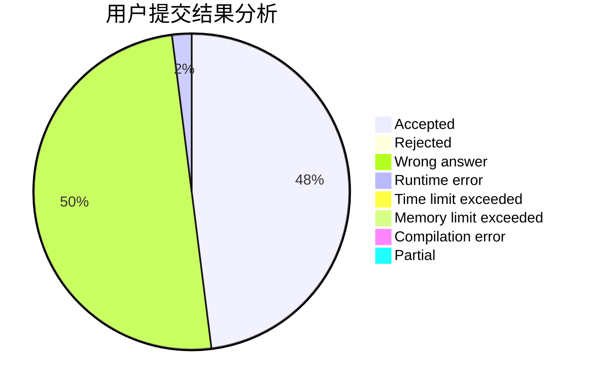
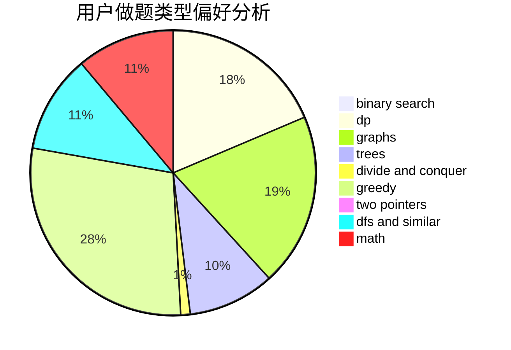

# SmartTurtle

<!-- tabs:start -->

#### **用户提交结果分析**

#### **用户做题类型偏好分析**

<!-- tabs:end -->
# 推荐题目
[993B](https://codeforces.com/contest/993/problem/B)
[1495C](https://codeforces.com/contest/1495/problem/C)
[584B](https://codeforces.com/contest/584/problem/B)
[764A](https://codeforces.com/contest/764/problem/A)
[914A](https://codeforces.com/contest/914/problem/A)
[13571](https://codeforces.com/contest/1357/problem/1)
[1510A](https://codeforces.com/contest/1510/problem/A)
[825F](https://codeforces.com/contest/825/problem/F)
[493D](https://codeforces.com/contest/493/problem/D)
[913H](https://codeforces.com/contest/913/problem/H)
