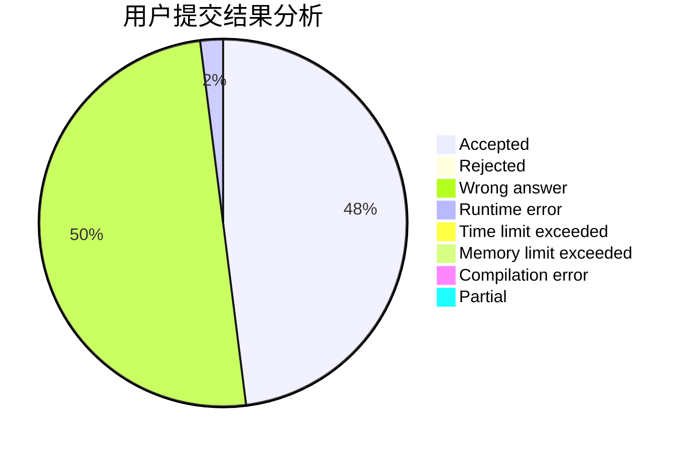
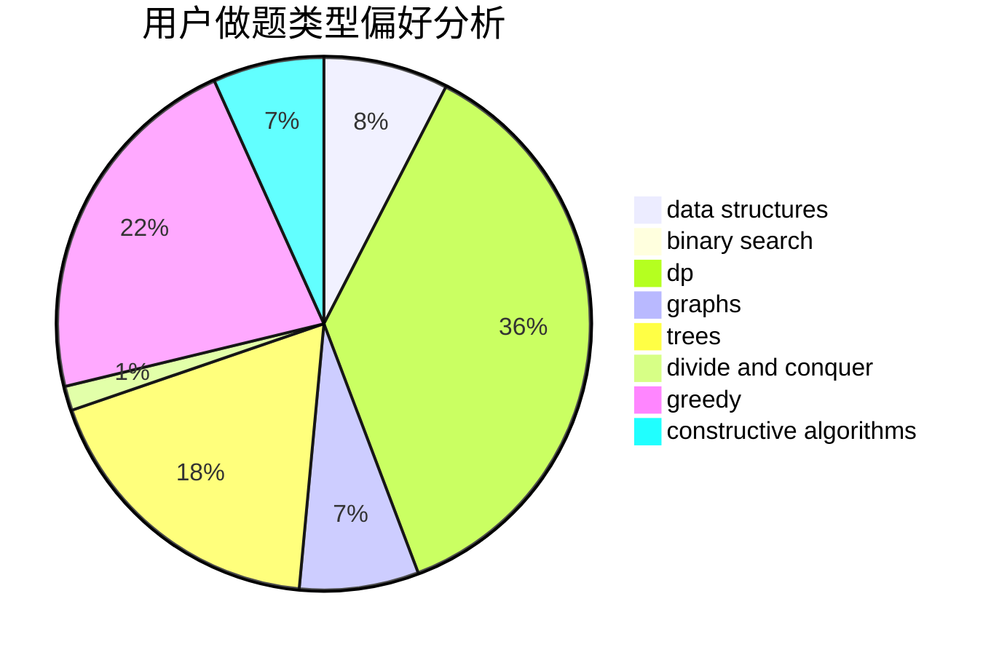
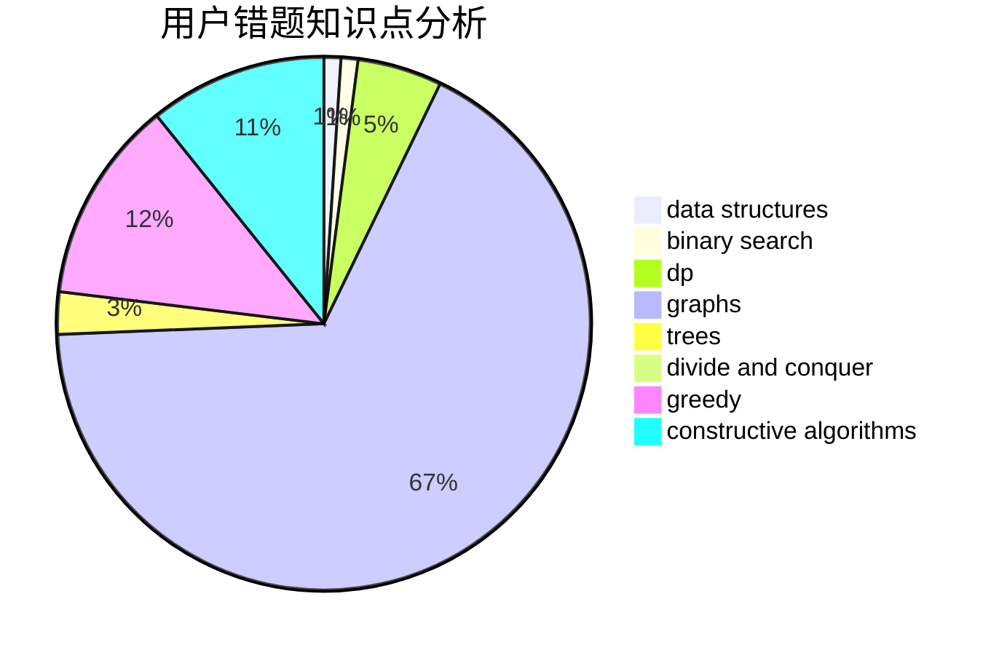

# SmartTurtle

<!-- tabs:start -->

#### **用户提交结果分析**

#### **用户做题类型偏好分析**

#### **用户错题知识点分析**

<!-- tabs:end -->
# 推荐题目
[993B](https://codeforces.com/contest/993/problem/B)		bitmasks,
                        brute force		  
[1495C](https://codeforces.com/contest/1495/problem/C)		constructive algorithms,
                        graphs		  
[584B](https://codeforces.com/contest/584/problem/B)		combinatorics		  
[764A](https://codeforces.com/contest/764/problem/A)		brute force,
                        implementation,
                        math		  
[914A](https://codeforces.com/contest/914/problem/A)		brute force,
                        implementation,
                        math		  
[13571](https://codeforces.com/contest/1357/problem/1)		dsu,graphs,sortings,trees		  
[1510A](https://codeforces.com/contest/1510/problem/A)		nan		  
[825F](https://codeforces.com/contest/825/problem/F)		dp,
                        hashing,
                        string suffix structures,
                        strings		  
[493D](https://codeforces.com/contest/493/problem/D)		constructive algorithms,
                        games,
                        math		  
[913H](https://codeforces.com/contest/913/problem/H)		math,
                        probabilities		  
