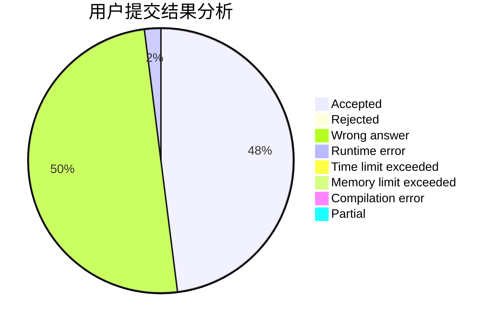
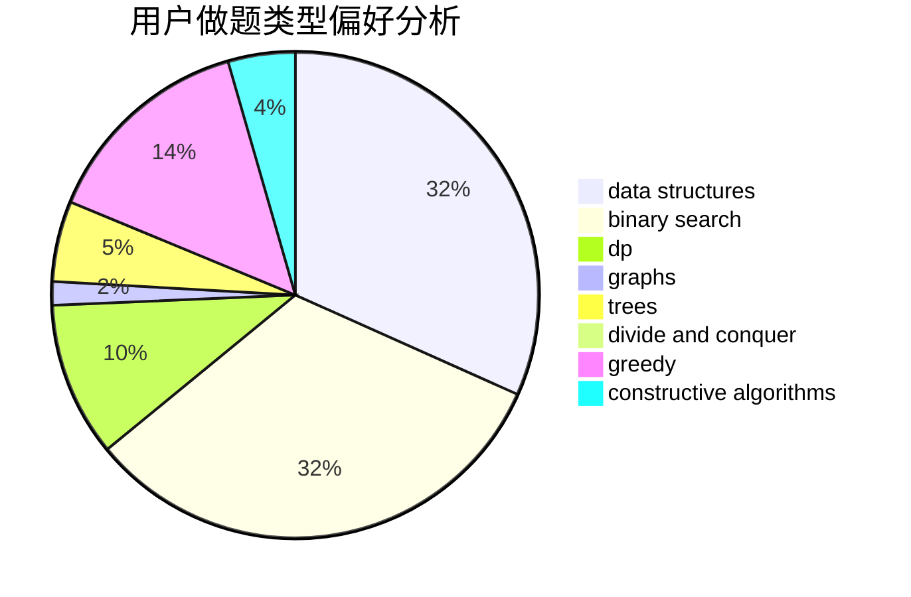

# SmartTurtle

<!-- tabs:start -->

#### **用户提交结果分析**

#### **用户做题类型偏好分析**

#### **用户错题知识点分析**

<!-- tabs:end -->
# 推荐题目
[979B](https://codeforces.com/contest/979/problem/B)		greedy		  
[1487F](https://codeforces.com/contest/1487/problem/F)		dp,
                        greedy,
                        shortest paths		  
[55D](https://codeforces.com/contest/55/problem/D)		dp,
                        number theory		  
[743E](https://codeforces.com/contest/743/problem/E)		binary search,
                        bitmasks,
                        brute force,
                        dp		  
[897B](https://codeforces.com/contest/897/problem/B)		brute force		  
[1349F1](https://codeforces.com/contest/1349F/problem/1)		dp,
                        fft,
                        math		  
[149E](https://codeforces.com/contest/149/problem/E)		string suffix structures,
                        strings		  
[808G](https://codeforces.com/contest/808/problem/G)		dp,
                        strings		  
[474E](https://codeforces.com/contest/474/problem/E)		binary search,
                        data structures,
                        dp,
                        sortings,
                        trees		  
[896E](https://codeforces.com/contest/896/problem/E)		data structures,
                        dsu		  
