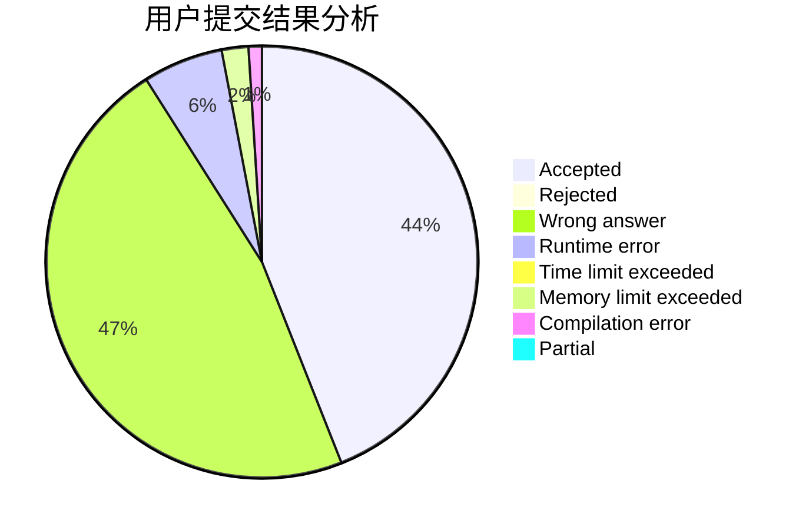
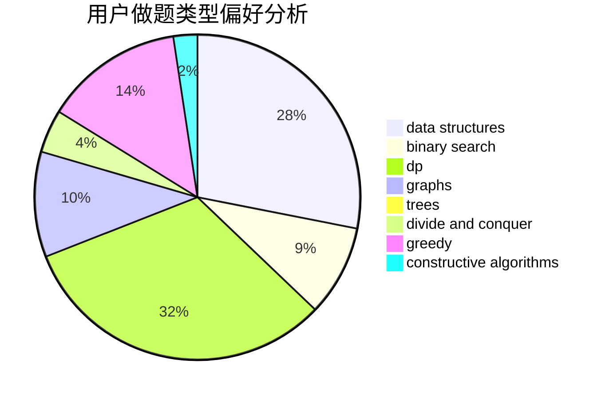

# Smilyt_
<!-- tabs:start -->
#### **用户提交结果分析**

#### **用户做题类型偏好分析**

#### **用户错题知识点分析**

<!-- tabs:end -->
# 推荐题目
[Song of the Sirens](http://codeforces.com/problemset/problem/1466/G)		combinatorics,
                        divide and conquer,
                        hashing,
                        math,
                        string suffix structures,
                        strings		  
[Seven Digit Number (2 points)](https://codeforces.com/contest/1164/problem/M)		nan		  
[Jumping Ball](http://codeforces.com/problemset/problem/725/A)		implementation		  
[New Year and Ancient Prophecy](http://codeforces.com/problemset/problem/611/D)		dp,
                        hashing,
                        strings		  
[Three-level Laser](https://codeforces.com/contest/956/problem/B)		binary search,
                        greedy,
                        two pointers		  
[Weird journey](http://codeforces.com/problemset/problem/788/B)		combinatorics,
                        constructive algorithms,
                        dfs and similar,
                        dsu,
                        graphs		  
[Jeff and Digits](http://codeforces.com/problemset/problem/352/A)		brute force,
                        implementation,
                        math		  
[Beautiful fountains rows](http://codeforces.com/problemset/problem/799/F)		data structures		  
[The Untended Antiquity](http://codeforces.com/problemset/problem/869/E)		data structures,
                        hashing		  
[Equal Rectangles](http://codeforces.com/problemset/problem/1203/B)		greedy,
                        math		  
<!-- tabs:start -->
#### **data structures**
[Song of the Sirens](http://codeforces.com/problemset/problem/799/F)		data structures		  
[Seven Digit Number (2 points)](http://codeforces.com/problemset/problem/869/E)		data structures,
                        hashing		  
[Jumping Ball](http://codeforces.com/problemset/problem/165/D)		data structures,
                        dsu,
                        trees		  
[New Year and Ancient Prophecy](http://codeforces.com/problemset/problem/138/C)		binary search,
                        data structures,
                        probabilities,
                        sortings		  
[Three-level Laser](http://codeforces.com/problemset/problem/1416/D)		data structures,
                        dsu,
                        graphs,
                        implementation,
                        trees		  
[Weird journey](http://codeforces.com/problemset/problem/1446/D1)		data structures,
                        greedy		  
[Jeff and Digits](http://codeforces.com/problemset/problem/1491/C)		brute force,
                        data structures,
                        dp,
                        greedy,
                        implementation		  
[Beautiful fountains rows](http://codeforces.com/problemset/problem/1379/F2)		data structures,
                        divide and conquer		  
[The Untended Antiquity](http://codeforces.com/problemset/problem/1455/G)		data structures,
                        dp		  
[Equal Rectangles](http://codeforces.com/problemset/problem/1492/C)		binary search,
                        data structures,
                        dp,
                        greedy,
                        two pointers		  
#### **binary search**
[Song of the Sirens](https://codeforces.com/contest/956/problem/B)		binary search,
                        greedy,
                        two pointers		  
[Seven Digit Number (2 points)](http://codeforces.com/problemset/problem/138/C)		binary search,
                        data structures,
                        probabilities,
                        sortings		  
[Jumping Ball](http://codeforces.com/problemset/problem/1492/C)		binary search,
                        data structures,
                        dp,
                        greedy,
                        two pointers		  
[New Year and Ancient Prophecy](http://codeforces.com/problemset/problem/1463/D)		binary search,
                        constructive algorithms,
                        greedy,
                        two pointers		  
[Three-level Laser](http://codeforces.com/problemset/problem/1490/G)		binary search,
                        data structures,
                        math		  
[Weird journey](http://codeforces.com/problemset/problem/1479/D)		binary search,
                        bitmasks,
                        brute force,
                        data structures,
                        probabilities,
                        trees		  
[Jeff and Digits](http://codeforces.com/problemset/problem/1436/E)		binary search,
                        data structures,
                        two pointers		  
[Beautiful fountains rows](http://codeforces.com/problemset/problem/1461/D)		binary search,
                        brute force,
                        data structures,
                        divide and conquer,
                        implementation,
                        sortings		  
[The Untended Antiquity](http://codeforces.com/problemset/problem/1493/C)		binary search,
                        brute force,
                        constructive algorithms,
                        greedy,
                        strings		  
[Equal Rectangles](http://codeforces.com/problemset/problem/1487/D)		binary search,
                        brute force,
                        math,
                        number theory		  
#### **dp**
[Song of the Sirens](http://codeforces.com/problemset/problem/611/D)		dp,
                        hashing,
                        strings		  
[Seven Digit Number (2 points)](https://codeforces.com/contest/866/problem/E)		bitmasks,
                        brute force,
                        dp,
                        graphs		  
[Jumping Ball](http://codeforces.com/problemset/problem/123/E)		dfs and similar,
                        dp,
                        probabilities,
                        trees		  
[New Year and Ancient Prophecy](http://codeforces.com/problemset/problem/1077/F1)		dp		  
[Three-level Laser](http://codeforces.com/problemset/problem/11/D)		bitmasks,
                        dp,
                        graphs		  
[Weird journey](http://codeforces.com/problemset/problem/1491/C)		brute force,
                        data structures,
                        dp,
                        greedy,
                        implementation		  
[Jeff and Digits](http://codeforces.com/problemset/problem/1415/C)		brute force,
                        dp,
                        implementation		  
[Beautiful fountains rows](http://codeforces.com/problemset/problem/1444/D)		constructive algorithms,
                        dp,
                        geometry		  
[The Untended Antiquity](http://codeforces.com/problemset/problem/1133/E)		dp,
                        sortings,
                        two pointers		  
[Equal Rectangles](http://codeforces.com/problemset/problem/1455/G)		data structures,
                        dp		  
#### **graph**
[Song of the Sirens](http://codeforces.com/problemset/problem/788/B)		combinatorics,
                        constructive algorithms,
                        dfs and similar,
                        dsu,
                        graphs		  
[Seven Digit Number (2 points)](https://codeforces.com/contest/866/problem/E)		bitmasks,
                        brute force,
                        dp,
                        graphs		  
[Jumping Ball](http://codeforces.com/problemset/problem/11/D)		bitmasks,
                        dp,
                        graphs		  
[New Year and Ancient Prophecy](http://codeforces.com/problemset/problem/223/E)		flows,
                        geometry,
                        graphs		  
[Three-level Laser](http://codeforces.com/problemset/problem/1416/D)		data structures,
                        dsu,
                        graphs,
                        implementation,
                        trees		  
[Weird journey](http://codeforces.com/problemset/problem/1487/C)		brute force,
                        constructive algorithms,
                        dfs and similar,
                        graphs,
                        greedy,
                        implementation,
                        math		  
[Jeff and Digits](http://codeforces.com/problemset/problem/1437/C)		dp,
                        flows,
                        graph matchings,
                        greedy,
                        math,
                        sortings		  
[Beautiful fountains rows](http://codeforces.com/problemset/problem/1470/D)		constructive algorithms,
                        dfs and similar,
                        graph matchings,
                        graphs,
                        greedy		  
[The Untended Antiquity](http://codeforces.com/problemset/problem/1476/C)		dp,
                        graphs,
                        greedy		  
[Equal Rectangles](http://codeforces.com/problemset/problem/1304/D)		constructive algorithms,
                        graphs,
                        greedy,
                        two pointers		  
#### **trees**
[Song of the Sirens](http://codeforces.com/problemset/problem/165/D)		data structures,
                        dsu,
                        trees		  
[Seven Digit Number (2 points)](http://codeforces.com/problemset/problem/123/E)		dfs and similar,
                        dp,
                        probabilities,
                        trees		  
[Jumping Ball](http://codeforces.com/problemset/problem/1416/D)		data structures,
                        dsu,
                        graphs,
                        implementation,
                        trees		  
[New Year and Ancient Prophecy](http://codeforces.com/problemset/problem/1479/D)		binary search,
                        bitmasks,
                        brute force,
                        data structures,
                        probabilities,
                        trees		  
[Three-level Laser](http://codeforces.com/problemset/problem/1511/C)		brute force,
                        data structures,
                        implementation,
                        trees		  
[Weird journey](http://codeforces.com/problemset/problem/1499/F)		combinatorics,
                        dfs and similar,
                        dp,
                        trees		  
[Jeff and Digits](http://codeforces.com/problemset/problem/1491/E)		brute force,
                        dfs and similar,
                        divide and conquer,
                        number theory,
                        trees		  
[Beautiful fountains rows](http://codeforces.com/problemset/problem/1466/D)		data structures,
                        greedy,
                        sortings,
                        trees		  
[The Untended Antiquity](http://codeforces.com/problemset/problem/1495/D)		combinatorics,
                        dfs and similar,
                        graphs,
                        math,
                        shortest paths,
                        trees		  
[Equal Rectangles](http://codeforces.com/problemset/problem/1303/G)		data structures,
                        divide and conquer,
                        geometry,
                        trees		  
#### **divide and conquer**
[Song of the Sirens](http://codeforces.com/problemset/problem/1466/G)		combinatorics,
                        divide and conquer,
                        hashing,
                        math,
                        string suffix structures,
                        strings		  
[Seven Digit Number (2 points)](http://codeforces.com/problemset/problem/1375/H)		constructive algorithms,
                        divide and conquer		  
[Jumping Ball](http://codeforces.com/problemset/problem/1379/F2)		data structures,
                        divide and conquer		  
[New Year and Ancient Prophecy](http://codeforces.com/problemset/problem/1461/D)		binary search,
                        brute force,
                        data structures,
                        divide and conquer,
                        implementation,
                        sortings		  
[Three-level Laser](http://codeforces.com/problemset/problem/1466/G)		combinatorics,
                        divide and conquer,
                        hashing,
                        math,
                        string suffix structures,
                        strings		  
[Weird journey](http://codeforces.com/problemset/problem/1490/D)		dfs and similar,
                        divide and conquer,
                        implementation		  
[Jeff and Digits](https://codeforces.com/contest/1483/problem/C)		data structures,
                        divide and conquer,
                        dp		  
[Beautiful fountains rows](http://codeforces.com/problemset/problem/1491/E)		brute force,
                        dfs and similar,
                        divide and conquer,
                        number theory,
                        trees		  
[The Untended Antiquity](http://codeforces.com/problemset/problem/1303/G)		data structures,
                        divide and conquer,
                        geometry,
                        trees		  
[Equal Rectangles](http://codeforces.com/problemset/problem/1494/D)		constructive algorithms,
                        data structures,
                        dfs and similar,
                        divide and conquer,
                        dsu,
                        greedy,
                        sortings,
                        trees		  
#### **greedy**
[Song of the Sirens](https://codeforces.com/contest/956/problem/B)		binary search,
                        greedy,
                        two pointers		  
[Seven Digit Number (2 points)](http://codeforces.com/problemset/problem/1203/B)		greedy,
                        math		  
[Jumping Ball](https://codeforces.com/contest/1020/problem/C)		greedy		  
[New Year and Ancient Prophecy](http://codeforces.com/problemset/problem/258/A)		greedy,
                        math		  
[Three-level Laser](http://codeforces.com/problemset/problem/1055/D)		greedy,
                        implementation,
                        strings		  
[Weird journey](https://codeforces.com/contest/1339/problem/C)		greedy,
                        math		  
[Jeff and Digits](http://codeforces.com/problemset/problem/402/A)		greedy,
                        math		  
[Beautiful fountains rows](http://codeforces.com/problemset/problem/1446/D1)		data structures,
                        greedy		  
[The Untended Antiquity](http://codeforces.com/problemset/problem/1491/C)		brute force,
                        data structures,
                        dp,
                        greedy,
                        implementation		  
[Equal Rectangles](http://codeforces.com/problemset/problem/1120/B)		constructive algorithms,
                        greedy,
                        implementation,
                        math		  
#### **constructive algorithms**
[Song of the Sirens](http://codeforces.com/problemset/problem/788/B)		combinatorics,
                        constructive algorithms,
                        dfs and similar,
                        dsu,
                        graphs		  
[Seven Digit Number (2 points)](http://codeforces.com/problemset/problem/509/D)		constructive algorithms,
                        math		  
[Jumping Ball](http://codeforces.com/problemset/problem/1375/H)		constructive algorithms,
                        divide and conquer		  
[New Year and Ancient Prophecy](http://codeforces.com/problemset/problem/282/C)		constructive algorithms,
                        implementation,
                        math		  
[Three-level Laser](http://codeforces.com/problemset/problem/1444/D)		constructive algorithms,
                        dp,
                        geometry		  
[Weird journey](http://codeforces.com/problemset/problem/1120/B)		constructive algorithms,
                        greedy,
                        implementation,
                        math		  
[Jeff and Digits](http://codeforces.com/problemset/problem/1493/A)		constructive algorithms,
                        greedy		  
[Beautiful fountains rows](http://codeforces.com/problemset/problem/1463/D)		binary search,
                        constructive algorithms,
                        greedy,
                        two pointers		  
[The Untended Antiquity](https://codeforces.com/contest/1456/problem/B)		bitmasks,
                        brute force,
                        constructive algorithms		  
[Equal Rectangles](http://codeforces.com/problemset/problem/1492/D)		bitmasks,
                        constructive algorithms,
                        greedy,
                        math		  
#### **sortings**
[Song of the Sirens](http://codeforces.com/problemset/problem/138/C)		binary search,
                        data structures,
                        probabilities,
                        sortings		  
[Seven Digit Number (2 points)](http://codeforces.com/problemset/problem/1133/E)		dp,
                        sortings,
                        two pointers		  
[Jumping Ball](https://codeforces.com/contest/1496/problem/C)		geometry,
                        greedy,
                        math,
                        sortings		  
[New Year and Ancient Prophecy](http://codeforces.com/problemset/problem/1495/A)		geometry,
                        greedy,
                        math,
                        sortings		  
[Three-level Laser](http://codeforces.com/problemset/problem/1497/A)		brute force,
                        data structures,
                        greedy,
                        sortings		  
[Weird journey](http://codeforces.com/problemset/problem/1427/A)		math,
                        sortings		  
[Jeff and Digits](http://codeforces.com/problemset/problem/1461/D)		binary search,
                        brute force,
                        data structures,
                        divide and conquer,
                        implementation,
                        sortings		  
[Beautiful fountains rows](http://codeforces.com/problemset/problem/1437/C)		dp,
                        flows,
                        graph matchings,
                        greedy,
                        math,
                        sortings		  
[The Untended Antiquity](http://codeforces.com/problemset/problem/1473/A)		greedy,
                        implementation,
                        math,
                        sortings		  
[Equal Rectangles](http://codeforces.com/problemset/problem/1486/B)		binary search,
                        geometry,
                        shortest paths,
                        sortings		  
<!-- tabs:end -->
