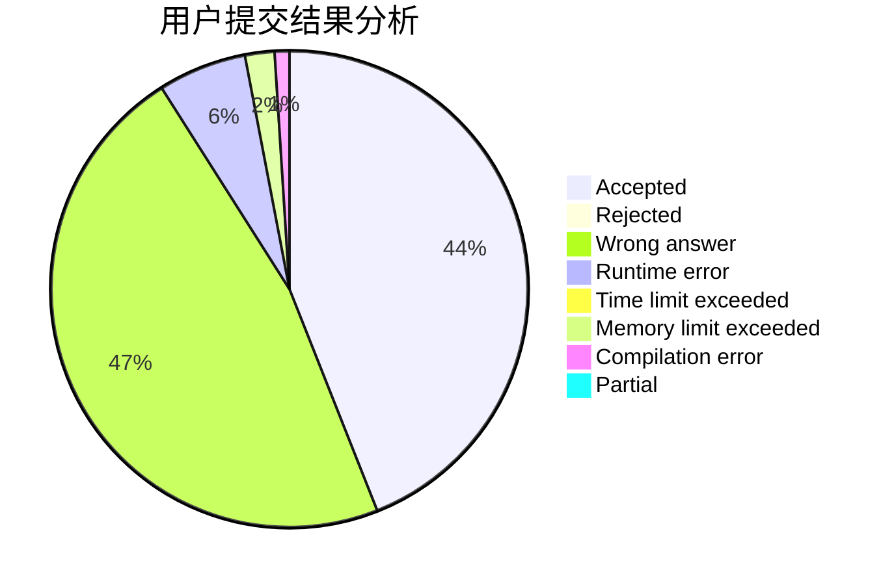
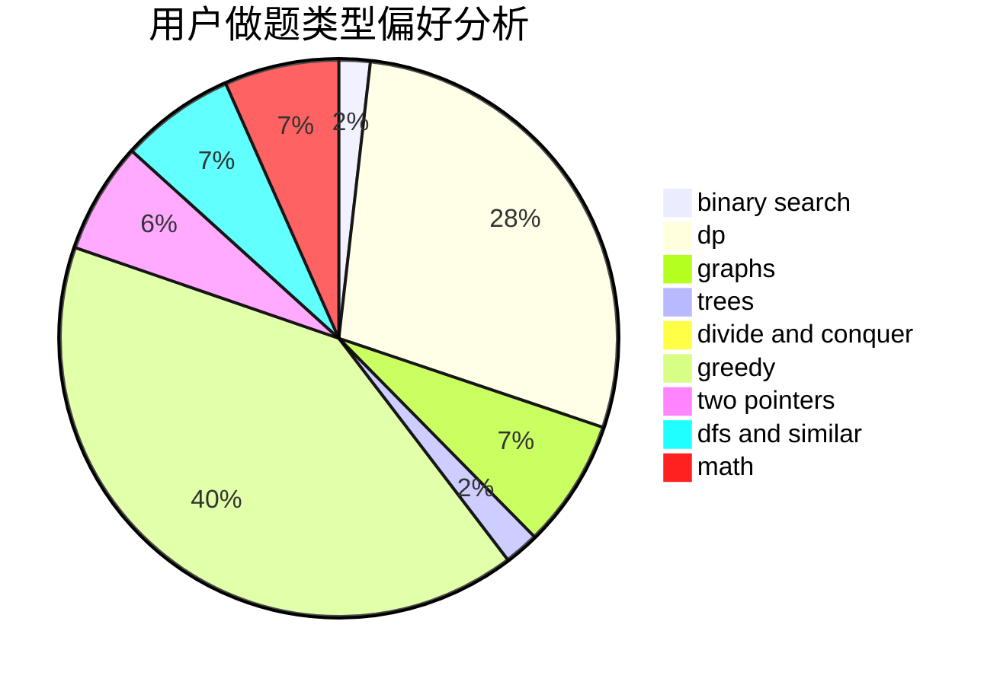

# Smilyt_

<!-- tabs:start -->

#### **用户提交结果分析**

#### **用户做题类型偏好分析**

<!-- tabs:end -->
# 推荐题目
[1473G](https://codeforces.com/contest/1473/problem/G)
[1166D](https://codeforces.com/contest/1166/problem/D)
[190C](https://codeforces.com/contest/190/problem/C)
[813F](https://codeforces.com/contest/813/problem/F)
[1023A](https://codeforces.com/contest/1023/problem/A)
[630G](https://codeforces.com/contest/630/problem/G)
[742E](https://codeforces.com/contest/742/problem/E)
[1245C](https://codeforces.com/contest/1245/problem/C)
[112A](https://codeforces.com/contest/112/problem/A)
[1423G](https://codeforces.com/contest/1423/problem/G)
