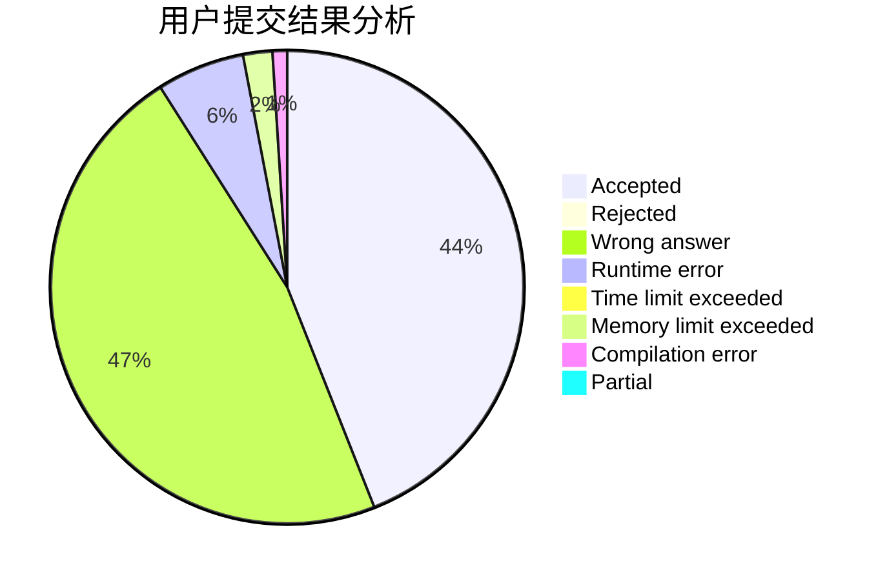
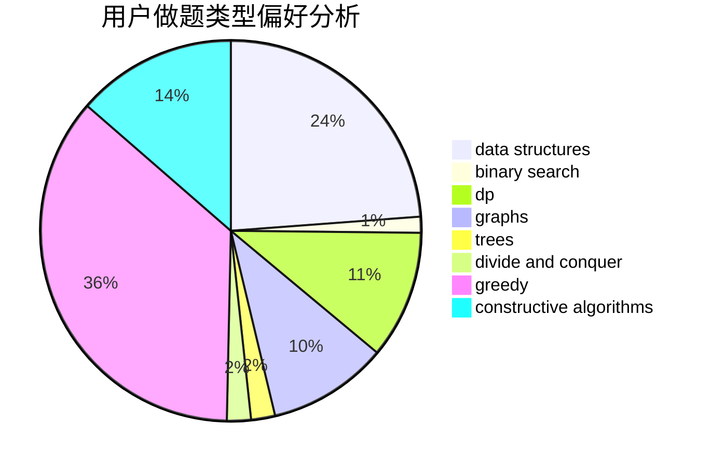

# Smilyt_

<!-- tabs:start -->

#### **用户提交结果分析**

#### **用户做题类型偏好分析**

#### **用户错题知识点分析**

<!-- tabs:end -->
# 推荐题目
[1473G](https://codeforces.com/contest/1473/problem/G)		combinatorics,
                        dp,
                        fft,
                        math		  
[1166D](https://codeforces.com/contest/1166/problem/D)		binary search,
                        brute force,
                        greedy,
                        math		  
[190C](https://codeforces.com/contest/190/problem/C)		dfs and similar		  
[813F](https://codeforces.com/contest/813/problem/F)		data structures,
                        dsu,
                        graphs		  
[1023A](https://codeforces.com/contest/1023/problem/A)		brute force,
                        implementation,
                        strings		  
[630G](https://codeforces.com/contest/630/problem/G)		combinatorics,
                        math		  
[742E](https://codeforces.com/contest/742/problem/E)		dsu,graphs,sortings,trees		  
[1245C](https://codeforces.com/contest/1245/problem/C)		dp		  
[112A](https://codeforces.com/contest/112/problem/A)		implementation,
                        strings		  
[1423G](https://codeforces.com/contest/1423/problem/G)		data structures		  
