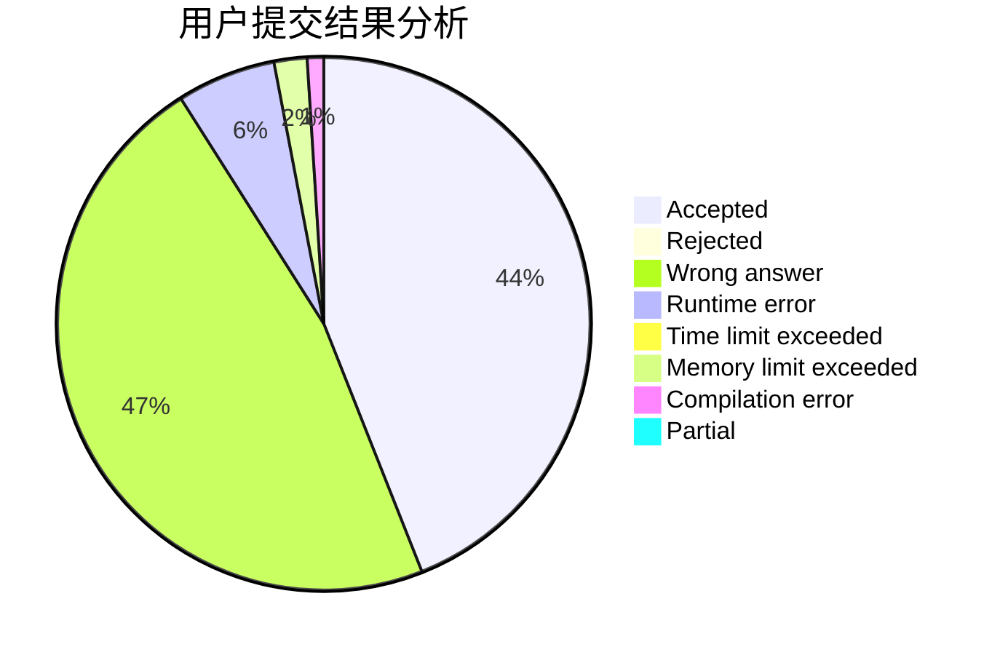
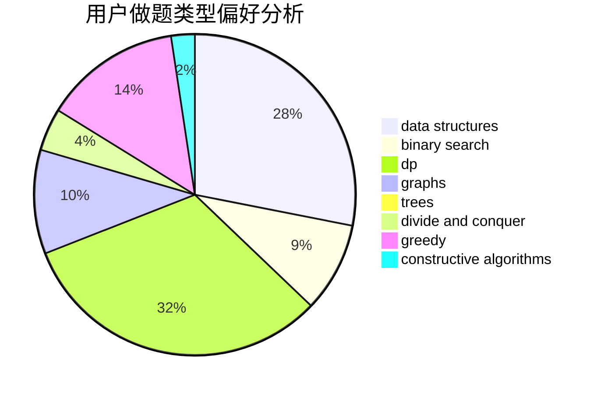

# Smilyt_

<!-- tabs:start -->

#### **用户提交结果分析**

#### **用户做题类型偏好分析**

#### **用户错题知识点分析**

<!-- tabs:end -->
# 推荐题目
[1466G](https://codeforces.com/contest/1466/problem/G)		combinatorics,
                        divide and conquer,
                        hashing,
                        math,
                        string suffix structures,
                        strings		  
[1164M](https://codeforces.com/contest/1164/problem/M)		dsu,graphs,sortings,trees		  
[165D](https://codeforces.com/contest/165/problem/D)		data structures,
                        dsu,
                        trees		  
[799F](https://codeforces.com/contest/799/problem/F)		data structures		  
[1020C](https://codeforces.com/contest/1020/problem/C)		dsu,graphs,sortings,trees		  
[611D](https://codeforces.com/contest/611/problem/D)		dp,
                        hashing,
                        strings		  
[725A](https://codeforces.com/contest/725/problem/A)		implementation		  
[123E](https://codeforces.com/contest/123/problem/E)		dfs and similar,
                        dp,
                        probabilities,
                        trees		  
[1120B](https://codeforces.com/contest/1120/problem/B)		constructive algorithms,
                        greedy,
                        implementation,
                        math		  
[1415C](https://codeforces.com/contest/1415/problem/C)		brute force,
                        dp,
                        implementation		  
