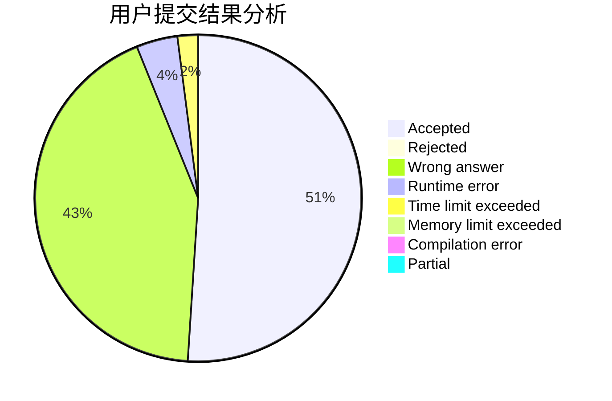
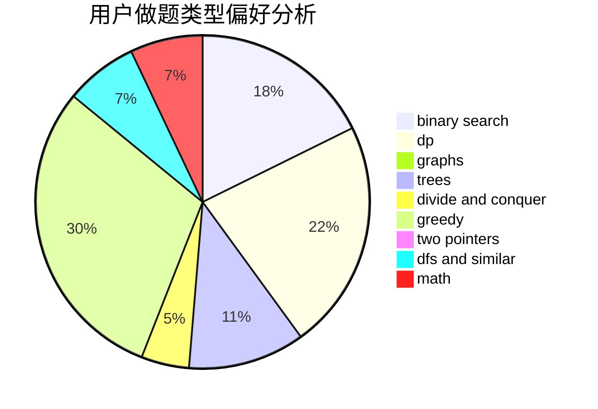

# Snoobie

<!-- tabs:start -->

#### **用户提交结果分析**

#### **用户做题类型偏好分析**

<!-- tabs:end -->
# 推荐题目
[1424G](https://codeforces.com/contest/1424/problem/G)
[1070H](https://codeforces.com/contest/1070/problem/H)
[1215B](https://codeforces.com/contest/1215/problem/B)
[656A](https://codeforces.com/contest/656/problem/A)
[865B](https://codeforces.com/contest/865/problem/B)
[659G](https://codeforces.com/contest/659/problem/G)
[1142D](https://codeforces.com/contest/1142/problem/D)
[376B](https://codeforces.com/contest/376/problem/B)
[98C](https://codeforces.com/contest/98/problem/C)
[1086C](https://codeforces.com/contest/1086/problem/C)
