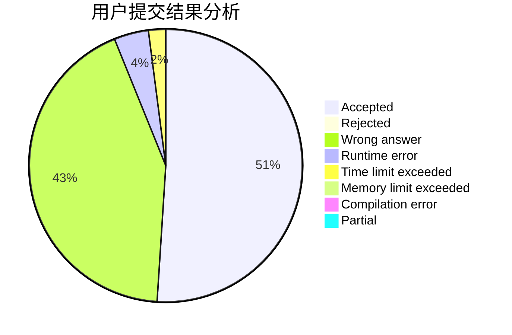
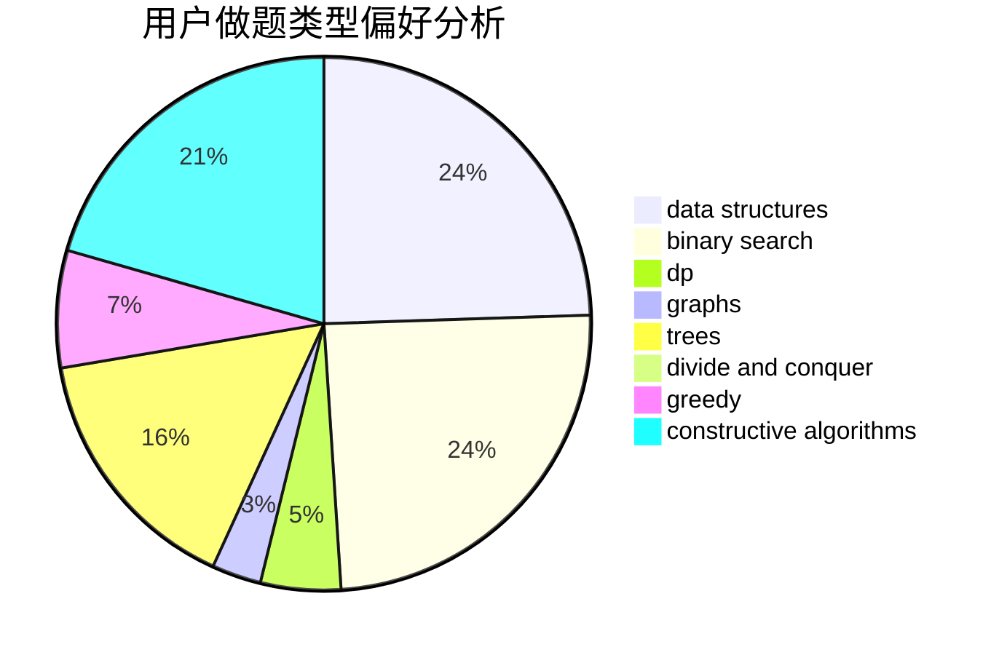

# Snoobie

<!-- tabs:start -->

#### **用户提交结果分析**

#### **用户做题类型偏好分析**

#### **用户错题知识点分析**

<!-- tabs:end -->
# 推荐题目
[1416F](https://codeforces.com/contest/1416/problem/F)		flows,
                        graph matchings,
                        greedy,
                        implementation		  
[1070E](https://codeforces.com/contest/1070/problem/E)		binary search,
                        data structures		  
[1209E2](https://codeforces.com/contest/1209E/problem/2)		bitmasks,
                        dp,
                        greedy,
                        sortings		  
[628B](https://codeforces.com/contest/628/problem/B)		dp		  
[847B](https://codeforces.com/contest/847/problem/B)		binary search,
                        data structures		  
[62E](https://codeforces.com/contest/62/problem/E)		dp,
                        flows		  
[1140F](https://codeforces.com/contest/1140/problem/F)		data structures,
                        divide and conquer,
                        dsu		  
[34A](https://codeforces.com/contest/34/problem/A)		implementation		  
[975D](https://codeforces.com/contest/975/problem/D)		geometry,
                        math		  
[1085G](https://codeforces.com/contest/1085/problem/G)		combinatorics,
                        data structures,
                        dp		  
