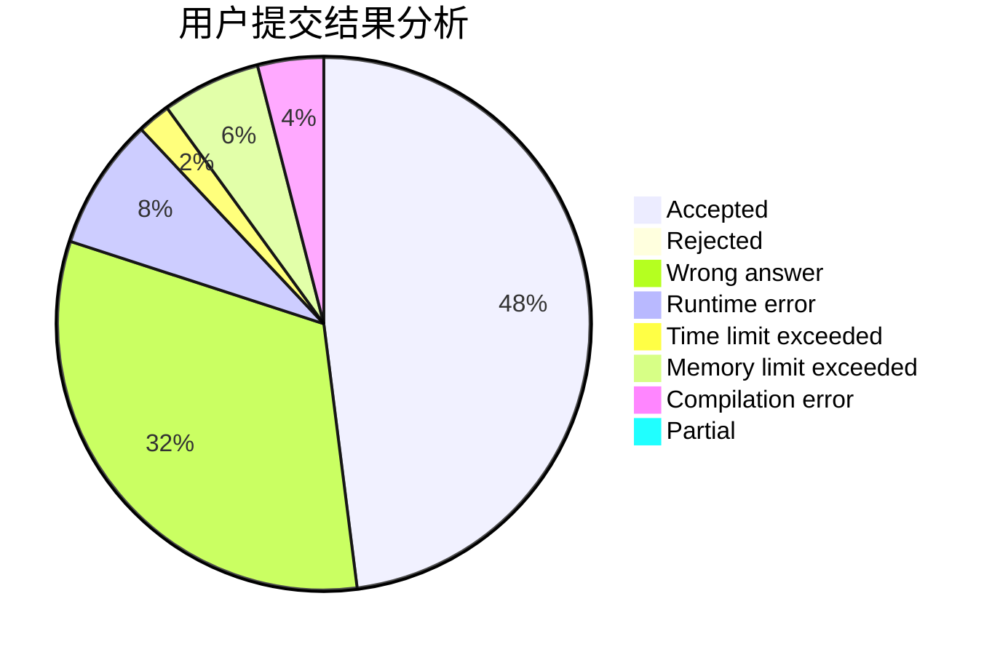
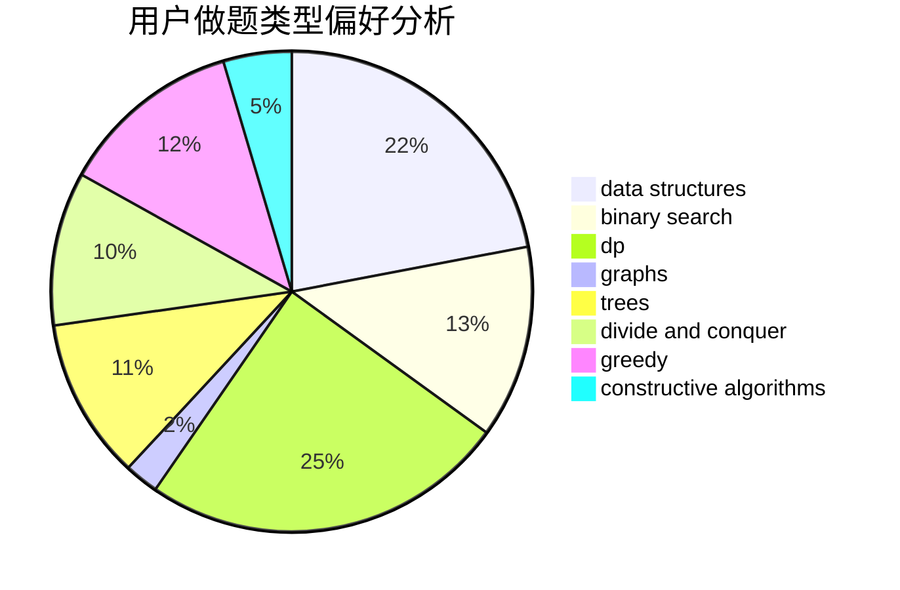
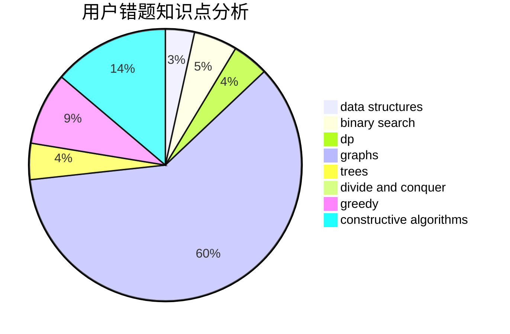

# Snowe

<!-- tabs:start -->

#### **用户提交结果分析**

#### **用户做题类型偏好分析**

#### **用户错题知识点分析**

<!-- tabs:end -->
# 推荐题目
[794C](https://codeforces.com/contest/794/problem/C)		games,
                        greedy,
                        sortings		  
[1464B](https://codeforces.com/contest/1464/problem/B)		dsu,graphs,sortings,trees		  
[1147B](https://codeforces.com/contest/1147/problem/B)		brute force,
                        strings		  
[851B](https://codeforces.com/contest/851/problem/B)		geometry,
                        math		  
[1019A](https://codeforces.com/contest/1019/problem/A)		brute force,
                        greedy		  
[486D](https://codeforces.com/contest/486/problem/D)		dfs and similar,
                        dp,
                        math,
                        trees		  
[689E](https://codeforces.com/contest/689/problem/E)		combinatorics,
                        data structures,
                        dp,
                        geometry,
                        implementation		  
[1284G](https://codeforces.com/contest/1284/problem/G)		graphs		  
[266C](https://codeforces.com/contest/266/problem/C)		constructive algorithms,
                        greedy,
                        math		  
[1270D](https://codeforces.com/contest/1270/problem/D)		constructive algorithms,
                        interactive,
                        math,
                        sortings		  
