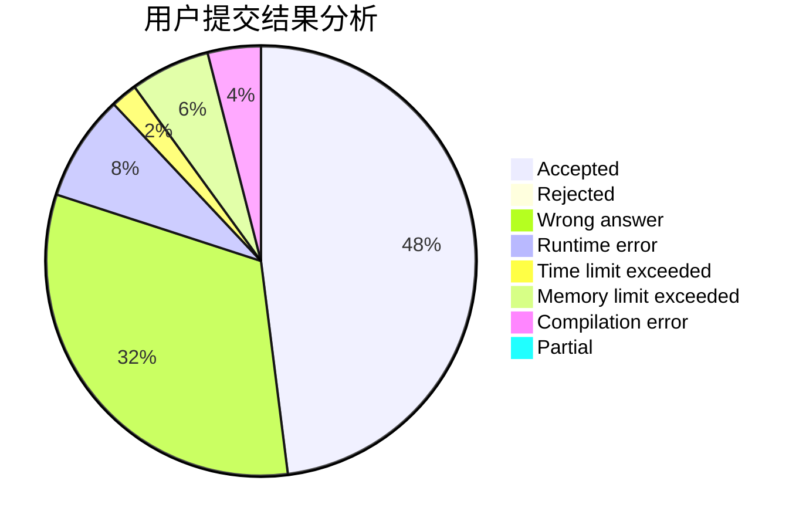
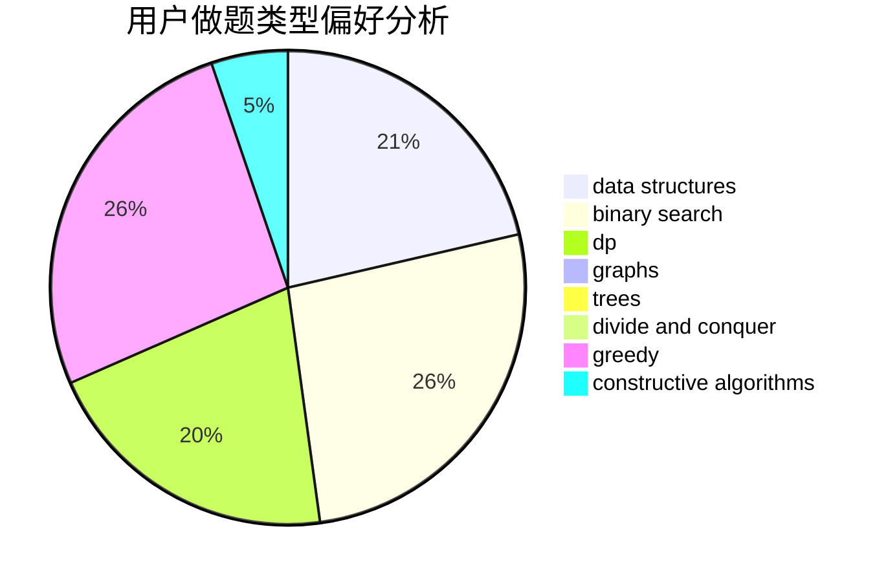
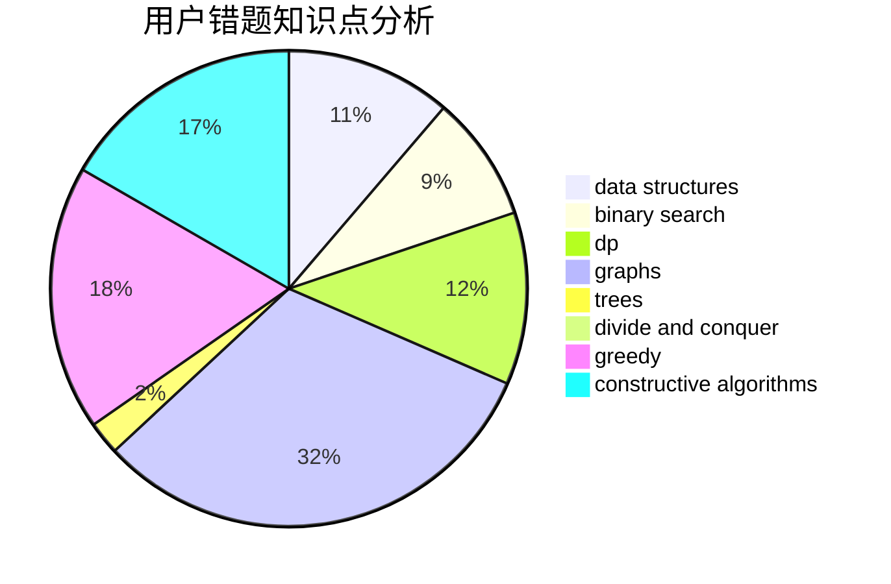

# Snowe

<!-- tabs:start -->

#### **用户提交结果分析**

#### **用户做题类型偏好分析**

#### **用户错题知识点分析**

<!-- tabs:end -->
# 推荐题目
[776D](https://codeforces.com/contest/776/problem/D)		2-sat,
                        dfs and similar,
                        dsu,
                        graphs		  
[1454E](https://codeforces.com/contest/1454/problem/E)		combinatorics,
                        dfs and similar,
                        graphs,
                        trees		  
[1145A](https://codeforces.com/contest/1145/problem/A)		implementation		  
[833B](https://codeforces.com/contest/833/problem/B)		binary search,
                        data structures,
                        divide and conquer,
                        dp,
                        two pointers		  
[1017E](https://codeforces.com/contest/1017/problem/E)		geometry,
                        hashing,
                        strings		  
[467A](https://codeforces.com/contest/467/problem/A)		implementation		  
[667E](https://codeforces.com/contest/667/problem/E)		dsu,graphs,sortings,trees		  
[1278E](https://codeforces.com/contest/1278/problem/E)		constructive algorithms,
                        dfs and similar,
                        divide and conquer,
                        trees		  
[246A](https://codeforces.com/contest/246/problem/A)		constructive algorithms,
                        greedy,
                        sortings		  
[1264E](https://codeforces.com/contest/1264/problem/E)		constructive algorithms,
                        flows,
                        graph matchings		  
