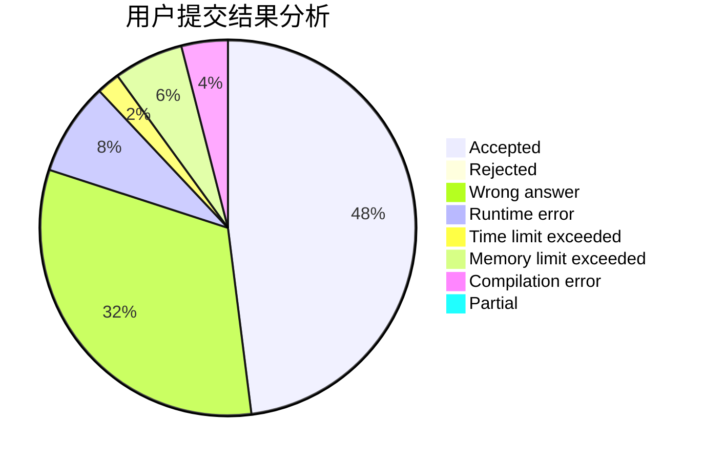
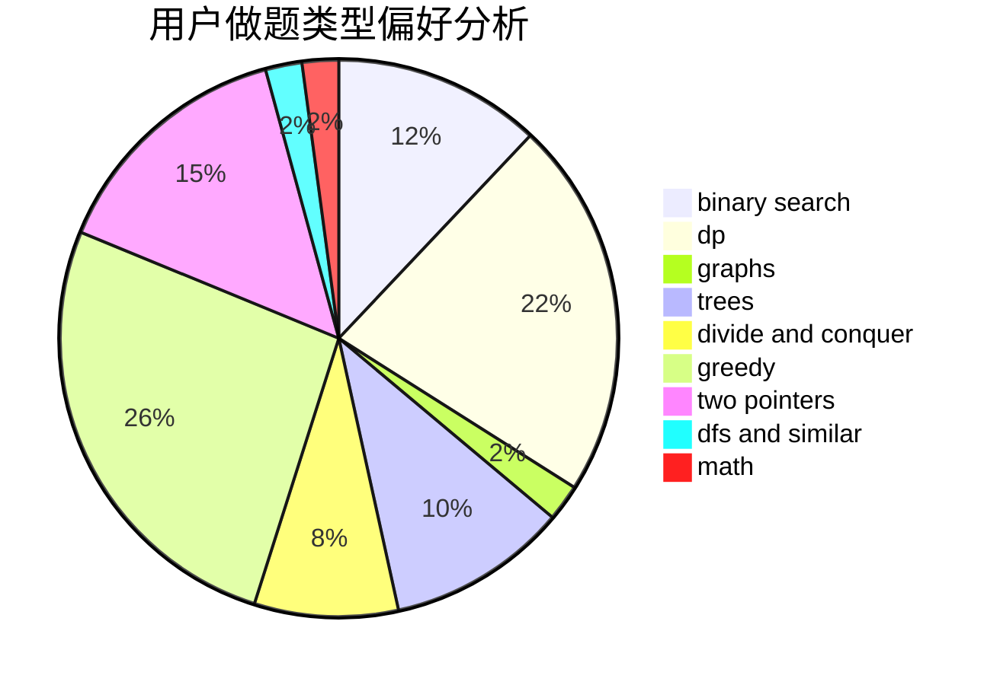

# Snowe

<!-- tabs:start -->

#### **用户提交结果分析**

#### **用户做题类型偏好分析**

<!-- tabs:end -->
# 推荐题目
[794C](https://codeforces.com/contest/794/problem/C)
[1464B](https://codeforces.com/contest/1464/problem/B)
[1147B](https://codeforces.com/contest/1147/problem/B)
[851B](https://codeforces.com/contest/851/problem/B)
[1019A](https://codeforces.com/contest/1019/problem/A)
[486D](https://codeforces.com/contest/486/problem/D)
[689E](https://codeforces.com/contest/689/problem/E)
[1284G](https://codeforces.com/contest/1284/problem/G)
[266C](https://codeforces.com/contest/266/problem/C)
[1270D](https://codeforces.com/contest/1270/problem/D)
