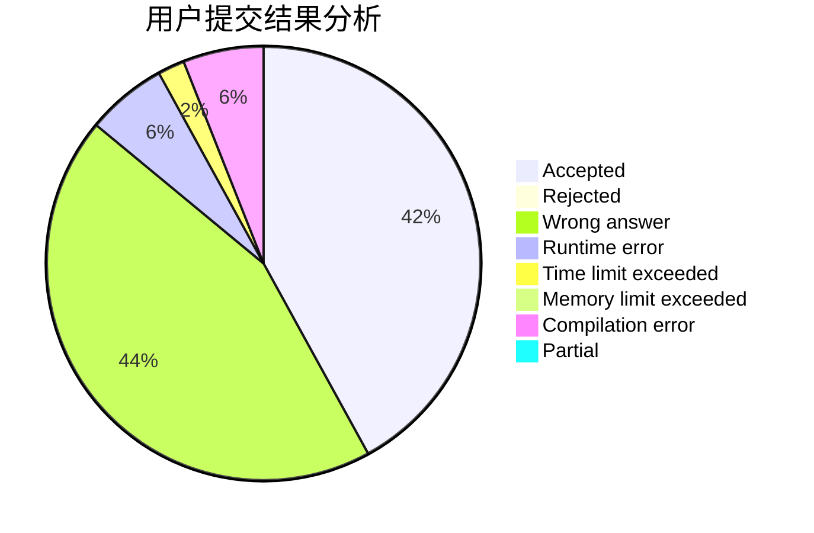
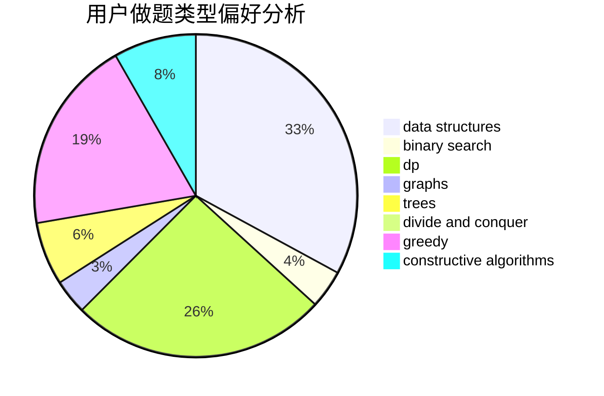
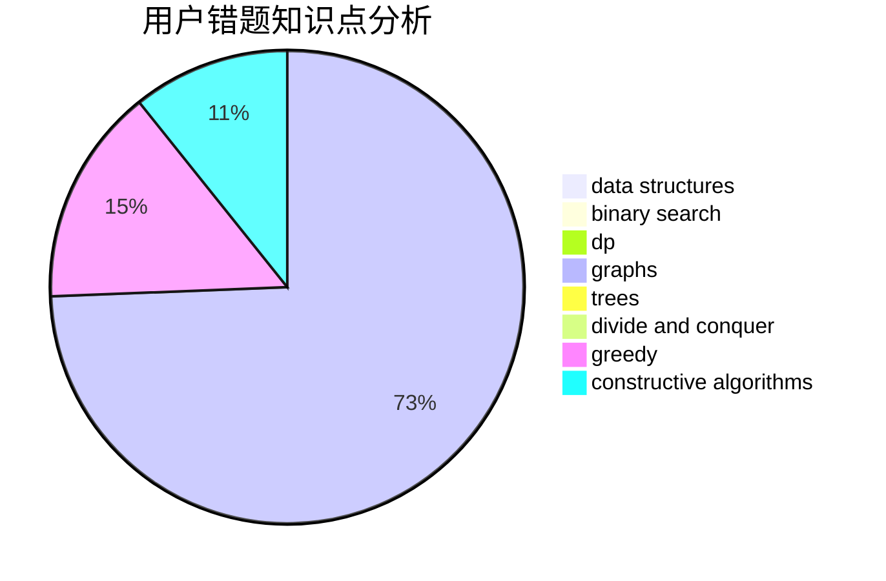

# 100yearsleft
<!-- tabs:start -->
#### **用户提交结果分析**

#### **用户做题类型偏好分析**

#### **用户错题知识点分析**

<!-- tabs:end -->
# 推荐题目
[Odd Federalization](http://codeforces.com/problemset/problem/1070/L)		constructive algorithms		  
[Pictures with Kittens (easy version)](http://codeforces.com/problemset/problem/1077/F1)		dp		  
[Good Array](http://codeforces.com/problemset/problem/1077/C)		nan		  
[Curiosity Has No Limits](https://codeforces.com/contest/1072/problem/B)		nan		  
[Rectangles](http://codeforces.com/problemset/problem/1028/C)		geometry,
                        implementation,
                        sortings		  
[Vasya and a Tree](http://codeforces.com/problemset/problem/1076/E)		data structures,
                        trees		  
[Diverse Substring](http://codeforces.com/problemset/problem/1073/A)		implementation,
                        strings		  
[Getting Deals Done](http://codeforces.com/problemset/problem/1070/E)		binary search,
                        data structures		  
[Find a Number](http://codeforces.com/problemset/problem/1070/A)		dp,
                        graphs,
                        number theory,
                        shortest paths		  
[Intersecting Subtrees](https://codeforces.com/contest/1074/problem/B)		dfs and similar,
                        interactive,
                        trees		  
<!-- tabs:start -->
#### **data structures**
[Odd Federalization](http://codeforces.com/problemset/problem/1076/E)		data structures,
                        trees		  
[Pictures with Kittens (easy version)](http://codeforces.com/problemset/problem/1070/E)		binary search,
                        data structures		  
[Good Array](http://codeforces.com/problemset/problem/1077/F2)		data structures,
                        dp		  
[Curiosity Has No Limits](http://codeforces.com/problemset/problem/1073/D)		binary search,
                        brute force,
                        data structures,
                        greedy		  
[Rectangles](http://codeforces.com/problemset/problem/1070/B)		data structures,
                        greedy		  
[Vasya and a Tree](http://codeforces.com/problemset/problem/1070/C)		data structures,
                        greedy		  
[Diverse Substring](http://codeforces.com/problemset/problem/1073/G)		data structures,
                        string suffix structures		  
[Getting Deals Done](http://codeforces.com/problemset/problem/1492/C)		binary search,
                        data structures,
                        dp,
                        greedy,
                        two pointers		  
[Find a Number](http://codeforces.com/problemset/problem/1490/G)		binary search,
                        data structures,
                        math		  
[Intersecting Subtrees](http://codeforces.com/problemset/problem/1479/D)		binary search,
                        bitmasks,
                        brute force,
                        data structures,
                        probabilities,
                        trees		  
#### **binary search**
[Odd Federalization](http://codeforces.com/problemset/problem/1070/E)		binary search,
                        data structures		  
[Pictures with Kittens (easy version)](http://codeforces.com/problemset/problem/1073/C)		binary search,
                        two pointers		  
[Good Array](http://codeforces.com/problemset/problem/1073/D)		binary search,
                        brute force,
                        data structures,
                        greedy		  
[Curiosity Has No Limits](https://codeforces.com/contest/1074/problem/A)		binary search,
                        two pointers		  
[Rectangles](http://codeforces.com/problemset/problem/1076/C)		binary search,
                        math		  
[Vasya and a Tree](http://codeforces.com/problemset/problem/1077/D)		binary search,
                        sortings		  
[Diverse Substring](http://codeforces.com/problemset/problem/1492/C)		binary search,
                        data structures,
                        dp,
                        greedy,
                        two pointers		  
[Getting Deals Done](http://codeforces.com/problemset/problem/1463/D)		binary search,
                        constructive algorithms,
                        greedy,
                        two pointers		  
[Find a Number](http://codeforces.com/problemset/problem/1490/G)		binary search,
                        data structures,
                        math		  
[Intersecting Subtrees](http://codeforces.com/problemset/problem/1479/D)		binary search,
                        bitmasks,
                        brute force,
                        data structures,
                        probabilities,
                        trees		  
#### **dp**
[Odd Federalization](http://codeforces.com/problemset/problem/1077/F1)		dp		  
[Pictures with Kittens (easy version)](http://codeforces.com/problemset/problem/1070/A)		dp,
                        graphs,
                        number theory,
                        shortest paths		  
[Good Array](http://codeforces.com/problemset/problem/1077/F2)		data structures,
                        dp		  
[Curiosity Has No Limits](http://codeforces.com/problemset/problem/1070/J)		dp		  
[Rectangles](http://codeforces.com/problemset/problem/1070/G)		brute force,
                        dp,
                        greedy,
                        implementation		  
[Vasya and a Tree](http://codeforces.com/problemset/problem/1073/F)		dfs and similar,
                        dp,
                        greedy,
                        trees		  
[Diverse Substring](https://codeforces.com/contest/1074/problem/C)		dp,
                        geometry		  
[Getting Deals Done](https://codeforces.com/contest/1068/problem/D)		dp		  
[Find a Number](http://codeforces.com/problemset/problem/1076/F)		dp,
                        greedy		  
[Intersecting Subtrees](http://codeforces.com/problemset/problem/106/C)		dp		  
#### **graph**
[Odd Federalization](http://codeforces.com/problemset/problem/1070/A)		dp,
                        graphs,
                        number theory,
                        shortest paths		  
[Pictures with Kittens (easy version)](http://codeforces.com/problemset/problem/1070/I)		flows,
                        graph matchings,
                        graphs		  
[Good Array](https://codeforces.com/contest/1071/problem/D)		brute force,
                        graphs,
                        math		  
[Curiosity Has No Limits](http://codeforces.com/problemset/problem/1068/C)		constructive algorithms,
                        graphs		  
[Rectangles](http://codeforces.com/problemset/problem/1076/D)		graphs,
                        greedy,
                        shortest paths		  
[Vasya and a Tree](http://codeforces.com/problemset/problem/1487/C)		brute force,
                        constructive algorithms,
                        dfs and similar,
                        graphs,
                        greedy,
                        implementation,
                        math		  
[Diverse Substring](http://codeforces.com/problemset/problem/1437/C)		dp,
                        flows,
                        graph matchings,
                        greedy,
                        math,
                        sortings		  
[Getting Deals Done](http://codeforces.com/problemset/problem/1470/D)		constructive algorithms,
                        dfs and similar,
                        graph matchings,
                        graphs,
                        greedy		  
[Find a Number](http://codeforces.com/problemset/problem/1476/C)		dp,
                        graphs,
                        greedy		  
[Intersecting Subtrees](http://codeforces.com/problemset/problem/1304/D)		constructive algorithms,
                        graphs,
                        greedy,
                        two pointers		  
#### **trees**
[Odd Federalization](http://codeforces.com/problemset/problem/1076/E)		data structures,
                        trees		  
[Pictures with Kittens (easy version)](https://codeforces.com/contest/1074/problem/B)		dfs and similar,
                        interactive,
                        trees		  
[Good Array](http://codeforces.com/problemset/problem/1073/F)		dfs and similar,
                        dp,
                        greedy,
                        trees		  
[Curiosity Has No Limits](http://codeforces.com/problemset/problem/1479/D)		binary search,
                        bitmasks,
                        brute force,
                        data structures,
                        probabilities,
                        trees		  
[Rectangles](http://codeforces.com/problemset/problem/1511/C)		brute force,
                        data structures,
                        implementation,
                        trees		  
[Vasya and a Tree](http://codeforces.com/problemset/problem/1499/F)		combinatorics,
                        dfs and similar,
                        dp,
                        trees		  
[Diverse Substring](http://codeforces.com/problemset/problem/1491/E)		brute force,
                        dfs and similar,
                        divide and conquer,
                        number theory,
                        trees		  
[Getting Deals Done](http://codeforces.com/problemset/problem/1466/D)		data structures,
                        greedy,
                        sortings,
                        trees		  
[Find a Number](http://codeforces.com/problemset/problem/1495/D)		combinatorics,
                        dfs and similar,
                        graphs,
                        math,
                        shortest paths,
                        trees		  
[Intersecting Subtrees](http://codeforces.com/problemset/problem/1303/G)		data structures,
                        divide and conquer,
                        geometry,
                        trees		  
#### **divide and conquer**
[Odd Federalization](http://codeforces.com/problemset/problem/1070/M)		constructive algorithms,
                        divide and conquer,
                        geometry		  
[Pictures with Kittens (easy version)](http://codeforces.com/problemset/problem/1461/D)		binary search,
                        brute force,
                        data structures,
                        divide and conquer,
                        implementation,
                        sortings		  
[Good Array](http://codeforces.com/problemset/problem/1466/G)		combinatorics,
                        divide and conquer,
                        hashing,
                        math,
                        string suffix structures,
                        strings		  
[Curiosity Has No Limits](http://codeforces.com/problemset/problem/1490/D)		dfs and similar,
                        divide and conquer,
                        implementation		  
[Rectangles](https://codeforces.com/contest/1483/problem/C)		data structures,
                        divide and conquer,
                        dp		  
[Vasya and a Tree](http://codeforces.com/problemset/problem/1491/E)		brute force,
                        dfs and similar,
                        divide and conquer,
                        number theory,
                        trees		  
[Diverse Substring](http://codeforces.com/problemset/problem/1303/G)		data structures,
                        divide and conquer,
                        geometry,
                        trees		  
[Getting Deals Done](http://codeforces.com/problemset/problem/1494/D)		constructive algorithms,
                        data structures,
                        dfs and similar,
                        divide and conquer,
                        dsu,
                        greedy,
                        sortings,
                        trees		  
[Find a Number](http://codeforces.com/problemset/problem/1482/E)		data structures,
                        divide and conquer,
                        dp		  
[Intersecting Subtrees](http://codeforces.com/problemset/problem/566/C)		dfs and similar,
                        divide and conquer,
                        trees		  
#### **greedy**
[Odd Federalization](http://codeforces.com/problemset/problem/1073/D)		binary search,
                        brute force,
                        data structures,
                        greedy		  
[Pictures with Kittens (easy version)](http://codeforces.com/problemset/problem/1070/G)		brute force,
                        dp,
                        greedy,
                        implementation		  
[Good Array](http://codeforces.com/problemset/problem/1073/F)		dfs and similar,
                        dp,
                        greedy,
                        trees		  
[Curiosity Has No Limits](https://codeforces.com/contest/1072/problem/D)		greedy		  
[Rectangles](http://codeforces.com/problemset/problem/1076/A)		greedy,
                        strings		  
[Vasya and a Tree](https://codeforces.com/contest/1068/problem/F)		constructive algorithms,
                        greedy		  
[Diverse Substring](http://codeforces.com/problemset/problem/1070/B)		data structures,
                        greedy		  
[Getting Deals Done](http://codeforces.com/problemset/problem/1076/D)		graphs,
                        greedy,
                        shortest paths		  
[Find a Number](http://codeforces.com/problemset/problem/1070/F)		greedy		  
[Intersecting Subtrees](http://codeforces.com/problemset/problem/1077/E)		greedy,
                        sortings		  
#### **constructive algorithms**
[Odd Federalization](http://codeforces.com/problemset/problem/1070/L)		constructive algorithms		  
[Pictures with Kittens (easy version)](https://codeforces.com/contest/1071/problem/C)		constructive algorithms		  
[Good Array](http://codeforces.com/problemset/problem/1070/M)		constructive algorithms,
                        divide and conquer,
                        geometry		  
[Curiosity Has No Limits](https://codeforces.com/contest/1068/problem/F)		constructive algorithms,
                        greedy		  
[Rectangles](http://codeforces.com/problemset/problem/1068/C)		constructive algorithms,
                        graphs		  
[Vasya and a Tree](http://codeforces.com/problemset/problem/1493/A)		constructive algorithms,
                        greedy		  
[Diverse Substring](http://codeforces.com/problemset/problem/1463/D)		binary search,
                        constructive algorithms,
                        greedy,
                        two pointers		  
[Getting Deals Done](https://codeforces.com/contest/1456/problem/B)		bitmasks,
                        brute force,
                        constructive algorithms		  
[Find a Number](http://codeforces.com/problemset/problem/1492/D)		bitmasks,
                        constructive algorithms,
                        greedy,
                        math		  
[Intersecting Subtrees](https://codeforces.com/contest/1504/problem/D)		constructive algorithms,
                        games,
                        interactive		  
#### **sortings**
[Odd Federalization](http://codeforces.com/problemset/problem/1028/C)		geometry,
                        implementation,
                        sortings		  
[Pictures with Kittens (easy version)](http://codeforces.com/problemset/problem/1077/D)		binary search,
                        sortings		  
[Good Array](http://codeforces.com/problemset/problem/1077/E)		greedy,
                        sortings		  
[Curiosity Has No Limits](https://codeforces.com/contest/1496/problem/C)		geometry,
                        greedy,
                        math,
                        sortings		  
[Rectangles](http://codeforces.com/problemset/problem/1495/A)		geometry,
                        greedy,
                        math,
                        sortings		  
[Vasya and a Tree](http://codeforces.com/problemset/problem/1497/A)		brute force,
                        data structures,
                        greedy,
                        sortings		  
[Diverse Substring](http://codeforces.com/problemset/problem/1427/A)		math,
                        sortings		  
[Getting Deals Done](http://codeforces.com/problemset/problem/1461/D)		binary search,
                        brute force,
                        data structures,
                        divide and conquer,
                        implementation,
                        sortings		  
[Find a Number](http://codeforces.com/problemset/problem/1437/C)		dp,
                        flows,
                        graph matchings,
                        greedy,
                        math,
                        sortings		  
[Intersecting Subtrees](http://codeforces.com/problemset/problem/1473/A)		greedy,
                        implementation,
                        math,
                        sortings		  
<!-- tabs:end -->
