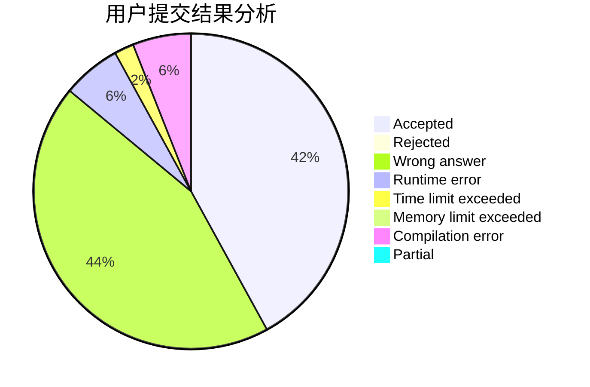
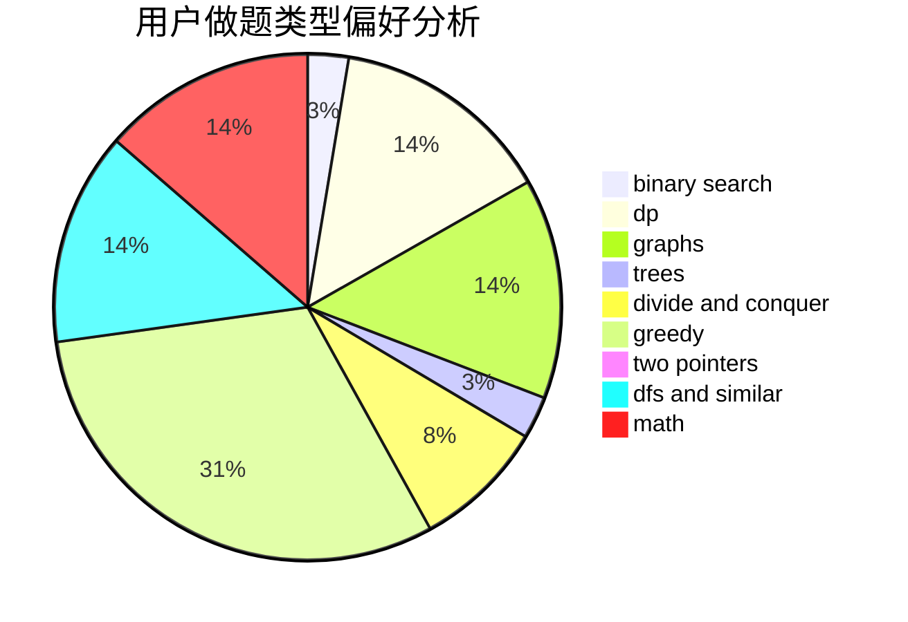

# 100yearsleft

<!-- tabs:start -->

#### **用户提交结果分析**

#### **用户做题类型偏好分析**

<!-- tabs:end -->
# 推荐题目
[10772](https://codeforces.com/contest/1077/problem/2)
[1071B](https://codeforces.com/contest/1071/problem/B)
[1077E](https://codeforces.com/contest/1077/problem/E)
[1073F](https://codeforces.com/contest/1073/problem/F)
[1073A](https://codeforces.com/contest/1073/problem/A)
[1070A](https://codeforces.com/contest/1070/problem/A)
[1073C](https://codeforces.com/contest/1073/problem/C)
[1076D](https://codeforces.com/contest/1076/problem/D)
[1074B](https://codeforces.com/contest/1074/problem/B)
[1076A](https://codeforces.com/contest/1076/problem/A)
